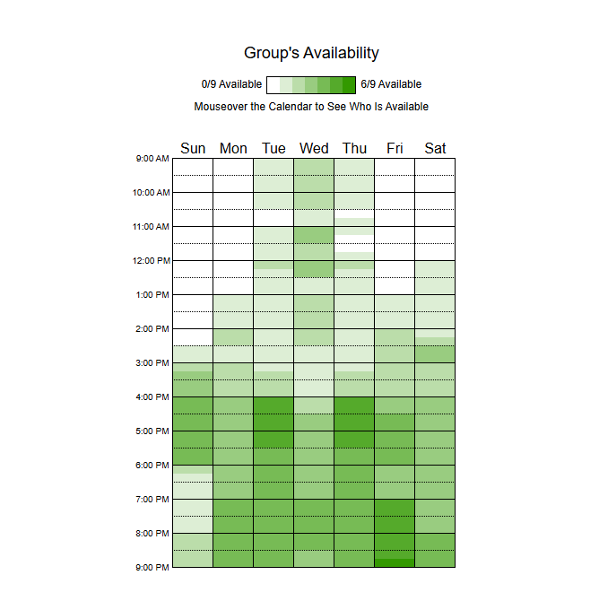

## Reuniões Gerais

Registro e formalização dos alinhamentos internos, definições de arquitetura, divisões de trabalho e acompanhamento de entregas.

---

#### Reunião 01 — Configuração inicial da Equipe e Entendimento do Projeto (23/08/2026)

* **Objetivo Geral:** Buscar compreender em conjunto o projeto proposto na disciplina Arquitetura e Desenho de Software e tomar decisões acerca das configurações iniciais de equipe, repositório e objeto de estudo.
* **Participantes:** Dylan Portela, Mariana Ribeiro, Nayra Silva, Rafaela Andrea, Samuel Felipe, Uires Carlos.
* **Redação/Autoria:** Rafaela Andrea
* **Links Úteis:**
  * [Ata Detalhada em PDF](../assets/documents/ata-reuniao-01.pdf ':ignore')
  * [Gravação da Reunião (Vídeo)]()

---

#### Reunião 02 — Alinhamento da Equipe, Organização do GitPages e Diretrizes da Nova Entrega (11/09/2026)

* **Objetivo Geral:** Determinar a composição das subequipes, alinhar o fluxo de publicação do conteúdo no GitHub Pages, definir o escopo dos entregáveis (focos, extras e documentos gerais) e estabelecer as diretrizes de versionamento, branches e rastreabilidade para o novo módulo do projeto.
* **Participantes:** Nayra Silva, Rafaela Andrea, Samuel Felipe, Uires Carlos.
* **Redação/Autoria:** Rafaela Andrea
* **Links Úteis:**
  * [Ata Detalhada em PDF](../assets/documents/ata-reuniao-02.pdf ':ignore')
  * [Gravação da Reunião (Vídeo)](https://youtu.be/ACxi3ecCsnM)

---

## Mapeamento de Disponibilidade (When2meet)

Para consolidar o alinhamento de horários e a organização da equipe, utilizamos a plataforma **When2meet** para mapear a disponibilidade de todos os integrantes. O mapa de calor gerado ilustra visualmente os horários em que há maior sobreposição coletiva, facilitando o agendamento de reuniões e sessões de trabalho conjuntas.

#### Heatmap de Disponibilidade da Equipe

> *Fonte: Elaborado pela equipe utilizando a plataforma [When2meet](https://www.when2meet.com/?38165755-7iWpE).*

#### Análise de Melhores Horários para Reunião
Com base no mapa de calor obtido, identificamos que os melhores momentos para encontros e alinhamentos síncronos da equipe ocorrem:
* **Período da Tarde (16:00 às 18:00):** Apresenta alta concentração de disponibilidade em dias úteis, sendo ideal para reuniões gerais.
* **Período da Noite (17:00 às 21:00):** Destaca-se como a janela com maior sobreposição de membros disponíveis (chegando a picos de alta disponibilidade, especialmente entre 17:00 e 20:00), acomodando bem os compromissos acadêmicos e de estágio da equipe.

---

> **Nota:** Todos os documentos e evidências listados nesta seção contam com artefatos auditáveis e históricos de versão disponíveis no repositório do projeto.

---

> **Histórico de Versões**
> 
> | Versão | Data | Descrição | Autores | Revisor |
> | :---: | :---: | :--- | :--- | :---: |
> | 0.1 | 12/09/2026 | Criação da página | [Rafaela Andrea](https://github.com/radamesGuerra) | [Letícia de Carvalho]((https://github.com/LeticiaSantosss)) |
