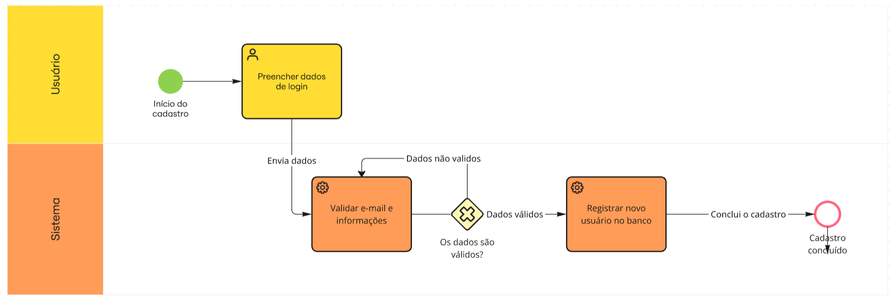

# Introdução 

A análise de um sistema complexo exige diferentes formas de representação, uma vez que uma única perspectiva não é suficiente para evidenciar todos os elementos envolvidos em seu funcionamento. Nesse sentido, a documentação desenvolvida neste trabalho reúne diferentes modelos capazes de representar o sistema em níveis distintos de abstração, desde a visão geral das relações entre os envolvidos até o detalhamento das funcionalidades, processos e interações.

Para isso, foram utilizadas técnicas de modelagem que se complementam ao longo da análise. Cada representação possui uma finalidade específica e contribui para a construção de uma visão mais abrangente do objeto estudado, permitindo relacionar aspectos funcionais e não funcionais e destacar questões associadas à segurança, privacidade e usabilidade.

Assim, os modelos apresentados a seguir organizam os resultados obtidos durante a análise e fornecem diferentes perspectivas sobre o funcionamento do sistema, servindo como base para as demais etapas do trabalho.

# Metodologia

A metodologia adotada foi baseada em Engenharia Reversa, utilizando como objeto de análise os fluxos de autenticação e gerenciamento de conta do e-commerce da Decathlon Brasil. O trabalho buscou compreender o comportamento do sistema a partir da perspectiva do usuário, identificar os principais atores, interações, processos e aspectos de qualidade envolvidos, e representar os resultados por meio de diferentes técnicas de modelagem.

Inicialmente, foi realizada a observação dos fluxos de autenticação e gerenciamento de conta, contemplando login convencional, login social, cadastro, recuperação e alteração de senha, logout e gerenciamento do perfil. Durante essa etapa, foram registradas as ações realizadas pelo usuário, as respostas apresentadas pelo sistema, as transições entre telas, os mecanismos de validação, as mensagens de retorno e os comportamentos considerados relevantes para a análise.

A partir das informações levantadas, foi elaborado o Rich Picture, utilizado para representar de maneira sistêmica o contexto analisado. O modelo permitiu identificar os principais atores, elementos, relações, interações e pontos críticos relacionados ao processo de autenticação e gerenciamento de conta. Entre os aspectos observados, foram considerados fatores relacionados à usabilidade, segurança, privacidade, consistência das interfaces e feedback ao usuário.

Posteriormente, os processos identificados foram formalizados por meio da notação BPMN 2.0 (Business Process Model and Notation). Utilizando as raias (pools/lanes) de Usuário e Sistema para representar a divisão de responsabilidades entre as ações humanas e as operações sistêmicas, os gateways foram aplicados para estruturar decisões e caminhos alternativos. Os principais fluxos mapeados com essa notação estão detalhados a seguir:

Fluxo de Login: Conforme ilustrado na Figura 3, o processo é iniciado pelo usuário ao inserir seus dados de acesso. O sistema, em sua raia, recebe e analisa essas informações. Um gateway de decisão avalia se as credenciais estão corretas: em caso afirmativo, o sistema redireciona o usuário para a tela principal, concedendo o acesso; caso contrário, o fluxo retorna para a etapa de inserção de dados.

Fluxo de Recuperação de Senha: O diagrama correspondente demonstra o cenário em que o usuário solicita a recuperação informando o e-mail associado à conta. O sistema verifica se o e-mail existe na base de dados. Se o e-mail não existir, o processo é encerrado. Se for validado, o sistema envia um link de redefinição. A partir desse link, o usuário cadastra uma nova senha, o sistema atualiza o registro no banco de dados e a credencial é restaurada com sucesso.

Fluxo de Cadastro: Representado no Diagrama 3, este fluxo tem início quando o usuário preenche seus dados de registro. Após o envio, o sistema assume a validação das informações e do e-mail. Um gateway decide os próximos passos com base na validade dos dados inseridos: caso não sejam válidos, ocorre um retorno sistêmico para revalidação; se estiverem corretos, o sistema registra o novo usuário no banco de dados e o cadastro é dado como concluído.

Os pontos críticos e preocupações de qualidade identificados durante a análise desses fluxos foram utilizados como base para a construção do NFR Framework (Non-Functional Requirements Framework). A partir das evidências observadas, foram definidos softgoals relacionados principalmente à Usabilidade, Segurança e Confiança, além de aspectos voltados à privacidade e transparência. Esses softgoals foram refinados em preocupações mais específicas e relacionados a operacionalizações, claims e possíveis contribuições positivas ou negativas.

A análise também buscou estabelecer a rastreabilidade entre as observações realizadas e os requisitos não funcionais identificados. Dessa forma, os comportamentos observados no sistema foram relacionados aos problemas ou expectativas representados no Rich Picture, posteriormente aos softgoals do NFR Framework e, por fim, às respectivas operacionalizações e evidências. Essa abordagem permitiu conectar diretamente os resultados da Engenharia Reversa às preocupações de qualidade sistêmica.

Por fim, foi elaborado o Diagrama de Sequência, utilizando os fluxos analisados como base para representar a ordem temporal das interações entre o usuário e os componentes envolvidos. O diagrama complementará os modelos desenvolvidos ao detalhar as trocas de mensagens e a comunicação entre os participantes durante a execução das funcionalidades.

Dessa forma, a metodologia integra diferentes perspectivas de modelagem: o Rich Picture representa o contexto e as relações do domínio; o BPMN formaliza os processos e suas regras de negócio; o NFR Framework organiza os requisitos não funcionais e suas métricas de qualidade; e o Diagrama de Sequência mapeia a dinâmica temporal das interações. A utilização conjunta desses artefatos permite uma análise profunda e abrangente do fluxo de autenticação e gerenciamento de conta do sistema estudado.

# Rich Picture

<div align="center">


<p align="center"><sub>Fonte: Elaborado pelos autores da Subequipe 1: Dylan Cavalcante, Rafaela Andrea, Samuel Felipe e Mariana Ribeiro, 2026.</sub></p>

</div>

Utilizou-se a técnica do **Rich Picture** para mapear o ecossistema de login e gerenciamento de conta no e-commerce da Decathlon Brasil. O objetivo foi visualizar a dinâmica entre os atores envolvidos, as interações com o sistema, as preocupações de segurança e privacidade e os principais pontos de atenção identificados durante a Engenharia Reversa.

O Rich Picture representa os fluxos de **login, login social, gerenciamento do perfil, alteração de senha, recuperação de acesso e proteção das informações da conta**, destacando relações entre o usuário e os mecanismos de autenticação e gerenciamento de credenciais.

## Análise do Ponto Crítico

Os principais pontos críticos identificados no Rich Picture foram:

- **Login social com excesso de etapas:** foi observado que o login social exige **6 cliques**, indicando possível aumento do esforço necessário para concluir a autenticação.
- **Possibilidade de enumeração de usuários:** mensagens como **"conta não encontrada"** podem fornecer informações sobre a existência ou não de uma conta, representando uma preocupação de segurança.
- **Exposição e tratamento de dados pessoais:** o gerenciamento do perfil envolve informações como CPF e demais dados da conta, tornando relevante a preocupação com confidencialidade e privacidade.
- **Inconsistência após alteração da senha:** após a alteração da senha, o usuário é direcionado para outra interface, que apresenta informações diferentes das encontradas no perfil convencional.
- **Ausência de feedback após alteração de senha:** durante a avaliação, não foi recebido e-mail informando a alteração da senha, caracterizando uma preocupação relacionada ao feedback de ações críticas.
- **Relação entre segurança e usabilidade:** mecanismos de autenticação mais rigorosos podem aumentar a proteção da conta, mas também podem aumentar o esforço necessário para o usuário concluir o processo.

## Legenda do Rich Picture

| Elemento | Significado |
| --- | --- |
| Usuário | Ator que realiza as ações de login, recuperação, alteração de senha e gerenciamento da conta. |
| Janela de login | Representa a interface utilizada para autenticação e acesso à conta. |
| Login social | Representa as alternativas de autenticação por provedores externos. |
| E-mail / código | Representa o mecanismo utilizado para verificação e recuperação de acesso. |
| Perfil | Representa o espaço de gerenciamento das informações da conta. |
| Alertas | Destacam comportamentos ou situações que representam pontos críticos identificados na análise. |
| Setas | Representam relações, fluxos e interações entre os elementos do sistema. |
| Ícones de segurança | Representam mecanismos e preocupações relacionados à proteção das credenciais e dos dados. |
| Informações de privacidade | Representam as preocupações relacionadas ao tratamento e à visibilidade dos dados do usuário. |

---

# NFR Framework

O SIG foi construído a partir das preocupações identificadas no Rich Picture e nos resultados da avaliação do Fluxo A. O softgoal superior é **Experiência de uso segura e confiável — Decathlon**. Ele foi decomposto em três preocupações principais que devem ser consideradas conjuntamente: **Usabilidade**, **Segurança** e **Confiança**.

A preocupação com **Privacidade** também está presente na modelagem, principalmente por meio do softgoal **Confidencialidade dos dados**, refinado a partir de Segurança, e de **Transparência**, refinada a partir de Confiança.

## Softgoals e refinamentos

| Softgoal | Refinamentos principais |
| --- | --- |
| **Experiência de uso segura e confiável — Decathlon** | Usabilidade; Segurança; Confiança |
| **Usabilidade** | Eficiência da interação; Consistência da interface; Feedback e clareza |
| **Eficiência da interação** | Poucas etapas no processo de login; Baixo esforço cognitivo na autenticação |
| **Consistência da interface** | Consistência visual; Consistência de navegação |
| **Feedback e clareza** | Feedback sobre ações críticas |
| **Segurança** | Autenticação; Confidencialidade dos dados |
| **Autenticação** | Autenticação por código enviado por e-mail; Senha de uso único |
| **Confidencialidade dos dados** | Prevenção de enumeração de usuários |
| **Confiança** | Transparência |
| **Transparência** | Clareza sobre dados tratados; Clareza sobre alterações da conta |

## Operacionalizações selecionadas

| Softgoal | Operacionalização | Contribuição |
| --- | --- | --- |
| Baixo esforço cognitivo na autenticação | **Simplificar a sequência de autenticação** | `+` |
| Poucas etapas no processo de login | **Reduzir etapas desnecessárias no login** | `+` |
| Consistência da interface | **Manter interface unificada para gerenciamento da conta** | `+` |
| Feedback sobre ações críticas | **Notificar o usuário após alteração de senha** | `+` |
| Confidencialidade dos dados | **Fornecer mensagens de erro que não revelem a existência da conta** | `++` |
| Clareza sobre dados tratados | **Informar claramente os dados tratados** | `+` |
| Autenticação | **Autenticação por código enviado por e-mail** | `+` |
| Autenticação | **Senha de uso único** | `+` |

## SIG

<p align="center"><b>Figura 2</b> — SIG do Fluxo A na notação do NFR Framework</p>


<p align="center"><sub>Fonte: Elaborado pelos autores da Subequipe 1: Dylan Cavalcante, Rafaela Andrea, Samuel Felipe e Mariana Ribeiro, 2026.</sub></p>

Neste SIG, as nuvens representam **softgoals** e **operacionalizações**. O softgoal superior representa a preocupação geral com uma experiência de uso segura e confiável. As decomposições `AND` representam preocupações que devem ser consideradas conjuntamente.

As contribuições `++` e `+` representam, respectivamente, contribuições positivas forte e moderada. A contribuição `-` representa uma contribuição negativa ou possível efeito adverso entre preocupações.

No modelo, a operacionalização **Fornecer mensagens de erro que não revelem a existência da conta** contribui fortemente (`++`) para a **Prevenção de enumeração de usuários**. Já **Reduzir etapas desnecessárias no login** contribui positivamente para a eficiência da interação, mas a simplificação excessiva pode apresentar uma relação negativa com Segurança.

## Claims e trade-offs

| Claim/risco | Softgoal relacionado | Contribuição ou relação |
| --- | --- | --- |
| **Login social exige 6 cliques** | Poucas etapas no processo de login | Evidência de preocupação com eficiência da interação |
| **Após alteração da senha, o usuário é transferido para outra interface** | Consistência da interface | Evidência de possível inconsistência de navegação |
| **A outra interface apresenta dados diferentes do perfil convencional** | Consistência da interface / Consistência das informações | Evidência de possível inconsistência na apresentação das informações |
| **Nenhum e-mail de alteração de senha foi recebido** | Feedback sobre ações críticas | Evidência de ausência de feedback após ação sensível |
| **Mensagem "conta não encontrada"** | Prevenção de enumeração de usuários | Risco relacionado à exposição da existência da conta |

O principal trade-off identificado ocorre entre **Usabilidade e Segurança**.

A operacionalização **Simplificar a sequência de autenticação** apresenta uma contribuição positiva (`+`) para Usabilidade, pois a redução da complexidade pode diminuir o esforço cognitivo do usuário. Entretanto, a simplificação excessiva pode apresentar uma contribuição negativa (`-`) para Segurança, caso reduza barreiras de proteção.

Assim, o modelo representa o seguinte relacionamento:

```text
           Simplificar a sequência
                de autenticação
                    |
             +------+------+
             |             |
             v             v
        Usabilidade     Segurança
             +             -
```

Esse relacionamento não significa que simplificar a autenticação necessariamente comprometa a segurança. O objetivo é representar o possível **trade-off entre redução do esforço do usuário e fortalecimento dos mecanismos de proteção**.

## Relação com o Rich Picture e rastreabilidade

O Rich Picture identifica atores, expectativas, problemas e relações observadas durante a análise do sistema. O SIG transforma as preocupações de qualidade encontradas nesse contexto em **softgoals, refinamentos, operacionalizações e claims**.

A rastreabilidade utilizada é:

**observação do fluxo → problema/expectativa no Rich Picture → softgoal → refinamento → operacionalização → claim ou evidência → decisão de projeto.**

Exemplos de rastreabilidade:

* **Login social com 6 cliques** → preocupação com excesso de etapas → **Poucas etapas no processo de login** → **Reduzir etapas desnecessárias no login**.
* **Mensagem "conta não encontrada"** → risco de exposição da existência da conta → **Prevenção de enumeração de usuários** → **Fornecer mensagens de erro que não revelem a existência da conta**.
* **Ausência de e-mail após alteração da senha** → falta de feedback → **Feedback sobre ações críticas** → **Notificar o usuário após alteração de senha**.
* **Mudança de interface após alteração da senha** → inconsistência na experiência → **Consistência da interface** → **Manter interface unificada para gerenciamento da conta**.

---

# Modelo BPMN

Modelagem dos processos de autenticação e gerenciamento de conta da Decathlon Brasil, elaborada em notação **BPMN 2.0**, cobrindo os fluxos de **login, alteração/recuperação de senha e cadastro**.

## Diagramas

### Diagrama 1: Login

<p align="center">
    
</p>

<p align="center">
    <b>Figura 3</b> — Diagrama BPMN do fluxo de login.
</p>

<p align="center"><sub>Fonte: Elaborado pelos autores da Subequipe 1: Dylan Cavalcante, Rafaela Andrea, Samuel Felipe e Mariana Ribeiro, 2026.</sub></p>


### Diagrama 2: Alteração e recuperação de senha

<p align="center">
    
</p>

<p align="center">
    <b>Figura 4</b> — Diagrama BPMN do fluxo de recuperação e alteração de senha.
</p>

<p align="center"><sub>Fonte: Elaborado pelos autores da Subequipe 1: Dylan Cavalcante, Rafaela Andrea, Samuel Felipe e Mariana Ribeiro, 2026.</sub></p>

### Diagrama 3: Cadastro

<p align="center">
    
</p>

<p align="center">
    <b>Figura 5</b> — Diagrama BPMN do fluxo de cadastro.
</p>

<p align="center"><sub>Fonte: Elaborado pelos autores da Subequipe 1: Dylan Cavalcante, Rafaela Andrea, Samuel Felipe e Mariana Ribeiro, 2026.</sub></p>

## Atores e raias (pools / lanes)

| Pool                                              | Lane        | Responsabilidade                                                                                                                                      |
| ------------------------------------------------- | ----------- | ----------------------------------------------------------------------------------------------------------------------------------------------------- |
| Processo de autenticação e gerenciamento de conta | **Usuário** | Executar as ações necessárias para realizar login, cadastrar uma conta, recuperar a senha e informar ou atualizar suas credenciais.                   |
| Processo de autenticação e gerenciamento de conta | **Sistema** | Receber e analisar os dados, validar informações, verificar credenciais, enviar links de recuperação, atualizar registros e conceder ou negar acesso. |

Nos diagramas, a divisão entre as raias **Usuário** e **Sistema** permite diferenciar as ações executadas diretamente pelo consumidor das operações realizadas pela aplicação.

## Descrição dos processos

### 1. Login

O fluxo começa quando o usuário decide realizar o login e insere suas credenciais. Os dados são enviados ao sistema para análise.

O gateway **"Credenciais corretas?"** determina o caminho do processo:

* **Sim:** o sistema redireciona o usuário para a tela principal e o acesso é concedido.
* **Não:** o fluxo retorna à etapa de inserção das credenciais, permitindo uma nova tentativa.

### 2. Recuperação e alteração de senha

O usuário inicia o processo de recuperação informando o e-mail associado à conta.

O sistema verifica o gateway **"E-mail existe na base?"**:

* **Sim:** o sistema envia um link de redefinição de senha para o e-mail informado.
* O usuário acessa o link e cadastra uma nova senha.
* O sistema atualiza o registro correspondente no banco de dados.
* O fluxo termina com a credencial restaurada.
* **Não:** o processo não prossegue e é encerrado.

### 3. Cadastro

O usuário inicia o cadastro e preenche seus dados.

O sistema executa a validação das informações e o gateway **"Os dados são válidos?"** determina o próximo caminho:

* **Sim:** o sistema registra o novo usuário no banco de dados e conclui o cadastro.
* **Não:** o fluxo retorna à etapa de preenchimento e validação, permitindo que o usuário corrija os dados.

## Premissas de negócio

* O usuário precisa fornecer informações de autenticação para acessar uma conta existente.
* O login somente é concedido quando as credenciais fornecidas são consideradas corretas pelo sistema.
* O cadastro somente é concluído após a validação dos dados informados.
* A recuperação de senha depende da existência do e-mail informado na base de dados.
* A redefinição da senha ocorre por meio de um link enviado ao e-mail associado à conta.
* A nova senha é registrada no banco de dados após sua definição pelo usuário.
* Dados inválidos durante o cadastro devem retornar para correção antes da conclusão do processo.
* O processo de autenticação envolve mecanismos de segurança e proteção das credenciais do usuário.
* O fluxo analisado está delimitado às funcionalidades de autenticação e gerenciamento de conta, não abrangendo busca de produtos, carrinho ou pagamento.

---

# Engenharia Reversa: Fluxo de login

## Visão Geral

Esta documentação consolida o estudo de **Engenharia Reversa** conduzido pela **Subequipe 01**, direcionado ao ecossistema de login e gerenciamento de conta do e-commerce Decathlon Brasil.

A investigação mapeou a jornada do consumidor desde a **inserção das credenciais, criação de uma conta ou solicitação de recuperação de acesso** até a **concessão do acesso, conclusão do cadastro ou restauração da credencial**.

Os achados foram modelados por meio de um **Rich Picture**, utilizado para fornecer uma visão sistêmica do cenário, e de diagramas **BPMN (Business Process Model and Notation)**, utilizados para representar formalmente os processos de login, cadastro e recuperação/alteração de senha.

## Cenário de Análise e Desafios Encontrados

A análise foi realizada sobre os fluxos de autenticação e gerenciamento de conta da plataforma, considerando login convencional, login social, cadastro, recuperação de acesso, alteração de senha, logout e gerenciamento das informações do perfil.

Durante a avaliação, foram identificados alguns comportamentos relevantes:

* o **login social exigiu 6 cliques**;
* foram observados elementos relacionados à **privacidade e ao tratamento de dados pessoais**;
* a mensagem **"conta não encontrada"** representa uma preocupação relacionada à possibilidade de enumeração de usuários;
* após a alteração da senha, o usuário foi direcionado para **outra interface**;
* a interface posterior apresentava **dados diferentes** daqueles encontrados no perfil convencional;
* não foi recebido **e-mail de confirmação da alteração da senha**;
* o sistema rejeitou uma senha que já havia sido utilizada anteriormente.

Esses achados foram utilizados como evidências para o refinamento dos softgoals do NFR Framework e para a identificação dos principais pontos de atenção do fluxo.

## Ponto Crítico de Acessibilidade

A análise realizada não teve como objetivo executar uma auditoria completa de conformidade com padrões de acessibilidade. Dessa forma, os resultados obtidos não são suficientes para afirmar conformidade ou não conformidade com WCAG.

Entretanto, foram observadas questões relacionadas à **usabilidade e ao esforço cognitivo**, especialmente no fluxo de login social, que exigiu 6 cliques para sua conclusão. Esse comportamento foi incorporado ao NFR Framework por meio dos softgoals **Eficiência da interação**, **Poucas etapas no processo de login** e **Baixo esforço cognitivo na autenticação**.

## Cobertura do Estudo

A Engenharia Reversa contemplou:

* **Login convencional**;
* **Login social**;
* **Cadastro de usuário**;
* **Recuperação de acesso**;
* **Alteração de senha**;
* **Logout**;
* **Gerenciamento do perfil**;
* **Proteção das informações da conta**;
* **Privacidade e visibilidade dos dados**;
* **Validação de credenciais e informações fornecidas pelo usuário**;
* **Comportamentos de feedback e tratamento de erros**.

O estudo foi delimitado ao **Fluxo A**, não abrangendo funcionalidades de busca de produtos, carrinho e pagamento.

## Execução Prática da Engenharia Reversa

O mapeamento seguiu o fluxo operacional executado pelo cliente final:

1. **Mapeamento da Jornada:** acompanhamento sequencial das etapas dos fluxos de login, cadastro e recuperação de acesso, registrando ações do usuário, respostas do sistema e pontos de decisão.

2. **Inspeção de Interface:** observação dos componentes visuais, mensagens apresentadas pelo sistema, comportamento das telas e mudanças de interface durante as operações analisadas.

3. **Identificação de Pontos Críticos:** registro de comportamentos relacionados à segurança, usabilidade, privacidade, consistência da interface e feedback ao usuário.

4. **Diagramação e Síntese:** consolidação das observações no Rich Picture e posterior representação formal dos fluxos por meio dos diagramas BPMN.

5. **Modelagem dos NFRs:** utilização dos achados observados para identificar softgoals, refinamentos, operacionalizações, claims e possíveis trade-offs entre as preocupações de qualidade.

---

# Referências

[1] CHUNG, Lawrence; NIXON, Brian A.; YU, Eric; MYLOPOULOS, John. **Non-Functional Requirements in Software Engineering**. Boston: Kluwer Academic Publishers, 2000.

[2] SINGH, Pratima; TRIPATHI, Anil Kumar. **Treating NFR as First Grade for Its Testability**. *Journal of Software Engineering and Applications*, v. 5, p. 991-1000, 2012.

[3] IBM. **O que é modelagem e notação de processos de negócios (BPMN)?**

[4] MIRO. **Diagrama BPMN.**

---

> **Histórico de Versões**
>
> | Versão |    Data    | Descrição                                                                             | Autores            |    Revisor   |
> | :----: | :--------: | :------------------------------------------------------------------------------------ | :----------------- | :----------: |
> |   0.1  | 16/09/2026 | Criação da página                                                                     | [Dylan Cavalcante] | não revisado |
> |   0.2  | 16/09/2026 | Preenchimento dos conteúdos de Rich Picture, NFR Framework, BPMN e Engenharia Reversa | [Dylan Cavalcante] | não revisado |
