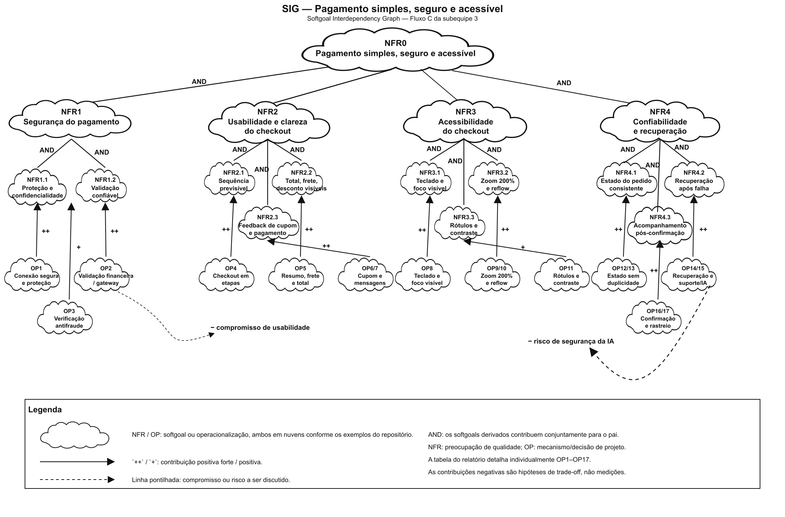
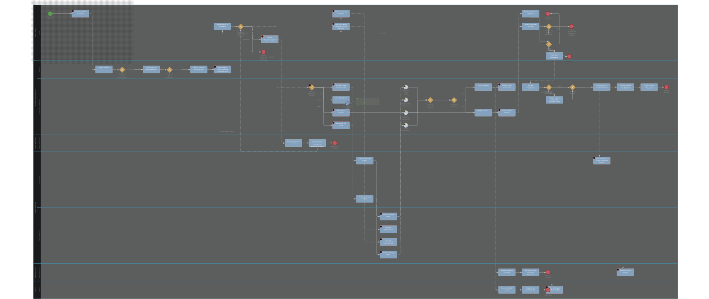

## Rich Picture

Fonte: Elaborado pelos autores da Subequipe 3: Camile Barbosa Gonzaga de Oliveira, Lucas Oliveira Meireles, Letícia de Carvalho dos Santos, 2026.

Utilizou-se a técnica do Rich Picture para mapear o ecossistema do checkout no e-commerce da Decathlon. O objetivo foi visualizar a dinâmica entre os atores (Usuário, Empresa, Banco e Suporte) e destacar os gargalos que impactam a experiência do cliente e as metas do negócio.

Análise do Ponto Crítico: Acessibilidade no Checkout

* O Problema de Layout: Ao aplicar o recurso de Zoom em 200%, a interface do checkout sofre uma distorção grave de proporcionalidade: a área inferior destinada ao resumo do carrinho passa a ocupar a maior parte da tela, enquanto o formulário de pagamento fica espremido em uma faixa extremamente reduzida.
* Impacto no Usuário: A limitação do espaço útil dificulta a leitura, a digitação e a conferência dos dados do cartão ou boleto. Isso gera frustração, incerteza sobre o preenchimento correto e leva o cliente a acionar o Suporte/Atendimento ou abandonar a compra.
* Impacto no Negócio: Essa falha de renderização entra em atrito direto com os objetivos estratégicos da Decathlon de reduzir o abandono de carrinho e oferecer uma boa experiência, resultando em perda de conversão.
* Requisito Arquitetural: O problema evidencia a necessidade de refatorar a arquitetura do frontend (CSS/Layout Grid/Flexbox) para seguir as diretrizes de acessibilidade web (WCAG). A interface deve adaptar a hierarquia visual dinamicamente sob ampliação, garantindo que o formulário principal continue visível e utilizável sem ser soterrado por elementos secundários da página.

#### Legenda do Rich Picture

| Elemento | Significado |
| --- | --- |
| Pessoa/figura humana | Usuário que realiza a compra e manifesta expectativas/dúvidas |
| Edifício/organização | Empresa/e-commerce e seus objetivos de negócio |
| Sistema/cartão/cadeado | Checkout e processamento seguro do pagamento |
| Instituição financeira | Componente externo que autoriza ou recusa a transação; o provedor específico não foi confirmado |
| Caminhão | Entrega, prazo, frete e rastreio após confirmação |
| Fones de atendimento | Suporte e recuperação após erro/recusa |
| Balão de fala | Expectativa, dúvida ou problema percebido pelo usuário |
| Seta contínua | Fluxo de informação, ação ou resposta |
| Linha pontilhada | Influência, problema ou requisito transversal |

---
---

# NFR Framework

O SIG foi construído a partir das preocupações identificadas no Rich Picture. O softgoal superior é **Pagamento simples, seguro e acessível**. Ele foi decomposto por AND em quatro preocupações que devem ser atendidas conjuntamente: **Segurança do pagamento**, **Usabilidade e clareza do checkout**, **Acessibilidade do checkout** e **Confiabilidade e recuperação** [1].

#### Softgoals e refinamentos

| Softgoal | Refinamentos principais |
| --- | --- |
| Segurança do pagamento | Proteção/confidencialidade; validação confiável |
| Usabilidade e clareza do checkout | Sequência previsível; total, frete e desconto visíveis; feedback de cupom e pagamento |
| Acessibilidade do checkout | Teclado/foco visível; zoom 200% e reflow; rótulos e contraste |
| Confiabilidade e recuperação | Estado consistente; recuperação após falha; acompanhamento pós-confirmação |

#### Operacionalizações selecionadas

| Softgoal | Operacionalização | Contribuição |
| --- | --- | --- |
| Segurança | Conexão segura e proteção dos dados | `++` |
| Segurança | Validar pagamento com instituição financeira/gateway | `++` |
| Usabilidade | Checkout em etapas: dados → entrega → pagamento → revisão | `++` |
| Usabilidade | Resumo persistente do pedido e total atualizado | `++` |
| Usabilidade | Validar cupom e explicar desconto/recusa | `++` |
| Acessibilidade | Navegação por teclado e foco visível | `++` |
| Acessibilidade | Layout responsivo em zoom 200% e reflow | `++` |
| Confiabilidade | Tratar pendente, aprovado, recusado e cancelado | `++` |
| Confiabilidade | Permitir corrigir dados ou trocar método | `++` |
| Confiabilidade | Confirmar pedido somente após aprovação e exibir rastreio | `++` |

#### SIG

<b>Figura 2</b> — SIG do Fluxo C na notação do NFR Framework

Fonte: Elaborado pelos autores da Subequipe 3: Camile Barbosa Gonzaga de Oliveira, Lucas Oliveira Meireles, Letícia de Carvalho dos Santos, 2026.

Neste SIG, as nuvens representam softgoals e operacionalizações. As linhas com `AND` representam decomposição conjunta. `++` e `+` representam contribuições positivas forte e moderada. As linhas pontilhadas representam compromissos ou riscos.

#### Claims e trade-offs

| Claim/risco | Softgoal relacionado | Contribuição ou relação |
| --- | --- | --- |
| Formulário de pagamento fica espremido em zoom de 200% | Acessibilidade — zoom/reflow | Negativa; achado exploratório a validar |
| Resumo persistente pode ocupar espaço em zoom elevado | Acessibilidade e usabilidade | Compromisso; reorganizar sem remover a conferência |
| Verificação antifraude pode aumentar fricção | Segurança e usabilidade | Compromisso; equilibrar proteção e esforço |
| IA de apoio pode receber dados sensíveis indevidamente | Segurança e recuperação | Risco; limitar IA a orientação sem dados de cartão/senha |

#### Relação com o Rich Picture e rastreabilidade

O Rich Picture identifica atores, expectativas, problemas e relações. O SIG transforma as preocupações de qualidade encontradas nesse contexto em softgoals, refinamentos e operacionalizações. A rastreabilidade utilizada é:

**observação do checkout → problema/expectativa no Rich Picture → softgoal → refinamento → operacionalização → claim ou evidência → decisão de projeto.**

#### Referências

[1]: [ANDREOPOULOS, Bill. ACHIEVING SOFTWARE QUALITY USING THE NFR FRAMEWORK: MAINTAINABILITY AND PERFORMANCE. [S.l.: S.n.].](https://www.ee.columbia.edu/~wa2171/MULIC/AndreopoulosCSITeA.pdf)

---
---

# Modelo BPMN

Modelagem do processo de pagamento do checkout da Decathlon Brasil, elaborada em notação **BPMN 2.0**, cobrindo desde a montagem do carrinho até a confirmação do pedido e o encaminhamento para separação/logística.

#### Diagrama

<b>Figura 1</b> — Diagrama BPMN - Pagamento do Checkout Decathlon Brasil

Fonte: Elaborado pelos autores da Subequipe 3: Camile Barbosa Gonzaga de Oliveira, Lucas Oliveira Meireles, Letícia de Carvalho dos Santos, 2026.

Fonte editável: [`decathlon-fluxo-pagamento_subequipe3.bpmn`](../assets/images/decathlon-fluxo-pagamento_subequipe3.bpmn ':ignore')

#### Atores e raias (pools / lanes)

| Pool | Lane | Responsabilidade |
|---|---|---|
| Cliente / Usuário | Cliente | Carrinho, escolha do meio de pagamento, pagamento efetivo (Pix/boleto), recebimento de confirmação |
| Decathlon E-commerce | Checkout | Validação de carrinho, dados de entrega/frete, regras promocionais, split de marketplace |
| Decathlon E-commerce | Orquestrador de pagamento | Roteamento por meio de pagamento, espera de confirmação (síncrona/assíncrona), decisão de aprovação |
| Suporte / Atendimento | Suporte | Recebe acionamento do cliente com dificuldade no checkout e orienta o preenchimento |
| Gateway / Adquirente | Processamento | Autorização de cartão, cobrança PayPal |
| Gateway / Adquirente | Banco emissor / Pix | Aprovação de cartão, confirmação Pix, compensação de boleto |
| Marketplace parceiro | — | Recebimento do pedido e repasse via split (produtos vendidos por parceiros) |
| Logística | — | Separação, embalagem e despacho do pedido |

#### Descrição do processo

O cliente monta o carrinho e segue para o checkout, onde o sistema valida os itens e identifica se algum produto pertence a um vendedor parceiro (marketplace), aplicando a regra de split de pagamento quando necessário. Em seguida são capturados os dados de entrega e frete e aplicadas as regras promocionais vigentes (desconto de 5% no Pix, condições de parcelamento no cartão).

Ao selecionar o meio de pagamento, o processo verifica se o formulário permanece utilizável em zoom de 200%. Quando a renderização compromete o preenchimento, o cliente pode acionar o Suporte/Atendimento — que orienta o preenchimento e devolve o cliente ao checkout — ou abandonar a compra, cenário tratado como desfecho de exceção do processo.

A partir da seleção do meio de pagamento, o orquestrador direciona a transação:

- **Cartão de crédito** – dados tokenizados e enviados ao adquirente, que autoriza a transação junto ao banco emissor (resposta síncrona).
- **Pix** – geração de QR Code; a confirmação do banco chega de forma assíncrona.
- **Boleto bancário** – emissão do boleto; compensação confirmada em até 72h (assíncrono).
- **PayPal** – cobrança automática sobre o cartão cadastrado na conta do cliente.

O orquestrador aguarda o retorno de cada meio (evento de mensagem) e converge para o gateway de decisão "Pagamento aprovado?". Se aprovado, o pedido é confirmado, notificado ao cliente e encaminhado simultaneamente à logística (separação e despacho) e, quando aplicável, ao parceiro de marketplace (repasse via split). Se recusado, o cliente é notificado e pode tentar outro meio de pagamento ou abandonar a compra.

#### Premissas de negócio

- **Cartão de crédito**: parcelamento em até 10x, conforme valor mínimo de parcela.
- **Pix**: 5% de desconto em compras acima de R$250 (produtos vendidos e entregues pela Decathlon).
- **Boleto bancário**: pagamento à vista, com confirmação em até 72 horas.
- **PayPal**: cobrança automática sobre cartão previamente cadastrado.
- **Marketplace**: produtos de parceiros têm regras promocionais próprias, exigindo split de pagamento e notificação ao parceiro após confirmação do pedido.
- **Acessibilidade do checkout**: em zoom de 200%, o formulário de pagamento pode ficar comprimido pela área de resumo do carrinho, motivando o desvio de exceção para Suporte/Atendimento ou abandono da compra.

---
---

# Engenharia Reversa: Fluxo de Pagamentos 

#### Visão Geral

Esta documentação consolida o estudo de Engenharia Reversa conduzido pela **Sub-equipe 03**, direcionado ao ecossistema de pagamento do e-commerce Decathlon. A investigação mapeou a jornada do consumidor desde a consolidação do carrinho até a resposta da transação financeira. 

Os achados foram modelados por meio de um **Rich Picture** para visão sistêmica e diagramas **BPMN (Business Process Model and Notation)** para representação formal dos processos, identificando gargalos operacionais e de usabilidade.

#### Cenário de Análise e Desafios Encontrados

A exploração baseou-se em testes ponta a ponta na interface pública da plataforma e simulação de jornadas de compra. O levantamento ocorreu sem acesso ao código-fonte ou documentação interna do sistema, focando no comportamento observável da aplicação.

#### Ponto Crítico de Acessibilidade
Durante os testes de responsividade e acessibilidade, constatou-se que a aplicação do **zoom de 200% na interface** quebra a disposição dos elementos na tela. Esse comportamento oculta e sobrepõe campos essenciais para a inserção dos dados de pagamento, impondo uma barreira severa para usuários que dependem de ampliação de tela.

#### Cobertura do Estudo

* Validação de itens e valores no Carrinho de Compras;
* Coleta e validação de informações de cadastro e endereço de entrega;
* Seleção e processamento de métodos de pagamento;
* Interface de comunicação e resposta das instituições financeiras (Aprovação/Recusa);
* Gestão pós-compra (estimativa de frete, prazos e rastreio);
* Atendimento e suporte ao cliente diante de falhas na transação;
* Impactos de acessibilidade sob ampliação de tela (zoom 200%).

#### Execução Prática da Engenharia Reversa

O mapeamento seguiu o fluxo operacional executado pelo cliente final:

1. **Mapeamento da Jornada:** Acompanhamento sequencial de cada etapa do checkout, registrando os pontos de decisão e requisições de dados.
2. **Inspeção de Interface:** Análise do comportamento dos componentes visuais e tratativas de erro do formulário sob diferentes resoluções e níveis de zoom.
3. **Diagramação e Síntese:** Consolidação das interações no Rich Picture para evidenciar a relação entre usuário, e-commerce e empresa, refinando-as posteriormente em fluxos BPMN.

---
> **Histórico de Versões**
> 
> | Versão | Data | Descrição | Autores | Revisor |
> | :---: | :---: | :--- | :--- | :---: |
> | 0.1 | 12/09/2026 | Criação da página | [Rafaela Andrea](https://github.com/radamesGuerra) | [Camile0318](https://github.com/Camile0318) |