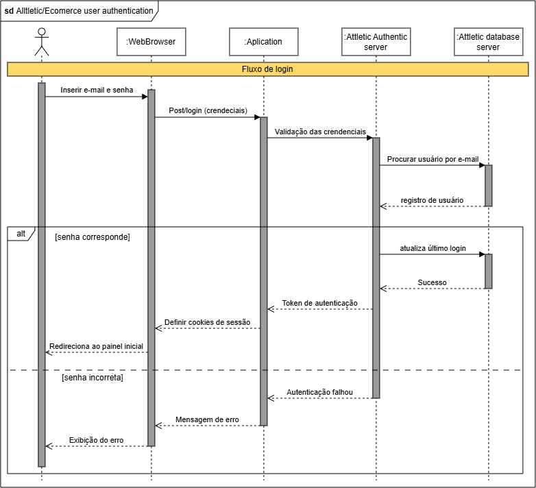

# Modelo Dinâmico - Diagrama de Sequência

> **Nota de rastreabilidade:** adicionar nota de rastreabilidade

## 1. Introdução & Objetivo

Este documento apresenta o módulo de autenticação de usuários desenvolvido para o projeto de e-commerce, com foco nos processos de login, gerenciamento de usuário e segurança da aplicação. O objetivo desta etapa é garantir que o acesso à plataforma ocorra de forma segura e confiável, validando as credenciais fornecidas antes de conceder permissão de uso ao sistema.

A autenticação é um dos pontos mais sensíveis de qualquer aplicação de comércio eletrônico, já que envolve dados pessoais, histórico de compras e informações de pagamento. Falhas nesse módulo comprometem não apenas a conta individual do usuário, mas a credibilidade da plataforma como um todo. Por esse motivo, optou-se por modelar o fluxo de login antes de sua implementação, delimitando com clareza as responsabilidades de cada componente do sistema.

Para representar esse funcionamento, foi elaborado um diagrama de sequência (UML) que ilustra a interação entre os principais atores e componentes envolvidos: o usuário, o navegador (WebBrowser), a aplicação, o servidor de autenticação (Alltletic Authentic Server) e o banco de dados (Alltletic Database Server). O diagrama descreve, passo a passo, desde a inserção de e-mail e senha até a validação das credenciais, contemplando os dois cenários possíveis: sucesso na autenticação e falha por senha incorreta.

## 2. Participação e Rastreabilidade do Artefato

A tabela a seguir detalha a divisão de responsabilidades, o fluxo de co-criação síncrona e a revisão em pares (*peer review*) aplicados exclusivamente para a construção deste artefato e seu relatório.

| Etapa / Tópico do Relatório | Autor(a) Principal | Revisor(a) em Par | Evidência / Commit |
| :--- | :--- | :--- | :---: |
| **Introdução, objetivos e metodologia** | [Nome do Membro] | [Nome do Revisor] | [Commit](https://github.com/...) |
| **Modelagem Síncrona (Diagrama)** | [Membro A] e [Membro B] | [Nome do Revisor] | [Ata/Reunião](https://...) |
| **Embasamento Teórico & Literatura** | [Nome do Membro] | [Nome do Revisor] | [Commit](https://github.com/...) |
| **Uso da IA Generativa & Validação** | [Nome do Membro] | [Nome do Revisor] | [Commit](https://github.com/...) |
| **Lições Aprendidas & Conclusão** | [Nome do Membro] | [Nome do Revisor] | [Commit](https://github.com/...) |

---
## 3. Metodologia

#### 3.1 Abordagem adotada
O desenvolvimento deste módulo seguiu uma abordagem de modelagem prévia à implementação, na qual o comportamento esperado do sistema é documentado por meio da UML (Unified Modeling Language) antes da codificação. Essa estratégia reduz ambiguidades entre os integrantes da equipe e facilita a identificação antecipada de falhas lógicas no fluxo.

#### 3.2 Ferramenta de modelagem

Optou-se pelo diagrama de sequência por ser o artefato mais adequado para representar interações ordenadas no tempo entre objetos distintos. Diferentemente de diagramas estruturais, ele evidencia a ordem cronológica das mensagens trocadas, tornando explícito o momento exato em que cada verificação de segurança ocorre.

#### 3.3 Componentes modelados 

O fluxo foi decomposto em cinco linhas de vida (*lifelines*):

| Componente | Responsabilidade |
|---|---|
| **Usuário** | Ator externo que fornece as credenciais |
| **WebBrowser** | Interface de entrada e armazenamento dos cookies de sessão |
| **Aplication** | Camada intermediária que encaminha a requisição e trata a resposta |
| **Alltletic Authentic Server** | Valida credenciais e emite o token de autenticação |
| **Alltletic Database Server** | Persiste e recupera os registros de usuário |

#### 3.4 Descrição do fluxo 

O processo de autenticação foi modelado nas seguintes etapas:

1. O usuário insere e-mail e senha na interface do navegador;
2. O navegador realiza uma requisição `POST /login` contendo as credenciais para a aplicação;
3. A aplicação encaminha as credenciais ao servidor de autenticação;
4. O servidor consulta o banco de dados buscando o usuário pelo e-mail informado;
5. O banco de dados retorna o registro correspondente;
6. O servidor compara a senha fornecida com a armazenada.

A partir da etapa 6, o diagrama utiliza um **fragmento combinado do tipo `alt`** (alternativa), representando os dois caminhos condicionais:

### Cenário A: `[senha corresponde]`

- O servidor atualiza o campo de último login no banco de dados;
- O banco confirma a operação;
- Um token de autenticação é gerado e enviado à aplicação;
- A aplicação define os cookies de sessão no navegador;
- O usuário é redirecionado ao painel inicial.

### Cenário B: `[senha incorreta]`

- O servidor retorna falha de autenticação à aplicação;
- A aplicação gera uma mensagem de erro genérica;
- O navegador exibe o erro ao usuário, sem revelar se o e-mail existe na base.

#### 2.5 Considerações de segurança incorporadas ao modelo

A modelagem contempla três decisões de projeto voltadas à segurança:

- **Validação centralizada no servidor:** nenhuma verificação de credenciais ocorre no lado do cliente, impedindo que a lógica de autenticação seja manipulada pelo navegador;
- **Uso de token e cookies de sessão:** após a validação bem-sucedida, a sessão é mantida por token, evitando o tráfego repetido de credenciais a cada requisição;
- **Mensagem de erro genérica:** a resposta de falha não diferencia "usuário inexistente" de "senha incorreta", mitigando ataques de enumeração de usuários.

## 4. Modelo UML

### 4.1. Diagrama

O diagrama a seguir detalha o processo de login do usuário no sistema de loja comercial digital, sendo o diagrama produzido o de sequência:

Fonte: Elaborado pelos autores da Subequipe 1: Samuel Felipe Lira de Souza,  e 2026.

**Recurso utilizado:** Mermaid, com refinamento do modelo a partir dos artefatos de **Rich Picture, BPMN, NFR Framework/SIG e Product Backlog**.

## Referências 

- [IBM — Sequence diagrams](https://www.ibm.com/docs/pt-br/rsas/7.5.0?topic=uml-sequence-diagrams)
- [Mermaid — Diagrama de sequência](https://mermaid.ai/app/projects/e2bde411-587f-459c-b0bf-9e6b7432828e/diagrams/33c08db6-f905-4a68-a163-730aac63e207/version/v0.1/edit)

> **Histórico de Versões**
> 
> | Versão | Data | Descrição | Autores | Revisor |
> | :---: | :---: | :--- | :--- | :---: |
> | 0.1 | 16/09/2026 | Criação e Estruturação da página | [Dylan Cavalcante](https://github.com/dylancavalcante) | não revisado |
> | 0.2 | 17/09/2026 | Adição do diagrama do modelo dinâmico | [Samuel Felipe](https://github.com/TerminaKng05) | não revisado |
> | 0.3 | 17/09/2026 | Adição da introdução, metodologia e referências | [Mariana Ribeiro](https://github.com/marianagonzaga0) | não revisado |

