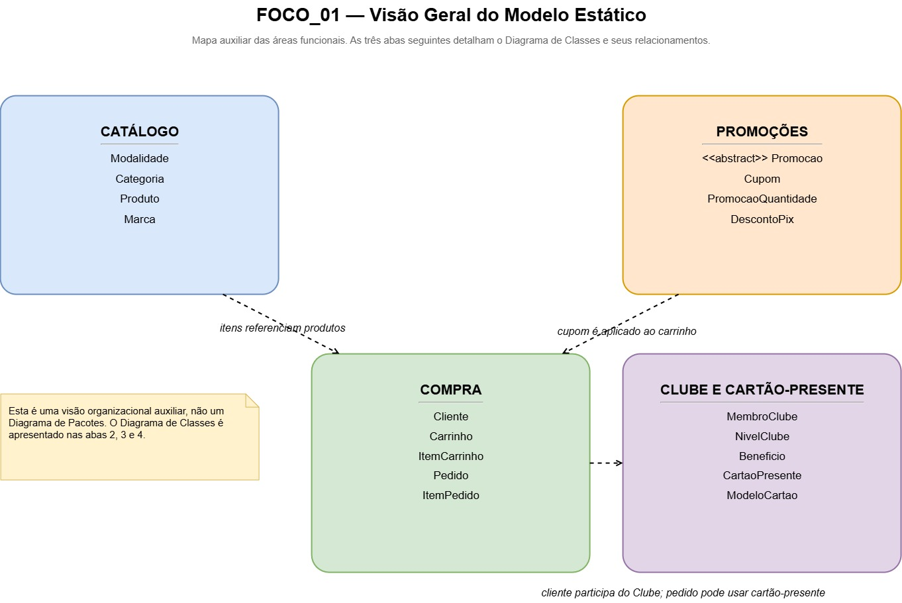
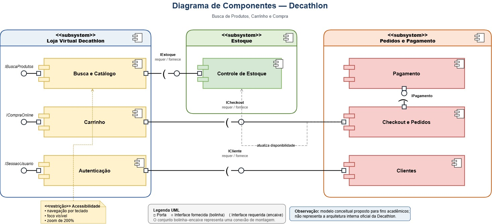

# SubEquipe_02

**Projeto:** comércio eletrônico da Decathlon  
**Escopo:** Fluxo B — Busca de Produtos, Carrinho e Compra  
**Integrantes:** [Diassis Bezerra Nascimento](https://github.com/Diaxiz), [Nayra Silva Nery](https://github.com/NayraNery127) e [Uires Carlos de Oliveira](https://github.com/uires2023).

Este é o relatório da Entrega 2 na estrutura de focos indicada no template da disciplina. **Os três integrantes elaboraram e revisaram em conjunto os quatro diagramas apresentados.** Os três focos e seus artefatos são documentados abaixo.

> **Natureza dos modelos:** são propostas conceituais elaboradas a partir da engenharia reversa. Não representam a arquitetura interna oficial da Decathlon. Regras comerciais específicas devem ser identificadas como observadas, documentadas ou apenas hipotéticas.

## Focos do Relatório

### FOCO_01: Modelagem Estática

**Entrega mínima:** um modelo estático na notação UML. A subequipe escolheu apresentar **Diagrama de Classes e Diagrama de Componentes**, que tratam do mesmo escopo sob perspectivas diferentes.

### Participantes no Foco_01

| Nome do membro | Participação no foco | Evidência |
| :--- | :--- | :--- |
| Diassis Bezerra Nascimento | Elaboração e revisão conjunta dos Diagramas de Classes e de Componentes. | Inserir link de commit ou histórico. |
| Nayra Silva Nery | Elaboração e revisão conjunta dos Diagramas de Classes e de Componentes. | Inserir link de commit ou histórico. |
| Uires Carlos de Oliveira | Elaboração e revisão conjunta dos Diagramas de Classes e de Componentes, incluindo ajustes de portas e interfaces. | Inserir link de commit ou histórico. |

### Metodologia do Foco_01

1. Os três integrantes trabalharam em conjunto na construção e revisão dos dois modelos. A equipe usou os achados do **Rich Picture** e da engenharia reversa da Entrega 1 para delimitar funcionalidades relativas à página inicial, aos produtos, ao carrinho e à compra.
2. O Diagrama de Classes organiza conceitos do domínio, como produto, categoria, promoção, cliente, carrinho e pedido. O Diagrama de Componentes organiza subsistemas conceituais, responsabilidades e interfaces.
3. A notação UML foi confrontada com os materiais da disciplina: relações e multiplicidades no modelo de classes; componentes, portas, interfaces fornecidas e requeridas no modelo de componentes.
4. As observações de acessibilidade registradas no **SIG/NFR da Entrega 1** foram mantidas como preocupação do modelo. Detalhes da arquitetura interna que não podem ser observados foram identificados como conceituais.

**Registro da colaboração:** inserir aqui, se disponíveis, os links de atas, gravações e versões intermediárias que mostrem como cada integrante colaborou neste foco.

### Modelo Estático

#### Diagrama de Classes

O modelo de classes apresenta conceitos ligados ao catálogo e às promoções, à compra e às funcionalidades de clube e cartão-presente. A imagem abaixo corresponde à **aba de visão geral**, que organiza essas áreas e indica onde encontrar os diagramas no arquivo editável.

**Atenção:** a imagem acima é um mapa auxiliar, não o Diagrama de Classes UML. Os diagramas de classes propriamente ditos estão nas **abas 2, 3 e 4** de `Modelo_Estatico_Decathlon.drawio`. Para apresentar esse segundo modelo estático no GitPages, publicar o arquivo editável e inserir também as imagens exportadas dessas abas.

Antes de publicar, conferir as regras específicas registradas no modelo, como validade e quantidade de cartões-presente, e indicar sua fonte ou tratá-las como hipóteses de modelagem.

#### Diagrama de Componentes

O modelo organiza **Loja Virtual Decathlon**, **Estoque** e **Pedidos e Pagamento**, com componentes como Busca e Catálogo, Carrinho, Autenticação, Controle de Estoque, Checkout e Pedidos, Pagamento e Clientes. As portas e interfaces indicam serviços oferecidos ou necessários nas relações entre esses componentes.

**Arquivo editável:** inserir o link para o `.drawio` do Diagrama de Componentes, caso ele seja publicado no repositório.

**Justificativa da dupla modelagem:** Classes detalha entidades e relações do domínio; Componentes apresenta módulos conceituais e suas interfaces. A presença dos dois modelos vai além do mínimo de um diagrama estático.

---

### FOCO_02: Modelagem Dinâmica

**Entrega mínima:** um modelo dinâmico na notação UML. A subequipe escolheu apresentar **Diagrama de Sequência e Diagrama de Atividades**.

### Participantes no Foco_02

| Nome do membro | Participação no foco | Evidência |
| :--- | :--- | :--- |
| Diassis Bezerra Nascimento | Elaboração e revisão conjunta dos Diagramas de Sequência e de Atividades. | Inserir link de commit ou histórico. |
| Nayra Silva Nery | Elaboração e revisão conjunta dos Diagramas de Sequência e de Atividades. | Inserir link de commit ou histórico. |
| Uires Carlos de Oliveira | Elaboração e revisão conjunta dos Diagramas de Sequência e de Atividades, incluindo ajustes de mensagens e caminhos alternativos. | Inserir link de commit ou histórico. |

### Metodologia do Foco_02

1. Os três integrantes construíram e revisaram os modelos dinâmicos em conjunto. O **BPMN da Entrega 1** serviu de referência para identificar tarefas, decisões e caminhos alternativos da busca até a compra.
2. No Diagrama de Sequência foram representadas mensagens entre Cliente, Interface da Loja, Catálogo, Estoque, Carrinho, Checkout e Pedidos e Pagamento. O modelo inclui repetição da visualização de produtos e alternativas de disponibilidade e pagamento.
3. No Diagrama de Atividades foram representadas as ações do usuário e do sistema na **navegação por modalidade**, até a seleção de uma categoria, campanha ou item.
4. Os dois modelos foram analisados conforme sua finalidade e a notação apresentada nos materiais de modelagem dinâmica da disciplina.

**Registro da colaboração:** inserir aqui, se disponíveis, atas, gravações e links de versões dos modelos produzidas pelos integrantes.

### Modelo Dinâmico

#### Diagrama de Sequência — Busca, Carrinho e Compra

O cliente pesquisa um produto; a interface consulta o catálogo e o estoque; o cliente visualiza detalhes e tenta adicionar um item ao carrinho. Havendo disponibilidade, inicia o checkout. O pagamento aprovado conduz à atualização do estoque e à confirmação do pedido; a indisponibilidade do item e a recusa do pagamento são caminhos alternativos.

**Arquivo editável:** inserir o link para o `.drawio` do Diagrama de Sequência, caso ele seja publicado no repositório.

#### Diagrama de Atividades — Navegação por Modalidade

O usuário acessa a página inicial, escolhe uma modalidade esportiva e pode explorar outra modalidade, selecionar uma categoria, abrir uma campanha ou refinar resultados antes de visualizar um item. As raias separam ações do **Usuário** e do **Sistema**.

**Arquivo editável:** inserir o link para o `.drawio` do Diagrama de Atividades, caso ele seja publicado no repositório.

**Delimitação dos cenários:** o Diagrama de Atividades termina na navegação/visualização do item; o Diagrama de Sequência acompanha também carrinho e pagamento. Essa diferença de recorte deve ser explicada na apresentação.

---

### FOCO_03: IA Generativa

**Entrega mínima:** pontos de vista **individuais** de todos os integrantes sobre o uso da IA generativa e as lições aprendidas, com validação e senso crítico.

### Participantes no Foco_03

| Nome do membro | Lições aprendidas | Uso da IA generativa (senso crítico) |
| :--- | :--- | :--- |
| Diassis Bezerra Nascimento | **Preencher pelo integrante:** descrever o que aprendeu com a modelagem estática e dinâmica e com a revisão dos modelos. | **Preencher pelo integrante:** informar quais ferramentas usou, para quê, como validou as respostas e quais erros ou limitações encontrou. |
| Nayra Silva Nery | **Preencher pela integrante:** descrever o que aprendeu ao modelar e avaliar a navegação, os diagramas e a notação UML. | **Preencher pela integrante:** informar como usou a IA, como comparou as sugestões com os artefatos e as fontes da disciplina e o que precisou corrigir. |
| Uires Carlos de Oliveira | Aprendi a distinguir a visão estrutural dos componentes da ordem das mensagens em um Diagrama de Sequência. Também percebi que os elementos UML e as afirmações sobre o funcionamento da loja precisam de conferência com as aulas e com a engenharia reversa. | Usei IA para interpretar as orientações da entrega, criar rascunhos e revisar os Diagramas de Componentes e de Sequência e a documentação. Comparei as sugestões com os slides, os exemplos da professora e os artefatos da Entrega 1. A IA ajudou a organizar o trabalho, mas sugeriu simplificações e estruturas que precisei revisar; ela não conhece a arquitetura interna real da Decathlon. **Revisar este relato antes da publicação.** |

### Metodologia do Foco_03

O apoio da IA foi tratado como **rascunho e revisão**. Para validar uma sugestão, os integrantes devem confrontá-la com a notação UML dos materiais da disciplina, as evidências observadas na engenharia reversa e os demais diagramas do grupo. Cada relato acima deve representar a experiência **do próprio integrante**; ninguém deve publicar um ponto de vista atribuído a outra pessoa sem sua revisão.

### Limitações e Lições Gerais

- A IA pode produzir relações UML imprecisas ou acrescentar regras de negócio que não foram verificadas.
- Diagramas gerados ou revisados com IA exigem leitura humana dos símbolos, dos fluxos alternativos e da legibilidade.
- Os modelos não revelam a implementação interna da Decathlon; sua finalidade é explicar uma proposta conceitual baseada nas observações do grupo.

---

## Versionamentos

Os três integrantes participaram da **elaboração e revisão dos quatro diagramas**. Complementar o registro com as datas, versões e links que comprovem as contribuições de cada pessoa. O relato do Foco 03 continua individual.

| Nome do membro | Contribuição | Data | Comprovação |
| :--- | :--- | :---: | :--- |
| Diassis Bezerra Nascimento | Elaboração e revisão conjunta dos modelos estáticos e dinâmicos; acrescentar sua contribuição individual sobre IA. | Inserir data dos commits | Inserir links dos commits |
| Nayra Silva Nery | Elaboração e revisão conjunta dos modelos estáticos e dinâmicos; acrescentar sua contribuição individual sobre IA. | Inserir data dos commits | Inserir links dos commits |
| Uires Carlos de Oliveira | Elaboração e revisão conjunta dos modelos estáticos e dinâmicos; revisão dos diagramas com apoio de IA e relato individual. | Inserir data dos commits | Inserir links dos commits |

### Quadro de Participações e Commits

| Integrante | Foco 01 — Estático | Foco 02 — Dinâmico | Foco 03 — IA generativa |
| :--- | :--- | :--- | :--- |
| Diassis Bezerra Nascimento | Cocriação e revisão de Classes e Componentes; inserir link | Cocriação e revisão de Sequência e Atividades; inserir link | Inserir relato e link |
| Nayra Silva Nery | Cocriação e revisão de Classes e Componentes; inserir link | Cocriação e revisão de Sequência e Atividades; inserir link | Inserir relato e link |
| Uires Carlos de Oliveira | Cocriação e revisão de Classes e Componentes; inserir link | Cocriação e revisão de Sequência e Atividades; inserir link | Revisar o relato acima e inserir link |

## Referências

1. Materiais da disciplina sobre **Modelagem Estática UML** e **Modelagem Dinâmica UML**. Inserir título, autoria, páginas utilizadas e link disponibilizado pela professora.
2. Subequipe 02. **Artefatos da Entrega 1:** Rich Picture, SIG/NFR de acessibilidade e BPMN de busca, carrinho e compra. Inserir links das páginas do projeto.
3. Acrescentar apenas livros, páginas ou especificações **efetivamente consultados** pelos integrantes para fundamentar decisões de modelagem. Informar autor, título, edição/data e endereço quando aplicável.

## Apresentação

Preparar uma apresentação de aproximadamente **10 minutos**, conforme o template enviado, diretamente pela Wiki ou pelo GitPages. Explicar os modelos, as decisões e os limites da engenharia reversa; mostrar o quadro de participações e os commits; resumir os relatos individuais de IA e a colaboração do grupo. Deixar as imagens dos diagramas disponíveis para consulta durante a apresentação.

--
# Observações: 
Entregável: Relatório, documentado no GitPages, revelando:
## Entrega Mínima (por subgrupo da equipe): um modelo estático na notação UML, um modelo dinâmico na notação UML, e pontos de vista de cada membro da equipe sobre as lições aprendidas e uso da IA Generativa. Mira-se no MM, com a entrega mínima.

## Como ir além, para conseguir menções superiores?
Embasar cada artefato gerado e cada decisão tomada na literatura;
Manter rastros claros para o trabalho em equipe (ex. vídeos das reuniões e atas bem elaboradas), evidenciando práticas metodológicas (ex. reuniões periódicas das metodologias ágeis; checklists; debates, e assim vai);
Usar os vários recursos de modelagem da notação UML, e
Reportar os pontos de vista de forma fundamentada, clara e com senso crítico.

## 📌A ideia não é quantidade, e sim qualidade do que é entregue.

## Apresentação:
Apresentação (para a professora) explicando o artefato elaborado, com: (i) rastro claro aos membros participantes (MOSTRAR QUADRO DE PARTICIPAÇÕES & COMMITS); (ii) justificativas & senso crítico sobre o trabalho realizado, e (iii) comentários gerais sobre o trabalho em equipe. Tempo da Apresentação: +/- 10min. Recomendação: Apresentar diretamente via Wiki ou GitPages do Projeto. Baixar os conteúdos com antecedência, evitando problemas de internet no momento de exposição nas Dinâmicas de Avaliação.

A Wiki ou GitPages do Projeto deve conter, PARA CADA SUBGRUPO, um tópico dedicado ao relatório com a entrega mínima, versionamentos, referências, e demais detalhamentos gerados pela equipe nesse escopo.
Demais orientações disponíveis nas Diretrizes (vide Aprender3).
