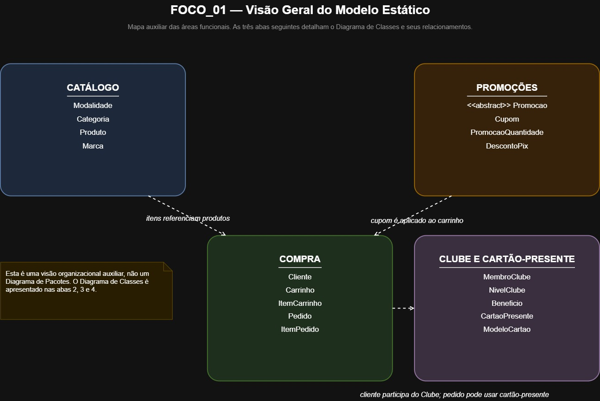
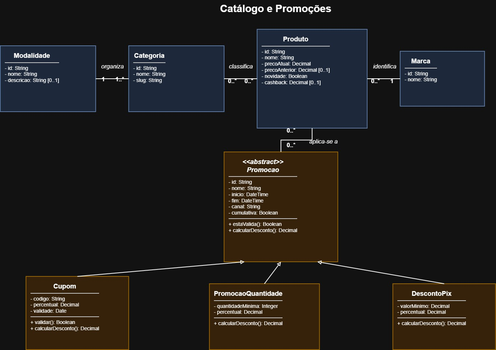
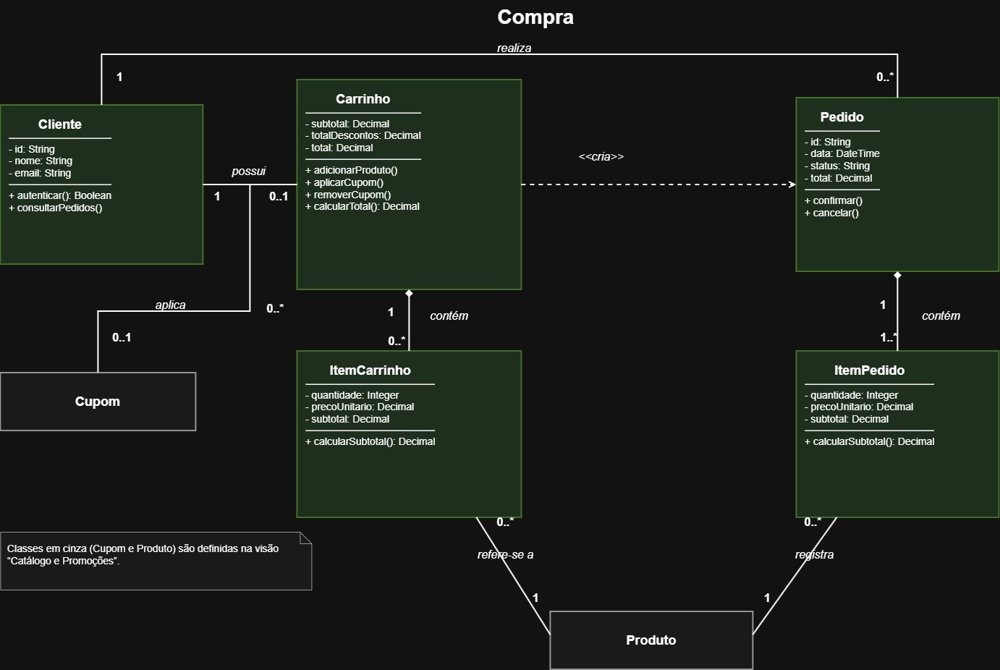
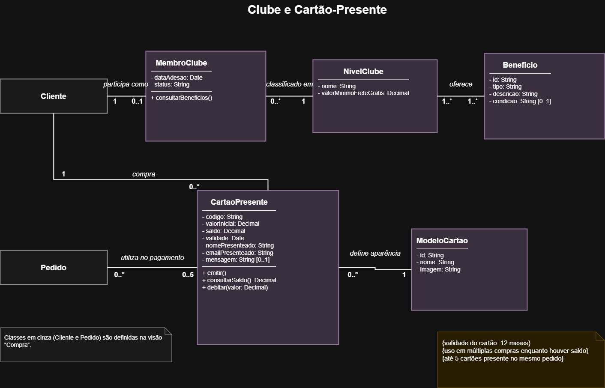

### FOCO_01: Modelagem Estática

### Participantes no Foco_01
| Nome do membro |
|---|
| **Diassis Bezerra Nascimento** |
| **Nayra Silva Nery** |
| **Uires Carlos de Oliveira** |

### Metodologia do Foco_01
O trabalho aplicou engenharia reversa sobre a interface pública da Decathlon. A equipe não teve acesso ao código-fonte, às APIs ou ao banco de dados. O modelo representa uma especificação recuperada do comportamento observável e não afirma que as classes correspondem à implementação interna real da empresa.

A análise ocorreu nas seguintes etapas:

1. Estudo dos slides sobre modelagem UML estática, especialmente a estrutura de classes, visibilidade, tipos, operações, multiplicidades, associação, composição e generalização.
2. Consolidação dos dois relatórios de engenharia reversa. O primeiro descreve os fluxos de navegação por modalidade, categoria e listagem. O segundo descreve promoções, carrinho, Clube Decathlon, novidades e cartão-presente.
3. Identificação dos substantivos relevantes como classes candidatas. Exemplos: `Produto`, `Categoria`, `Carrinho`, `Cupom`, `Cliente` e `CartaoPresente`.
4. Eliminação de elementos específicos da interface. Páginas, banners, botões, telas e carrosséis serviram como evidência, mas não foram mantidos como classes do domínio.
5. Transformação dos comportamentos observados em operações e das informações persistentes em atributos. As regras de negócio ajudaram a definir restrições e multiplicidades.
6. Verificação complementar no site oficial da Decathlon em 16 de setembro de 2026. Essa etapa confirmou regras sobre cupons, níveis do Clube, benefícios e utilização do cartão-presente.

| Artefato | Documento |
|---|---|
| Documento de Engenharia Reversa 01 | [Relatorio_Engenharia_Reversa_Decathlon.pdf](docs/Relatorio_Engenharia_Reversa_Decathlon.pdf ':ignore') |
| Documento de Engenharia Reversa 02 | [engenharia_reversa_decathlon_atualizado.pdf](docs/engenharia_reversa_decathlon_atualizado.pdf ':ignore') |

## Modelo Estático

<b>Figura 1 — Visão Geral do Modelo Estático</b>

<small><em>Fonte: Elaborado por Diassis Bezerra Nascimento com co-participação de Nayra Silva Nery e Uires Carlos de Oliveira, 2026.</em></small>

 

<b>Figura 2 — Catálogo e Promoções</b>

<small><em>Fonte: Elaborado por Diassis Bezerra Nascimento com co-participação de Nayra Silva Nery e Uires Carlos de Oliveira, 2026.</em></small>

 

<b>Figura 3 — Compra</b>

<small><em>Fonte: Elaborado por Diassis Bezerra Nascimento com co-participação de Nayra Silva Nery e Uires Carlos de Oliveira, 2026.</em></small>

 

<b>Figura 4 — Clube e Cartão-Presente</b>

<small><em>Fonte: Elaborado por Diassis Bezerra Nascimento com co-participação de Nayra Silva Nery e Uires Carlos de Oliveira, 2026.</em></small>

O modelo está disponível no arquivo `Modelo_Estatico_Decathlon.drawio`, editável no draw.io/diagrams.net.

Para preservar a legibilidade, o arquivo foi dividido em quatro abas complementares:

- **1 — Visão Geral do Modelo Estático:** mapa organizacional auxiliar, apresentado com containers simples para indicar as áreas funcionais contempladas. Esta aba não é apresentada como um Diagrama de Pacotes.
- **2 — Catálogo e Promoções:** reúne `Modalidade`, `Categoria`, `Produto`, `Marca`, a classe abstrata `Promocao` e suas especializações.
- **3 — Compra:** detalha `Cliente`, `Carrinho`, `ItemCarrinho`, `Pedido`, `ItemPedido` e as referências a `Cupom` e `Produto`.
- **4 — Clube e Cartão-Presente:** detalha `MembroClube`, `NivelClube`, `Beneficio`, `CartaoPresente`, `ModeloCartao` e as referências a `Cliente` e `Pedido`.

As abas 2, 3 e 4 formam, em conjunto, o modelo estático detalhado. Algumas classes são repetidas em cinza apenas pelo nome, para dar contexto local e evitar linhas longas entre as abas. Uma nota identifica em qual visão a classe é definida; nenhum estereótipo adicional nem definição parcial foi criado para essa finalidade.

### Decisões de modelagem

| Decisão | Justificativa |
|---|---|
| Organização em visões complementares | A quantidade de elementos recuperados tornaria um único diagrama pouco legível. A primeira aba funciona apenas como mapa visual das áreas funcionais; as abas 2, 3 e 4 formam o Diagrama de Classes detalhado. |
| Elementos de interface não viraram classes | A engenharia reversa utilizou páginas e componentes visuais para descobrir conceitos em nível mais alto de abstração. O diagrama representa o domínio recuperado. |
| `Modalidade` relaciona-se com uma ou mais `Categoria` | As páginas de Futebol e Natação organizam o catálogo por categorias relacionadas à modalidade selecionada. |
| `Categoria` e `Produto` possuem associação muitos para muitos | O catálogo permite diferentes caminhos de classificação e descoberta. Um produto pode aparecer em mais de um agrupamento do catálogo. |
| Cada `Produto` possui uma `Marca` | As listagens identificam a marca de cada item e permitem navegação ou filtragem por marca. |
| `Promocao` é abstrata | Cupom, promoção por quantidade e desconto no PIX compartilham validade e cálculo de desconto, mas possuem condições próprias. A relação de generalização pode ser lida como “Cupom é uma Promoção”. |
| `Carrinho` compõe `ItemCarrinho` | O item registra quantidade, preço unitário e subtotal dentro de um carrinho específico. Sem o carrinho, esse item deixa de existir no modelo. |
| `Pedido` compõe `ItemPedido` | O pedido precisa manter os itens e os preços confirmados no momento da compra, independentemente de futuras mudanças no catálogo. |
| `Carrinho` aplica no máximo um `Cupom` | A página oficial de cupons informa que as promoções de cupom não são cumulativas. |
| `Cliente` associa-se a `MembroClube` | `MembroClube` foi mantida como classe separada porque possui informações próprias, como data de adesão e status. Cada membro corresponde a um único cliente, enquanto um cliente pode não participar do Clube. |
| `MembroClube` pertence a um `NivelClube` | Player, Performer e Legend são classificações do programa de benefícios. Foram modeladas como valores de nível, não como subclasses. Não foram incluídos critérios de progressão porque essa dinâmica não foi investigada. |
| `NivelClube` relaciona-se com `Beneficio` | Frete grátis, cashback, desconto de aniversário e outros benefícios variam conforme o nível do membro. |
| `NivelClube` contém `valorMinimoFreteGratis` | A interface observada apresentou limites explícitos de R$ 279 para Player, R$ 189 para Performer e R$ 99 para Legend. Campos sobre quantidade de compras, gasto para progressão ou validade de cashback foram removidos por falta de evidência. |
| `CartaoPresente` associa-se a `Pedido` | O cartão pode ser utilizado como pagamento em múltiplas compras. A página oficial informa que um mesmo pedido pode utilizar até cinco cartões-presente. |
| `ModeloCartao` não é parte do pagamento | Ele representa apenas a aparência selecionada durante a criação do cartão e pode ser reutilizado por vários cartões emitidos. |

### Leitura das multiplicidades

| Relação | Leitura |
|---|---|
| `Modalidade 1 — 1..* Categoria` | Uma modalidade organiza uma ou mais categorias; cada categoria pertence a uma modalidade. |
| `Categoria 0..* — 0..* Produto` | Uma categoria pode classificar vários produtos; um produto pode aparecer em vários agrupamentos do catálogo. |
| `Marca 1 — 0..* Produto` | Uma marca pode identificar vários produtos; cada produto possui exatamente uma marca. |
| `Promocao 0..* — 0..* Produto` | Uma promoção pode abranger vários produtos; um produto pode participar de várias promoções ou de nenhuma. |
| `Cliente 1 — 0..1 Carrinho` | Um cliente pode não possuir carrinho ativo ou possuir um único carrinho; cada carrinho pertence a um cliente. |
| `Carrinho 1 ◆— 0..* ItemCarrinho` | Um carrinho contém zero ou muitos itens; cada item pertence a um único carrinho. |
| `Carrinho 0..* — 0..1 Cupom` | Um carrinho aplica no máximo um cupom; um mesmo cupom pode ser aplicado em vários carrinhos. |
| `Cliente 1 — 0..* Pedido` | Um cliente pode realizar vários pedidos; cada pedido pertence a um cliente. |
| `Pedido 1 ◆— 1..* ItemPedido` | Um pedido confirmado contém um ou mais itens; cada item pertence a um único pedido. |
| `ItemCarrinho 0..* — 1 Produto` | Cada item de carrinho referencia exatamente um produto; um produto pode aparecer em vários itens de carrinho. |
| `ItemPedido 0..* — 1 Produto` | Cada item de pedido registra exatamente um produto; um produto pode aparecer em vários itens de pedido. |
| `Cliente 1 — 0..1 MembroClube` | Um cliente pode participar ou não do Clube; cada membro do Clube corresponde a exatamente um cliente. |
| `MembroClube 0..* — 1 NivelClube` | Cada membro possui exatamente um nível; um nível pode classificar vários membros. |
| `NivelClube 1..* — 1..* Beneficio` | Cada nível oferece um ou mais benefícios; um benefício pode fazer parte de um ou mais níveis. |
| `Cliente 1 — 0..* CartaoPresente` | Um cliente pode comprar vários cartões-presente; cada cartão é comprado por um cliente autenticado. |
| `Pedido 0..* — 0..5 CartaoPresente` | Um pedido pode utilizar até cinco cartões; o mesmo cartão pode ser usado em compras diferentes enquanto houver saldo. |
| `ModeloCartao 1 — 0..* CartaoPresente` | Cada cartão-presente utiliza um modelo visual; um modelo pode ser reutilizado por vários cartões. |

As generalizações `Cupom —|> Promocao`, `PromocaoQuantidade —|> Promocao` e `DescontoPix —|> Promocao` não usam multiplicidades. A dependência tracejada `Carrinho ..> Pedido`, identificada por `<<cria>>`, representa a criação do pedido a partir do carrinho e também não recebe multiplicidades.

## Verificação complementar no site oficial

| Evidência observada | Impacto no modelo |
|---|---|
| A página do Clube apresenta Player, Performer e Legend com frete grátis acima de R$ 279, R$ 189 e R$ 99, respectivamente. | Sustenta `MembroClube — NivelClube — Beneficio` e o atributo `valorMinimoFreteGratis`. Não sustenta regras de progressão entre níveis. |
| A política de cupons informa validade, restrição por canal, não cumulatividade e aplicação no checkout. | Sustenta `Promocao`, `Cupom` e a multiplicidade `Carrinho — 0..1 Cupom`. |
| Listagens exibem marca, preço atual, preço anterior, novidade, cashback e desconto no PIX. | Sustenta os atributos de `Produto` e a relação com `Marca` e `Promocao`. |
| O cartão-presente possui validade de 12 meses, saldo consultável e uso em múltiplas compras. | Sustenta os atributos e operações de `CartaoPresente`. |
| A política do cartão-presente permite usar até cinco cartões na mesma compra e complementar o valor com outra forma de pagamento. | Sustenta a associação entre `Pedido` e `CartaoPresente` sem afirmar que o cartão é a única forma de pagamento. |

Páginas consultadas:

- [Clube Decathlon](https://www.decathlon.com.br/clube)
- [Cupons de desconto](https://www.decathlon.com.br/servicos/cupom-de-desconto)
- [Cartão Presente](https://www.decathlon.com.br/cartao-presente)
- [Regras do Cartão Presente](https://www.decathlon.com.br/servicos/cartao-presente)
- [Futebol](https://www.decathlon.com.br/esportes/Futebol)
- [Futebol Society](https://www.decathlon.com.br/esportes/society)

## Rastreabilidade dos materiais fornecidos

- Slides da professora: definição de diagrama de classes, estrutura das classes e notações de relacionamento, especialmente páginas 10 a 40.
- Relatório da homepage: hierarquia de modalidade, categoria e listagem, além de requisitos navegacionais e filtros, especialmente páginas 12 a 27.
- Relatório de funcionalidades extras: promoções, cupons, carrinho, Clube Decathlon, novidades, autenticação e cartão-presente, páginas 1 a 22.

## Limitações

- O diagrama representa classes candidatas inferidas da interface, dos fluxos e das regras documentadas.
- A ausência de acesso à implementação impede confirmar nomes internos, tipos exatos e estruturas de persistência.
- Acessibilidade e responsividade permanecem como requisitos não funcionais transversais, não como classes.
- Operações aparecem somente quando existe comportamento observável que as sustente.
- Não foram criadas interfaces técnicas, repositórios, serviços ou componentes de infraestrutura sem evidência observável.

## Versionamentos

| Versão | Nome do Membro | Contribuição | Revisor(a) | Data |
| :---: | :--- | :--- | :--- | :---: |
| 1.0 | Diassis Bezerra Nascimento | Criação do Diagrama de Classes (Modelo Estático) e documentação associada | Nayra Silva Nery | 17/09/2026 |
