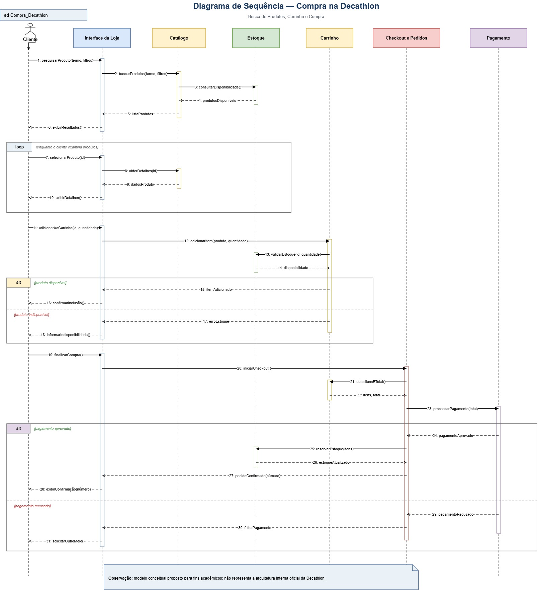

# Modelo Dinâmico — Diagramas de Sequência e de Atividades — Subequipe 02

> **Nota de rastreabilidade:** os modelos dinâmicos retomam a Engenharia Reversa da Entrega 1, especificamente o **Fluxo de Navegação B — Busca de Produtos, Carrinho e Compra**. O BPMN de busca, carrinho e compra orientou a identificação das ações e alternativas do Diagrama de Sequência; a observação da navegação da loja orientou o Diagrama de Atividades. Esses modelos são **propostas conceituais acadêmicas** e não representam a implementação interna oficial da Decathlon. Documentação da Entrega 1 da Subequipe 02: [2026.2-T02-_G1_ProjetoComercioEletronico_Entrega_01](https://github.com/UnBArqDsw2026-2-Turma02/2026.2-T02-_G1_ProjetoComercioEletronico_Entrega_01).

| Artefato | Documento |
|---|---|
| Documento de Engenharia Reversa 01 | [Relatorio_Engenharia_Reversa_Decathlon.pdf](modulo-2/subequipe-02/docs/Relatorio_Engenharia_Reversa_Decathlon.pdf ':ignore') |
| Documento de Engenharia Reversa 02 | [engenharia_reversa_decathlon_atualizado.pdf](modulo-2/subequipe-02/docs/engenharia_reversa_decathlon_atualizado.pdf ':ignore') |

## 1. Introdução & Objetivo

A modelagem dinâmica mostra o comportamento de um sistema: a ordem das interações entre participantes e os caminhos que podem ser percorridos durante uma tarefa. Diferente da modelagem estática, que descreve a estrutura, aqui o foco está na sequência temporal das mensagens e nas decisões que alteram o fluxo de navegação e de compra.

Para o Fluxo de Navegação B, identificado durante a Engenharia Reversa da plataforma Decathlon, a Subequipe 02 preparou dois modelos UML complementares. Como não houve acesso ao código-fonte, ao banco de dados, às APIs ou à documentação interna da plataforma, os modelos representam comportamentos observados e uma proposta conceitual das interações envolvidas, sem afirmar que correspondem à implementação interna real da Decathlon.

- **Diagrama de Sequência — Compra na Decathlon:** acompanha a comunicação entre cliente, interface e serviços conceituais durante a busca e a compra.
- **Diagrama de Atividades — Navegação por Modalidade:** acompanha a navegação por modalidade esportiva, da página inicial à visualização de um item ou conteúdo.

O objetivo é representar, em notação UML, como o usuário navega pelos produtos e como os participantes conceituais da loja interagem durante a busca, a inclusão no carrinho, o checkout e a resposta do pagamento — permitindo examinar decisões, repetições e responsabilidades, e comparar o resultado com os artefatos de Engenharia Reversa da Entrega 1.

Os dois modelos têm recortes de escopo diferentes e complementares: o **Diagrama de Atividades** termina na navegação e na visualização de um item ou conteúdo; o **Diagrama de Sequência** estende o recorte até o carrinho e o pagamento. Por isso, eles não precisam — nem devem — representar exatamente as mesmas etapas.

Os dois modelos foram elaborados e revisados em conjunto por [Diassis Bezerra Nascimento](https://github.com/Diaxiz), [Nayra Silva Nery](https://github.com/NayraNery127) e [Uires Carlos de Oliveira](https://github.com/uires2023), com revisão recíproca entre os três integrantes.

---

## 2. Metodologia

O desenvolvimento do Foco 02 foi realizado a partir da análise do comportamento observável da plataforma Decathlon e dos fluxos identificados durante o processo de Engenharia Reversa, nas seguintes etapas:

1. Análise dos fluxos identificados durante a Engenharia Reversa.
2. Identificação de comportamentos relevantes para representação dinâmica.
3. Escolha de dois recortes complementares: **navegação por modalidade** (Diagrama de Atividades) e **busca de produtos, carrinho e compra** (Diagrama de Sequência).
4. Identificação das ações realizadas pelo usuário e das respostas apresentadas pelo sistema.
5. Identificação dos participantes envolvidos nas interações de busca, consulta de disponibilidade, carrinho, checkout e pagamento.
6. Identificação dos pontos de decisão e caminhos alternativos existentes nos fluxos.
7. Organização das atividades, mensagens e respostas em uma sequência coerente.
8. Construção dos modelos utilizando a notação UML no [diagrams.net (draw.io)](https://app.diagrams.net/), com apoio dos materiais da disciplina e dos artefatos produzidos na Entrega 1.

Os dois diagramas apresentam perspectivas complementares do comportamento do sistema: o Diagrama de Atividades enfatiza o fluxo de navegação e as decisões realizadas pelo usuário, enquanto o Diagrama de Sequência evidencia a ordem das interações entre os participantes envolvidos durante o processo de busca e compra.

A revisão dos dois modelos foi recíproca entre os três integrantes.

---

## 3. Participação e Rastreabilidade do Artefato

A tabela a seguir detalha a divisão de responsabilidades, o fluxo de co-criação síncrona e a revisão em pares (*peer review*) aplicados exclusivamente para a construção deste artefato e seu relatório.

| Etapa / Tópico do Relatório | Autor(a) Principal | Revisor(a) em Par | Evidência / Commit |
| :--- | :--- | :--- | :---: |
| **Introdução, objetivo e metodologia** (fusão das duas versões do documento) | Diassis Bezerra Nascimento | | [PR #29](https://github.com/UnBArqDsw2026-2-Turma02/2026.2-T02-_G1_ProjetoComercioEletr-nico_Entrega02/pull/29) |
| **Diagrama de Atividades — Navegação por Modalidade** (revisão e mesclagem do texto entre as duas versões do documento; os diagramas não foram elaborados por Diassis) | Diassis Bezerra Nascimento | | [PR #29](https://github.com/UnBArqDsw2026-2-Turma02/2026.2-T02-_G1_ProjetoComercioEletr-nico_Entrega02/pull/29) |
| **Diagrama de Sequência — Compra na Decathlon** (revisão do texto, correção dos links para o arquivo `.drawio` já existente e identificação do ponto de atenção sobre `finalizarCompra()`; o diagrama não foi elaborado por Diassis) | Diassis Bezerra Nascimento | | [PR #29](https://github.com/UnBArqDsw2026-2-Turma02/2026.2-T02-_G1_ProjetoComercioEletr-nico_Entrega02/pull/29) |
| **Relação entre os modelos, relação com a Engenharia Reversa e Embasamento Teórico** | Diassis Bezerra Nascimento | | [PR #29](https://github.com/UnBArqDsw2026-2-Turma02/2026.2-T02-_G1_ProjetoComercioEletr-nico_Entrega02/pull/29) |
| **Limitações, Referências e organização geral do documento** (reorganização das seções e correção dos links do site) | Diassis Bezerra Nascimento | | [PR #29](https://github.com/UnBArqDsw2026-2-Turma02/2026.2-T02-_G1_ProjetoComercioEletr-nico_Entrega02/pull/29) |
| **Elaboração do Diagrama de Sequência — Compra na Decathlon** | Uires Carlos de Oliveira, Diassis Bezerra Nascimento e Nayra Silva Nery (trabalho conjunto) | Revisão mútua entre Uires, Diassis e Nayra | Inserir link do commit do diagrama |
| **Elaboração do Diagrama de Atividades — Navegação por Modalidade** | Uires Carlos de Oliveira, Diassis Bezerra Nascimento e Nayra Silva Nery (trabalho conjunto) | Revisão mútua entre Uires, Diassis e Nayra | Inserir link do commit do diagrama |
| **Conferência da coerência entre diagramas e texto do Foco 02** | Uires Carlos de Oliveira e Nayra Silva Nery | Diassis Bezerra Nascimento (revisão do texto) | [PR #29](https://github.com/UnBArqDsw2026-2-Turma02/2026.2-T02-_G1_ProjetoComercioEletr-nico_Entrega02/pull/29) |
| **Publicação da página do Foco 02 no GitHub Pages** | [Uires Carlos de Oliveira](https://github.com/uires2023) | A confirmar | Captura dos deployments `foco02` na `main`; inserir link direto do deployment |

A autoria e as evidências de revisão/commit deverão ser atualizadas pela equipe após a execução efetiva das atividades de co-criação e *peer review*.

---

## 4. Modelos UML

### 4.1. Diagrama de Atividades — Navegação por Modalidade

O Diagrama de Atividades representa a interação entre o usuário e o sistema durante a navegação pelas modalidades esportivas disponíveis na plataforma Decathlon. O modelo foi organizado em duas partições (raias):

- **Usuário:** ações realizadas diretamente pela pessoa que utiliza a plataforma;
- **Sistema:** respostas apresentadas pela aplicação após as ações realizadas pelo usuário.

**Leitura do fluxo:**

1. O usuário acessa a página inicial; o sistema apresenta a página e a seção destinada à descoberta de modalidades esportivas.
2. Após selecionar uma modalidade, o sistema apresenta a página temática correspondente, com atalhos, categorias, campanhas e conteúdos relacionados.
3. Durante a navegação, o usuário pode optar por acessar outra modalidade esportiva; nesse caso, o sistema apresenta uma nova página temática e disponibiliza novamente os conteúdos relacionados.
4. Ao continuar o fluxo, o usuário escolhe entre acessar uma **categoria** ou uma **campanha/conteúdo relacionado**.
5. Quando uma categoria é selecionada, o sistema apresenta a listagem correspondente e disponibiliza filtros e opções de ordenação quando aplicáveis. O usuário decide se deseja refinar os resultados antes de selecionar um item; após a seleção, o sistema apresenta a página do item, encerrando o fluxo representado.
6. No caminho relacionado a campanhas ou conteúdos, o sistema apresenta diretamente a campanha ou o conteúdo selecionado.

<b>Figura 1 — Diagrama de Atividades da Navegação por Modalidade</b>

<small><em>Autores: Nayra Silva Nery, Diassis Bezerra Nascimento e Uires Carlos de Oliveira.</em></small>

<small><em>Fonte: Elaborado pelos autores, 2026.</em></small>

 

**Decisões de Modelagem:**

| Decisão | Justificativa |
|---|---|
| Utilização de um Diagrama de Atividades | Permite representar a sequência das atividades e os diferentes caminhos existentes durante a navegação. |
| Separação entre Usuário e Sistema | As partições permitem identificar quais atividades são realizadas pelo usuário e quais correspondem às respostas do sistema. |
| Navegação por modalidade como fluxo principal | Esse fluxo representa parte relevante do processo de descoberta de produtos e conteúdos na plataforma. |
| Possibilidade de selecionar outra modalidade | O usuário pode continuar explorando outros esportes sem necessariamente encerrar o fluxo. |
| Separação entre categoria e campanha/conteúdo | A página temática oferece diferentes caminhos de navegação. |
| Filtros e ordenação como atividade opcional | O usuário pode selecionar um item diretamente ou refinar os resultados antes da seleção. |
| Utilização de decisões e caminhos alternativos | A navegação não ocorre de forma estritamente linear e depende das escolhas realizadas durante a interação. |

> **Resumo do fluxo principal:** Página inicial → modalidade → página temática → categoria → listagem → filtros/ordenação → seleção do item → página do item.

Além do fluxo principal, o diagrama representa caminhos alternativos, como a troca de modalidade, o acesso direto a campanhas ou conteúdos relacionados e a decisão de utilizar ou não filtros e opções de ordenação.

Este diagrama não possui um arquivo `.drawio` fonte publicado.

### 4.2. Diagrama de Sequência — Compra na Decathlon

O Diagrama de Sequência representa uma visão temporal das interações envolvidas no processo de busca de produtos, consulta de disponibilidade, inclusão no carrinho, checkout e pagamento. O modelo apresenta os seguintes participantes:

- **Cliente:** inicia as principais ações do fluxo;
- **Interface da Loja:** recebe as interações realizadas pelo cliente;
- **Catálogo:** representa conceitualmente a recuperação das informações dos produtos;
- **Estoque:** participa da consulta e validação da disponibilidade;
- **Carrinho:** representa os produtos selecionados para compra;
- **Checkout e Pedidos:** representa a etapa de finalização e criação do pedido;
- **Pagamento:** representa o processamento do pagamento.

**Leitura do fluxo:**

1. O cliente pesquisa produtos utilizando um termo e possíveis filtros; a Interface da Loja encaminha a solicitação ao Catálogo, que consulta a disponibilidade junto ao Estoque (mensagem `validarEstoque`) e retorna a disponibilidade (mensagem de retorno `disponibilidade`) e a lista de produtos.
2. O cliente pode repetir a seleção e a consulta de detalhes de produtos — representada pelo fragmento **`loop`** — antes de escolher um item.
3. Ao tentar adicionar um produto ao carrinho, o Carrinho consulta novamente o Estoque. O primeiro fragmento **`alt`** apresenta os dois resultados possíveis: **produto disponível** (o item é incluído e o cliente recebe a confirmação) e **produto indisponível** (o sistema informa a indisponibilidade e impede a inclusão válida daquele item).
4. Após possuir itens disponíveis no carrinho, o cliente inicia a finalização da compra. A Interface da Loja solicita o início do checkout, e o participante de Checkout e Pedidos obtém do Carrinho as informações necessárias para continuar o processo; em seguida, o pagamento é solicitado.
5. O segundo fragmento **`alt`** distingue os resultados do pagamento: se **aprovado**, o checkout solicita a atualização de estoque e retorna a confirmação do pedido; se **recusado**, a falha é informada ao cliente, que pode tentar novamente com outra forma de pagamento.

> **Ponto de atenção para revisão do desenho:** no diagrama produzido, `finalizarCompra()` aparece desenhado após o bloco que também contém o resultado **produto indisponível**. Na leitura deste relatório, o checkout pressupõe um carrinho com pelo menos um item válido — mas, para que essa condição fique inequívoca no próprio desenho (e não apenas no texto), recomenda-se acrescentar uma guarda como **`[carrinho com item disponível]`** antes do checkout, evitando que o caminho de indisponibilidade pareça levar diretamente ao pagamento. Este ponto ainda precisa ser conferido/corrigido na imagem publicada.

<b>Figura 2 — Diagrama de Sequência da Compra na Decathlon</b>

<small><em>Autores: Nayra Silva Nery, Diassis Bezerra Nascimento e Uires Carlos de Oliveira.</em></small>

<small><em>Fonte: Elaborado pelos autores, 2026.</em></small>

 

**Decisões de Modelagem:**

| Decisão | Justificativa |
|---|---|
| Utilização de um Diagrama de Sequência | Permite representar a ordem temporal das interações realizadas durante o processo de busca e compra. |
| Cliente como ator inicial | As principais ações do fluxo são iniciadas pela interação do cliente com a plataforma. |
| Interface da Loja como intermediária | As ações do cliente são recebidas pela interface antes de serem encaminhadas aos demais participantes conceituais. |
| Separação entre Catálogo e Estoque | A consulta das informações do produto e a verificação de disponibilidade representam responsabilidades diferentes dentro do fluxo conceitual. |
| Utilização de `loop` na seleção dos produtos | O cliente pode visualizar diferentes produtos antes de escolher aquele que deseja adicionar ao carrinho. |
| Utilização de `alt` para disponibilidade | A tentativa de inclusão no carrinho produz resultados diferentes conforme a disponibilidade do produto. |
| Separação entre Carrinho e Checkout | O carrinho representa os itens selecionados, enquanto o checkout representa a etapa posterior de finalização da compra. |
| Utilização de `alt` no pagamento | O processamento pode resultar em aprovação ou recusa, gerando caminhos distintos no fluxo. |
| Confirmação do pedido após aprovação | O pedido somente é considerado confirmado após a conclusão bem-sucedida da etapa de pagamento representada no modelo. |

> **Resumo do fluxo principal:** Pesquisa → consulta ao catálogo → verificação de disponibilidade → apresentação dos resultados → seleção do produto → inclusão no carrinho → validação de disponibilidade → checkout → pagamento → confirmação do pedido.

O diagrama também representa caminhos alternativos: caso o produto esteja indisponível, o sistema informa a indisponibilidade ao cliente; durante o pagamento, uma aprovação permite a continuidade para a confirmação do pedido, enquanto uma recusa informa a falha e possibilita uma nova tentativa.

Os participantes apresentados representam uma **proposta conceitual para fins acadêmicos**, construída a partir dos fluxos analisados pela equipe, e não devem ser interpretados como componentes internos comprovados da arquitetura real da Decathlon.

**Arquivo editável:** [Diagrama_sequencia_subequipe2.drawio](modulo-2/subequipe-02/docs/Diagrama_sequencia_subequipe2.drawio ':ignore').

### 4.3. Elementos e Recursos da Notação Utilizados

| Diagrama | Elemento UML | Aplicação nos modelos |
| :--- | :--- | :--- |
| Sequência | Ator, linhas de vida e ativações | Identificam o cliente e os participantes conceituais e indicam quando recebem ou executam uma interação. |
| Sequência | Mensagens e retornos | Setas contínuas apresentam solicitações, como `validarEstoque`; setas tracejadas apresentam respostas, como `disponibilidade`. |
| Sequência | Fragmento `loop` | Representa a repetição da seleção e visualização de produtos. |
| Sequência | Fragmentos `alt` | Separam os resultados da disponibilidade do produto e da aprovação ou recusa do pagamento. |
| Atividades | Raias (*partições de atividade*) | Distribuem as ações entre **Usuário** e **Sistema**. |
| Atividades | Nó inicial, ações e nó final | Delimitam o começo, as ações da navegação e o encerramento do percurso modelado. |
| Atividades | Decisões, condições e junções | Representam a troca de modalidade, a escolha entre categoria e campanha e a opção de refinar resultados. |

---

## 5. Relação entre os Modelos

Os dois diagramas representam aspectos diferentes e complementares da Modelagem Dinâmica. O **Diagrama de Atividades** concentra-se nas ações, decisões e caminhos existentes durante a navegação do usuário. O **Diagrama de Sequência** concentra-se na ordem das interações realizadas entre os participantes conceituais envolvidos durante o processo de busca e compra.

| Diagrama | Principal aspecto representado |
|---|---|
| Diagrama de Atividades | Fluxo de atividades, decisões e caminhos alternativos. |
| Diagrama de Sequência | Ordem temporal das mensagens e interações entre participantes. |

---

## 6. Relação com a Engenharia Reversa

Os modelos dinâmicos foram construídos a partir dos fluxos identificados durante a Engenharia Reversa da plataforma Decathlon na Entrega 1. Elementos observados na interface — página inicial, modalidades, categorias, listagens, produtos, filtros, carrinho e etapas de compra — serviram como evidência para identificar comportamentos relevantes: as tarefas de busca, carrinho e compra do BPMN da Entrega 1 orientam as mensagens do Diagrama de Sequência; as opções de modalidades e produtos observadas na interface orientam as ações do Diagrama de Atividades.

A Modelagem Dinâmica concentra-se na sequência das ações e nas mudanças de comportamento decorrentes das decisões realizadas durante a interação. Os modelos apresentados não buscam reproduzir a implementação interna da Decathlon; seu objetivo é representar, em um nível de abstração compatível com a UML, comportamentos identificados durante a análise acadêmica da plataforma.

---

## 7. Embasamento Teórico

A especificação da [UML 2.5.1 publicada pela Object Management Group (OMG)](https://www.omg.org/spec/UML/2.5.1/) é a referência utilizada para interpretar os elementos de interações e de atividades empregados nos dois modelos. Os exemplos e slides da disciplina **Desenho de Software** orientaram a escolha dos diagramas e da notação. As decisões descritas nas seções 4.1 e 4.2 refletem o **modelo elaborado pela subequipe**, sem atribuir à Decathlon uma implementação interna não observada.

---

## 8. Limitações

- Os modelos foram construídos a partir do comportamento externamente observável da plataforma Decathlon.
- Não houve acesso ao código-fonte, banco de dados, APIs ou documentação técnica interna.
- Os participantes representados no Diagrama de Sequência são elementos conceituais utilizados para organizar as responsabilidades do fluxo e não componentes internos comprovados da arquitetura da Decathlon.
- O Diagrama de Atividades representa especificamente a navegação por modalidade e não todos os fluxos existentes na plataforma.
- O Diagrama de Sequência apresenta um recorte relacionado à busca, carrinho e compra e não pretende representar todas as situações possíveis durante uma compra real.
- O conteúdo e o comportamento da plataforma podem variar conforme modalidade, categoria, produto, disponibilidade, campanha ou condições comerciais.
- Aspectos de infraestrutura, persistência de dados e implementação interna não foram representados por não serem verificáveis apenas pela observação da interface.
- O ponto de atenção sobre `finalizarCompra()` (seção 4.2) ainda não foi corrigido na imagem publicada dos diagramas.

---

## 9. Referências

1. OBJECT MANAGEMENT GROUP (OMG). [*OMG Unified Modeling Language (OMG UML), Version 2.5.1*](https://www.omg.org/spec/UML/2.5.1/). 2017.
2. UnB FCTE — ArqDSW. [*Módulo — Modelagem*](https://sites.google.com/view/unb-fcte-arqdsw/m%C3%B3dulos/m%C3%B3dulo-modelagem?authuser=0), slides da disciplina Desenho de Software sobre modelagem dinâmica UML.
3. Subequipe 02. [*Artefatos da Entrega 1: Engenharia Reversa e BPMN do Fluxo B*](https://github.com/UnBArqDsw2026-2-Turma02/2026.2-T02-_G1_ProjetoComercioEletronico_Entrega_01).

---

## Versionamentos

| Versão | Nome do Membro | Contribuição | Revisor(a) | Data |
| :---: | :--- | :--- | :--- | :---: |
| 1.0 | Diassis Bezerra Nascimento | Criação da página base do Foco 02 | Uires Carlos de Oliveira | 17/09/2026 |
| 1.1 | Nayra Silva Nery | Desenvolvimento e documentação da Modelagem Dinâmica de Navegação por Modalidade: inserção do Diagrama de Atividades UML, definição das partições de Usuário e Sistema, decisões de modelagem, leitura do fluxo e limitações | Diassis Bezerra Nascimento | 17/09/2026 |
| 1.2 | Uires Carlos de Oliveira | Inclusão e documentação do Diagrama de Sequência da Compra na Decathlon: busca, disponibilidade, carrinho, checkout, pagamento, decisões de modelagem e leitura do fluxo | Nayra Silva Nery | 18/09/2026 |
| 1.3 | Uires Carlos de Oliveira | Rascunho paralelo com tabela de elementos de notação UML, embasamento teórico (UML 2.5.1 da OMG) e identificação de um ponto de revisão no Diagrama de Sequência (`finalizarCompra()`) | Diassis Bezerra Nascimento | 18/09/2026 |
| 1.4 | Diassis Bezerra Nascimento | Fusão das duas versões do documento: consolidação do texto, remoção da seção de rastreabilidade por etapa, inserção dos links reais (Entrega 1, slides, arquivo `.drawio` da Sequência) e reorganização da numeração das seções | Claude | 18/09/2026 |
| 1.5 | Diassis Bezerra Nascimento | Reinclusão da seção "Participação e Rastreabilidade do Artefato", com tabela de divisão de responsabilidades por etapa do relatório, e reorganização da numeração das seções seguintes | Claude | 18/09/2026 |
| 1.6 | Diassis Bezerra Nascimento | Ajuste da tabela "Participação e Rastreabilidade do Artefato" para explicitar que os Diagramas de Atividades e de Sequência não foram elaborados por Diassis, cuja participação se limitou à revisão, mesclagem e identificação de erros | Claude | 18/09/2026 |
