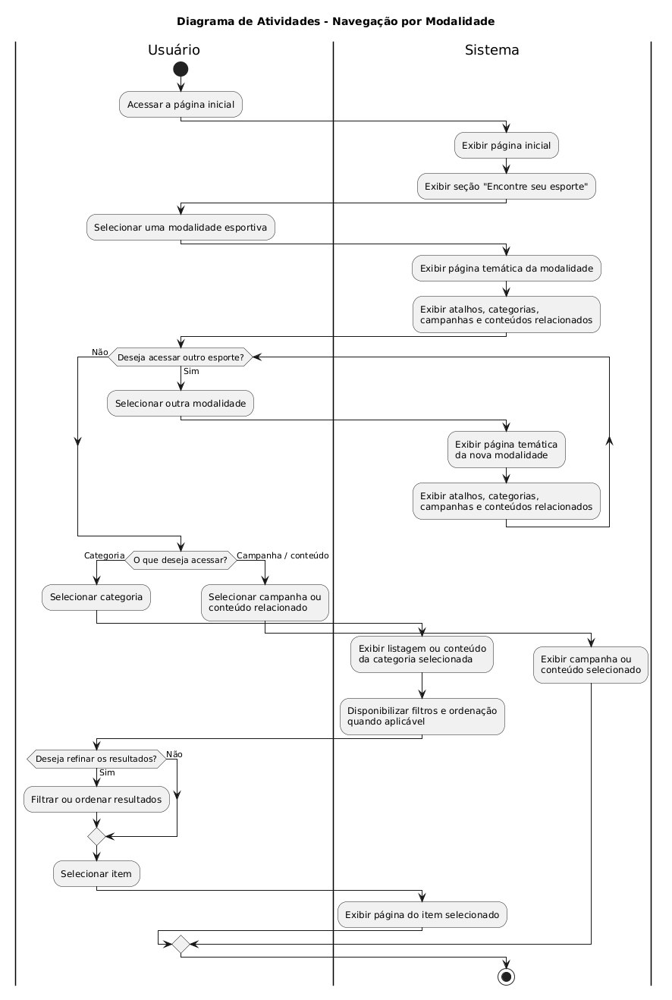
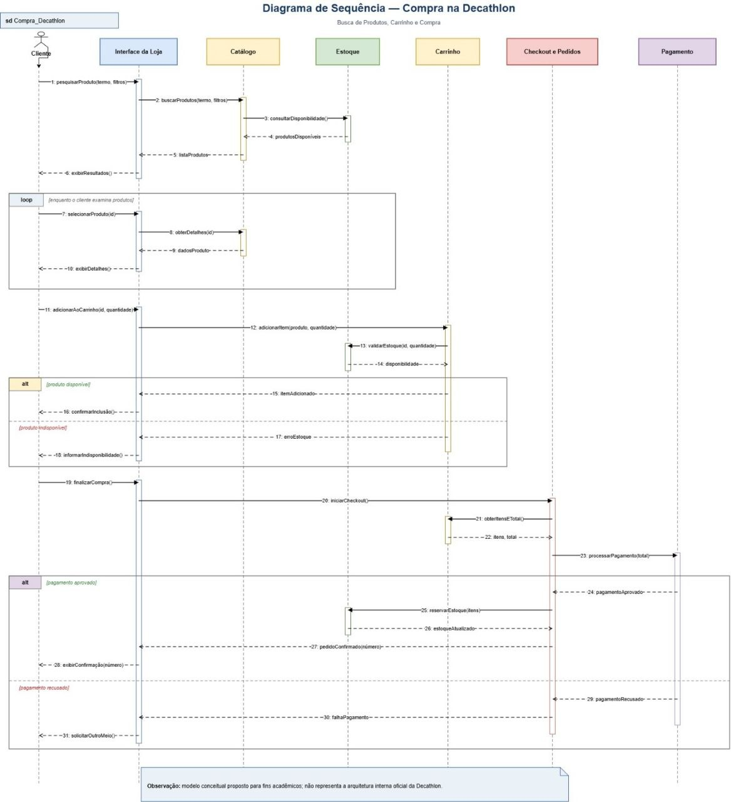

### FOCO_02: Modelagem Dinâmica

Entrega Mínima: um modelo dinâmico, na notação UML.

### Participantes no Foco_02

| Nome do Membro |
|---|
| **Diassis Bezerra Nascimento** |
| **Nayra Silva Nery** |
| **Uires Carlos de Oliveira** |

### Metodologia do Foco_02

O desenvolvimento do Foco 02 foi realizado a partir da análise do comportamento observável da plataforma Decathlon e dos fluxos identificados durante o processo de Engenharia Reversa.

Como não houve acesso ao código-fonte, banco de dados, APIs ou documentação interna da plataforma, os modelos representam comportamentos observados e uma proposta conceitual das interações envolvidas, sem afirmar que correspondem à implementação interna real da Decathlon.

A construção da Modelagem Dinâmica ocorreu nas seguintes etapas:

1. Análise dos fluxos identificados durante a Engenharia Reversa.

2. Identificação de comportamentos relevantes para representação dinâmica.

3. Escolha de dois recortes complementares:
   - **navegação por modalidade**, representada por um Diagrama de Atividades;
   - **busca de produtos, carrinho e compra**, representada por um Diagrama de Sequência.

4. Identificação das ações realizadas pelo usuário e das respostas apresentadas pelo sistema.

5. Identificação dos participantes envolvidos nas interações de busca, consulta de disponibilidade, carrinho, checkout e pagamento.

6. Identificação dos pontos de decisão e caminhos alternativos existentes nos fluxos.

7. Organização das atividades, mensagens e respostas em uma sequência coerente.

8. Construção dos modelos utilizando a notação UML.

Os dois diagramas apresentam perspectivas complementares do comportamento do sistema. O Diagrama de Atividades enfatiza o fluxo de navegação e as decisões realizadas pelo usuário, enquanto o Diagrama de Sequência evidencia a ordem das interações entre os participantes envolvidos durante o processo de busca e compra.

---

### Modelo Dinâmico

A Modelagem Dinâmica da Subequipe 02 foi representada por meio de dois modelos UML:

- **Diagrama de Atividades — Navegação por Modalidade**;
- **Diagrama de Sequência — Compra na Decathlon**.

Os modelos possuem objetivos diferentes e complementares. O primeiro representa atividades, decisões e caminhos alternativos de navegação. O segundo apresenta a sequência temporal das mensagens trocadas entre os participantes envolvidos durante a busca, seleção, inclusão no carrinho e finalização da compra.

---

### 1. Diagrama de Atividades — Navegação por Modalidade

O Diagrama de Atividades representa a interação entre o usuário e o sistema durante a navegação pelas modalidades esportivas disponíveis na plataforma Decathlon.

O modelo foi organizado em duas partições:

- **Usuário:** representa as ações realizadas diretamente pela pessoa que utiliza a plataforma;
- **Sistema:** representa as respostas apresentadas pela aplicação após as ações realizadas pelo usuário.

O fluxo tem início quando o usuário acessa a página inicial. Em seguida, o sistema apresenta a página e disponibiliza a seção destinada à descoberta de modalidades esportivas.

Após selecionar uma modalidade, o sistema apresenta a página temática correspondente, contendo atalhos, categorias, campanhas e conteúdos relacionados.

Durante a navegação, o usuário pode optar por acessar outra modalidade esportiva. Nesse caso, o sistema apresenta uma nova página temática e disponibiliza novamente os conteúdos relacionados.

Ao continuar o fluxo, o usuário pode escolher entre acessar uma **categoria** ou uma **campanha/conteúdo relacionado**.

Quando uma categoria é selecionada, o sistema apresenta a listagem correspondente e disponibiliza filtros e opções de ordenação quando aplicáveis.

O usuário pode decidir se deseja refinar os resultados. Caso escolha realizar o refinamento, pode aplicar filtros ou alterar a ordenação antes de selecionar um item. Caso contrário, pode avançar diretamente para a seleção.

Após a seleção de um item, o sistema apresenta sua página correspondente, encerrando o fluxo representado.

No caminho relacionado a campanhas ou conteúdos, o sistema apresenta diretamente a campanha ou conteúdo selecionado.

<b>Figura 1 — Diagrama de Atividades da Navegação por Modalidade</b>

<small><em>Autores: Nayra Silva Nery, Diassis Bezerra Nascimento e Uires Carlos de Oliveira.</em></small>

<small><em>Fonte: Elaborado pelos autores, 2026.</em></small>

 

#### Decisões de Modelagem do Diagrama de Atividades

| Decisão | Justificativa |
|---|---|
| Utilização de um Diagrama de Atividades | Permite representar a sequência das atividades e os diferentes caminhos existentes durante a navegação. |
| Separação entre Usuário e Sistema | As partições permitem identificar quais atividades são realizadas pelo usuário e quais correspondem às respostas do sistema. |
| Navegação por modalidade como fluxo principal | Esse fluxo representa parte relevante do processo de descoberta de produtos e conteúdos na plataforma. |
| Possibilidade de selecionar outra modalidade | O usuário pode continuar explorando outros esportes sem necessariamente encerrar o fluxo. |
| Separação entre categoria e campanha/conteúdo | A página temática oferece diferentes caminhos de navegação. |
| Filtros e ordenação como atividade opcional | O usuário pode selecionar um item diretamente ou refinar os resultados antes da seleção. |
| Utilização de decisões e caminhos alternativos | A navegação não ocorre de forma estritamente linear e depende das escolhas realizadas durante a interação. |

#### Leitura do Fluxo

O fluxo principal pode ser resumido da seguinte forma:

> **Página inicial → modalidade → página temática → categoria → listagem → filtros/ordenação → seleção do item → página do item.**

Além do fluxo principal, o diagrama representa caminhos alternativos, como a troca de modalidade, o acesso direto a campanhas ou conteúdos relacionados e a decisão de utilizar ou não filtros e opções de ordenação.

---

### 2. Diagrama de Sequência — Compra na Decathlon

O Diagrama de Sequência representa uma visão temporal das interações envolvidas no processo de busca de produtos, consulta de disponibilidade, inclusão no carrinho, checkout e pagamento.

O modelo apresenta os seguintes participantes:

- **Cliente:** inicia as principais ações do fluxo;
- **Interface da Loja:** recebe as interações realizadas pelo cliente;
- **Catálogo:** representa conceitualmente a recuperação das informações dos produtos;
- **Estoque:** participa da consulta e validação da disponibilidade;
- **Carrinho:** representa os produtos selecionados para compra;
- **Checkout e Pedidos:** representa a etapa de finalização e criação do pedido;
- **Pagamento:** representa o processamento do pagamento.

O fluxo começa quando o cliente realiza uma pesquisa utilizando um termo e possíveis filtros.

A Interface da Loja encaminha a solicitação ao Catálogo, que consulta a disponibilidade dos produtos junto ao Estoque. Após receber as informações, o Catálogo retorna a lista de produtos para a interface, que apresenta os resultados ao cliente.

O modelo utiliza um bloco **loop** para representar a possibilidade de o cliente visualizar diferentes produtos antes de escolher um item.

Ao selecionar um produto, a interface solicita seus detalhes ao Catálogo e apresenta as informações recebidas ao cliente.

Quando o cliente decide adicionar um produto ao carrinho, a Interface da Loja encaminha a solicitação ao Carrinho. Em seguida, a disponibilidade do produto é verificada.

O primeiro bloco **alt** representa dois possíveis resultados:

- **produto disponível:** o produto pode ser incluído no carrinho e o cliente recebe a confirmação;
- **produto indisponível:** o sistema informa a indisponibilidade e impede a inclusão válida daquele item.

Após possuir itens disponíveis no carrinho, o cliente pode iniciar a finalização da compra.

A Interface da Loja solicita o início do checkout, e o participante de Checkout e Pedidos obtém as informações necessárias do Carrinho para continuar o processo.

Em seguida, o pagamento é solicitado.

O segundo bloco **alt** representa dois possíveis resultados:

- **pagamento aprovado:** o fluxo continua com a confirmação do pedido e as atualizações relacionadas à compra;
- **pagamento recusado:** a falha é informada ao cliente, permitindo uma nova tentativa com outra forma de pagamento.

<b>Figura 2 — Diagrama de Sequência da Compra na Decathlon</b>

<small><em>Autores: Nayra Silva Nery, Diassis Bezerra Nascimento e Uires Carlos de Oliveira.</em></small>

<small><em>Fonte: Elaborado pelos autores, 2026.</em></small>

 

#### Decisões de Modelagem do Diagrama de Sequência

| Decisão | Justificativa |
|---|---|
| Utilização de um Diagrama de Sequência | Permite representar a ordem temporal das interações realizadas durante o processo de busca e compra. |
| Cliente como ator inicial | As principais ações do fluxo são iniciadas pela interação do cliente com a plataforma. |
| Interface da Loja como intermediária | As ações do cliente são recebidas pela interface antes de serem encaminhadas aos demais participantes conceituais. |
| Separação entre Catálogo e Estoque | A consulta das informações do produto e a verificação de disponibilidade representam responsabilidades diferentes dentro do fluxo conceitual. |
| Utilização de `loop` na seleção dos produtos | O cliente pode visualizar diferentes produtos antes de escolher aquele que deseja adicionar ao carrinho. |
| Utilização de `alt` para disponibilidade | A tentativa de inclusão no carrinho produz resultados diferentes conforme a disponibilidade do produto. |
| Separação entre Carrinho e Checkout | O carrinho representa os itens selecionados, enquanto o checkout representa a etapa posterior de finalização da compra. |
| Utilização de `alt` no pagamento | O processamento pode resultar em aprovação ou recusa, gerando caminhos distintos no fluxo. |
| Confirmação do pedido após aprovação | O pedido somente é considerado confirmado após a conclusão bem-sucedida da etapa de pagamento representada no modelo. |

#### Leitura do Fluxo

O fluxo principal representado pode ser resumido da seguinte forma:

> **Pesquisa → consulta ao catálogo → verificação de disponibilidade → apresentação dos resultados → seleção do produto → inclusão no carrinho → validação de disponibilidade → checkout → pagamento → confirmação do pedido.**

O diagrama também representa caminhos alternativos.

Caso o produto esteja indisponível, o sistema informa a indisponibilidade ao cliente.

Durante o pagamento, uma aprovação permite a continuidade para a confirmação do pedido. Em caso de recusa, o sistema informa a falha e possibilita uma nova tentativa de pagamento.

Os participantes apresentados no Diagrama de Sequência representam uma **proposta conceitual para fins acadêmicos**, construída a partir dos fluxos analisados pela equipe. Eles não devem ser interpretados como componentes internos comprovados da arquitetura real da Decathlon.

---

### Relação entre os Modelos

Os dois diagramas representam aspectos diferentes da Modelagem Dinâmica.

O **Diagrama de Atividades** concentra-se nas ações, decisões e caminhos existentes durante a navegação do usuário.

O **Diagrama de Sequência** concentra-se na ordem das interações realizadas entre os participantes conceituais envolvidos durante o processo de busca e compra.

Dessa forma, os modelos se complementam:

| Diagrama | Principal aspecto representado |
|---|---|
| Diagrama de Atividades | Fluxo de atividades, decisões e caminhos alternativos |
| Diagrama de Sequência | Ordem temporal das mensagens e interações entre participantes |

---

### Relação com a Engenharia Reversa

Os modelos dinâmicos foram construídos a partir dos fluxos identificados durante a Engenharia Reversa da plataforma Decathlon.

Elementos observados na interface, como página inicial, modalidades, categorias, listagens, produtos, filtros, carrinho e etapas de compra, serviram como evidência para identificar comportamentos relevantes.

A Modelagem Dinâmica concentra-se na sequência das ações e nas mudanças de comportamento decorrentes das decisões realizadas durante a interação.

Os modelos apresentados não buscam reproduzir a implementação interna da Decathlon. Seu objetivo é representar, em um nível de abstração compatível com a UML, comportamentos identificados durante a análise acadêmica da plataforma.

---

### Limitações

- Os modelos foram construídos a partir do comportamento externamente observável da plataforma Decathlon.

- Não houve acesso ao código-fonte, banco de dados, APIs ou documentação técnica interna.

- Os participantes representados no Diagrama de Sequência são elementos conceituais utilizados para organizar as responsabilidades do fluxo e não componentes internos comprovados da arquitetura da Decathlon.

- O Diagrama de Atividades representa especificamente a navegação por modalidade e não todos os fluxos existentes na plataforma.

- O Diagrama de Sequência apresenta um recorte relacionado à busca, carrinho e compra e não pretende representar todas as situações possíveis durante uma compra real.

- O conteúdo e o comportamento da plataforma podem variar conforme modalidade, categoria, produto, disponibilidade, campanha ou condições comerciais.

- Aspectos de infraestrutura, persistência de dados e implementação interna não foram representados por não serem verificáveis apenas pela observação da interface.

---

## Versionamentos

| Versão | Nome do Membro | Contribuição | Revisor(a) | Data |
| :---: | :--- | :--- | :--- | :---: |
| 1.0 | Diassis Bezerra Nascimento | Criação da página base do Foco 02 | Uires Carlos de Oliveira | 17/09/2026 |
| 1.1 | Nayra Silva Nery | Desenvolvimento e documentação da Modelagem Dinâmica de Navegação por Modalidade, contemplando a inserção do Diagrama de Atividades UML, definição das partições de Usuário e Sistema, representação das decisões e caminhos alternativos, descrição do fluxo, decisões de modelagem, relação com a Engenharia Reversa e limitações | Diassis Bezerra Nascimento | 17/09/2026 |
| 1.2 |Uires Carlos de Oliveira | Inclusão e documentação do Diagrama de Sequência da Compra na Decathlon, contemplando busca de produtos, consulta de disponibilidade, seleção de produto, inclusão no carrinho, checkout, processamento de pagamento, caminhos alternativos e relação entre os modelos dinâmicos | Nayra Silva Nery | 18/09/2026 |
