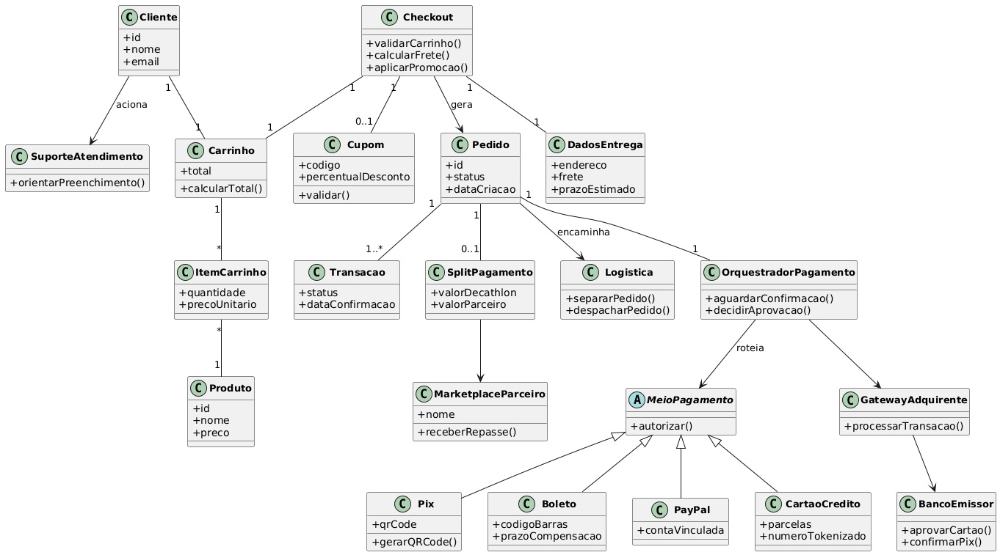

# [Nome do Artefato: ex. Modelo Estático - Diagrama de Classes]

> **Nota de rastreabilidade:** A modelagem estática aqui apresentada parte do estudo de Rich Picture, SIG (NFR Framework) e Engenharia Reversa do fluxo de pagamento (checkout, orquestrador, gateway/adquirente, marketplace e logística), conduzido pela Subequipe 03 no Módulo 1 — ver [Módulo 1 — Subequipe 03](../../modulo-1/subequipe-03.md).
> 
## 1. Introdução & Objetivo
[Descreva brevemente o artefato, seu propósito no contexto do sistema e qual problema ele visa resolver dentro da arquitetura.]

---

## 2. Participação e Rastreabilidade do Artefato

A tabela a seguir detalha a divisão de responsabilidades, o fluxo de co-criação síncrona e a revisão em pares (*peer review*) aplicados exclusivamente para a construção deste artefato e seu relatório.

| Etapa / Tópico do Relatório | Autor(a) Principal | Revisor(a) em Par | Evidência / Commit |
| :--- | :--- | :--- | :---: |
| **Introdução & Objetivos** | [Nome do Membro] | [Nome do Revisor] | [Commit](https://github.com/...) |
| **Modelagem Síncrona (Diagrama)** | [Membro A] e [Membro B] | [Nome do Revisor] | [Ata/Reunião](https://...) |
| **Embasamento Teórico & Literatura** | [Nome do Membro] | [Nome do Revisor] | [Commit](https://github.com/...) |
| **Uso da IA Generativa & Validação** | [Nome do Membro] | [Nome do Revisor] | [Commit](https://github.com/...) |
| **Lições Aprendidas & Conclusão** | [Nome do Membro] | [Nome do Revisor] | [Commit](https://github.com/...) |

---

## 3. Modelo UML

### 3.1. Diagrama

> **Recurso Utilizado:** Mermaid, copiado como JPG após sessão de *Pair Modeling*.

Fonte editável: [`diagrama-classes-subequipe3.mmd`](../../assets/images/diagrama-classes-subequipe3.mmd ':ignore'))

> **Recurso Utilizado:** Mermaid, refinado com apoio de IA Generativa durante sessão de *Pair Modeling*.
### 3.2. Elementos e Recursos da Notação Utilizados
* **[Elemento 1, ex: Múltiplicidade / Agregação]:** [Explicação de onde e por que foi aplicado no diagrama].
* **[Elemento 2, ex: Mensagens Síncronas]:** [Explicação do uso do recurso na notação].

---

## 4. Embasamento Teórico e Decisões de Projeto

Cada elemento do modelo foi fundamentado na literatura de Engenharia de Software e Modelagem Orientada a Objetos:

- **Decisão de Arquitetura 01:** [Descreva a decisão tomada].
  - **Fundamentação:** Segundo Fowler (2003, p. XX), *"..."*.
- **Decisão de Arquitetura 02:** [Descreva a decisão tomada].
  - **Fundamentação:** Conforme Larman (2007), a escolha do padrão X visa reduzir o acoplamento...

---
> **Histórico de Versões**
> 
> | Versão | Data | Descrição | Autores | Revisor |
> | :---: | :---: | :--- | :--- | :---: |
> | 0.1 | 12/09/2026 | Criação e Estruturação da página | [Rafaela Andrea](https://github.com/radamesGuerra) | [Camile0318](https://github.com/Camile0318) |
