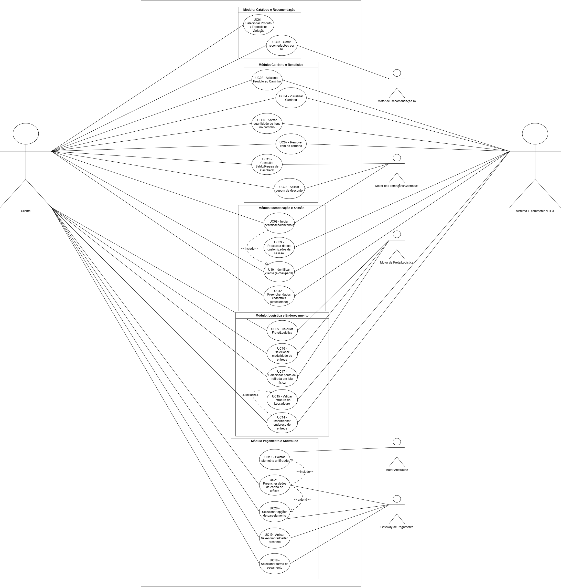
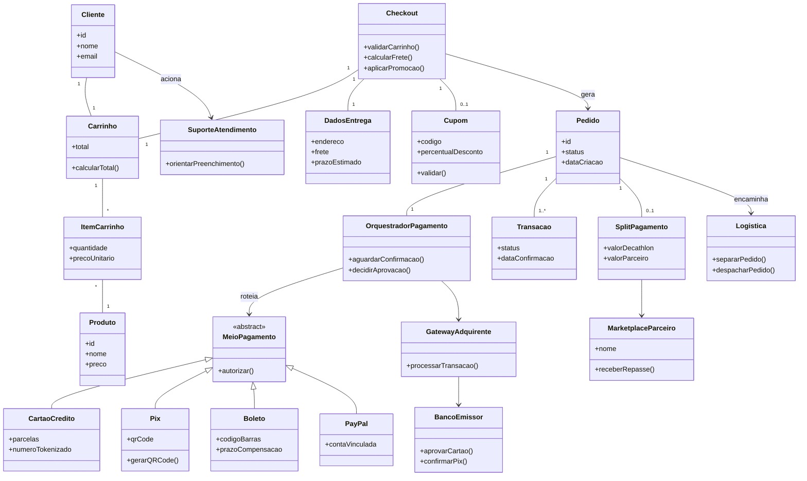
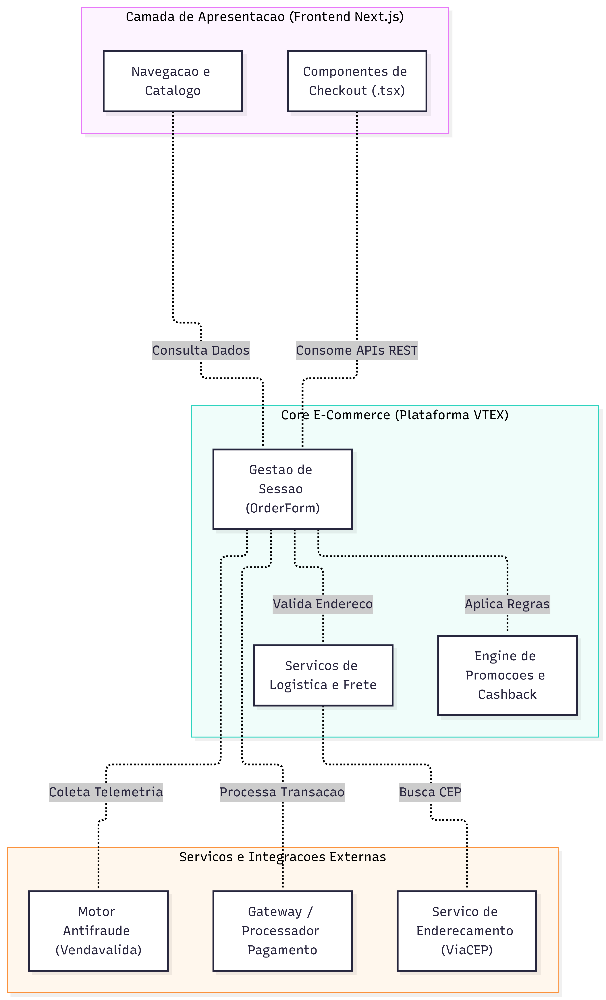

## Modelagem Estática

Segundo Grady Booch, James Rumbaugh e Ivar Jacobson, a visão estática de um sistema enfatiza a organização estrutural dos seus blocos de construção. Eles definem que os diagramas estruturais tratam da "arquitetura estática do sistema", servindo como uma planta detalhada de como as partes se conectam, de forma independente de eventos temporais.

Dentre os principais objetivos dessa modelagem estão:

- **Mapear a Fronteira do Sistema:** Delimitar formalmente o escopo funcional da aplicação e as interações do usuário com serviços internos e externos.
- **Modelar o Domínio de Dados:** Traduzir os *payloads* e respostas da API VTEX (`orderForm`, `shippingData`, `paymentData`) em entidades, atributos e métodos bem definidos.
- **Organizar a Arquitetura de Software:** Demonstrar o nível de desacoplamento, a coesão dos microsserviços e a distribuição dos artefatos do código-fonte *frontend* e *backend*.
- **Garantir Rastreabilidade Térmica:** Conectar diretamente as evidências capturadas via DevTools com os requisitos de software levantados.

Nesse contexto, buscando fornecer uma visão estática mais abrangente do Fluxo: Carrinho De Compras >> Checkout >> Pagamento, do sistema objeto de estudo, documentamos a arquitetura a partir de três diagramas complementares que atuam em diferentes níveis de abstração:

1. [Diagrama de Casos de Uso](#1-diagrama-de-casos-de-uso): Organiza os 22 casos de uso identificados em 5 sub-fronteiras de negócio. Seu foco é responder **O QUE** o sistema faz a partir da perspectiva do usuário (Cliente) e dos atores secundários (Sistema E-commerce VTEX, Motor de Recomendação IA, Motor de Promoções/Cashback, Motor de Frete/Logística, Motor Antifraude e Gateway de Pagamento).

2. [Diagrama de Classes](#2-diagrama-de-classes): Aprofunda a estrutura interna do software respondendo **COMO** a informação é processada. As entidades (como `OrderForm`, `ShippingData`, `CartaoCredito` e `PromoocaoECashback`) representam fielmente os objetos e estados manipulados durante o checkout.

3. [Diagrama de Pacotes](#3-diagrama-de-pacotes): Agrupa as classes e subsistemas em módulos físicos e conceituais, especificando **ONDE** cada componente reside (camada de UI, serviços de checkout, microsserviços de integração) e evidenciando a dependência entre as camadas da solução.

Esta abordagem tridimensional garante que qualquer funcionalidade identificada na interface do usuário possa ser rastreada desde o seu requisito funcional (*Caso de Uso*), passando por sua modelagem de dados (*Classe*), até sua localização na infraestrutura da aplicação (*Pacote*).

> **Nota de rastreabilidade:** A modelagem estática aqui apresentada parte do estudo técnico de inspeção realizado pela equipe, fundamentado na Engenharia Reversa combinada com Testes de Caixa-Preta e Inspeção de Tráfego de Rede com a ferramenta DevTools (F12).
[Relatório de Inspeção do Fluxo C]()

---

## Participação e Rastreabilidade do Artefato

| Etapa / Tópico do Relatório | Autor(a) Principal | Revisor(a) em Par | Evidência / Commit |
| :--- | :--- | :--- | :---: |
| **Estruturação da Página & Introdução** | Rafaela Andrea Radamés Guerra | Camile Barbosa Gonzaga de Oliveira | [Commit](https://github.com/...) |
| **Metodologia e Ferramental** | Rafaela Andrea Radamés Guerra | Letícia de Carvalho dos Santos | [Commit](https://github.com/...) |
| **Diagrama de Casos de Uso (Tópico 1)** | Letícia de Carvalho dos Santos e Rafaela Andrea Radamés Guerra | Camile Barbosa Gonzaga de Oliveira | [Commit](https://github.com/...) |
| **Diagrama de Classes (Tópico 2)** | Camile Barbosa Gonzaga de Oliveira e Rafaela Andrea Radamés Guerra | Letícia de Carvalho dos Santos | [Commit](https://github.com/...) |
| **Diagrama de Pacotes (Tópico 3)** | Rafaela Andrea Radamés Guerra | Camile Barbosa Gonzaga de Oliveira | [Commit](https://github.com/...) |
| **Uso da IA Generativa & Validação** | Camile Barbosa Gonzaga de Oliveira | Rafaela Andrea Radamés Guerra | [Commit](https://github.com/...) |
| **Lições Aprendidas & Conclusão** | [preencher] | [preencher] | [Commit](https://github.com/...) |
---

## Metodologia e Ferramental

A construção dos artefatos de modelagem estática não partiu de documentação
oficial da plataforma — inexistente para o sistema objeto de estudo — mas de um
processo de **Engenharia Reversa orientada a evidências**, estruturado em quatro
etapas sequenciais:

**Etapa 1 — Testes de Caixa-Preta.** Percorreu-se o Fluxo C (Carrinho >> Checkout
>> Pagamento) sob a ótica do usuário final, sem acesso ao código-fonte,
registrando cada interação e a resposta observável do sistema.

**Etapa 2 — Inspeção de Tráfego de Rede.** Com o DevTools (F12), nas abas
*Network* (filtro XHR/Fetch), *Sources* e *Console*, capturaram-se as requisições
HTTP, os *payloads* JSON e os scripts de terceiros acionados em cada cenário,
resultando nas **18 evidências** que sustentam este relatório.

**Etapa 3 — Abstração e Modelagem.** Os dados brutos foram traduzidos em
elementos UML: eventos de interface originaram **Casos de Uso**; estruturas JSON
(`orderForm`, `shippingData`, `paymentData`) originaram **Classes**; e a
segregação entre domínios de serviço originou os **Pacotes**.

**Etapa 4 — Revisão em Pares.** Todo artefato produzido foi submetido a revisão
por um segundo integrante, conforme a matriz de responsabilidades apresentada na
seção *Participação e Rastreabilidade do Artefato*.

### Ferramental Utilizado

| Ferramenta | Finalidade no Projeto |
| :--- | :--- |
| **Google Chrome DevTools (F12)** | Inspeção de requisições XHR/Fetch, análise de *payloads* JSON, rastreio de scripts de terceiros e identificação de endpoints. |
| **Mermaid (Mermaid Live Editor)** | Diagramação do Diagrama de Classes em formato *diagram-as-code*, permitindo versionamento textual e fonte editável pública. |
| **Lucidchart / draw.io** | Elaboração dos Diagramas de Casos de Uso e de Pacotes, com controle de notação UML. |
| **GitHub** | Versionamento dos artefatos, rastreabilidade via *commits* e revisão em pares por *Pull Request*. |
| **GitHub Pages / Docsify** | Publicação e navegação da documentação do projeto. |
| **IA Generativa (Claude / ChatGPT)** | Apoio à estruturação inicial de hipóteses arquiteturais e revisão textual, **sempre** com validação humana posterior contra as evidências coletadas (ver seção *Uso da IA Generativa*). |

> **Nota metodológica:** nenhum artefato gerado com apoio de IA foi incorporado
> sem confronto direto com as evidências empíricas do DevTools. A IA atuou como
> ferramenta de aceleração de rascunho, não como fonte de verdade.

## 1. Diagrama de Casos de Uso

### 1.1. Fundamentação Teórica

No contexto da Engenharia de Software, a Engenharia de Requisitos desempenha um papel crítico ao descobrir, analisar e documentar as funções de um sistema. Para externalizar e validar essas funções sob a perspectiva do usuário, utiliza-se a modelagem de casos de uso. De acordo com Booch, Rumbaugh e Jacobson (2006), um caso de uso pode ser definido como uma especificação do comportamento de um sistema, consistindo em uma descrição de sequências de ações que produzem um resultado observável e de valor para um ator específico.
O **Diagrama de Casos de Uso** na Linguagem de Modelagem Unificada (UML) é uma representação comportamental e de alto nível que delimita o escopo funcional do sistema através da interação entre seus elementos principais. Ele estabelece formalmente os **atores** — entidades externas que desempenham papéis ativos (atores primários) e passivos/reativos (atores secundários ou de suporte) — e define o **limite do sistema**, separando os processos internos sob responsabilidade da aplicação dos serviços periféricos e de terceiros.

---

### 1.2. Mapeamento de Casos de Uso
A construção dos casos de uso seguiu uma abordagem orientada a evidências:

1. **Inspeção de Rede e Comportamento:** As interações de usuário e as requisições HTTP registradas nos 18 cenários capturados via DevTools serviram como base empírica.
2. **Derivação Funcional:** Cada evento do cliente na interface (e.g., acionamento de botões, alteração de inputs) combinado com os *payloads* trafegados originou a especificação de um ou mais dos **22 Casos de Uso (UCs)** identificados.
3. **Rastreabilidade:** Mapeou-se do evento visual no *frontend* até os disparos de APIs e retornos nos microserviços de *backend*.

#### Tabela 1.1 — Matriz de Rastreabilidade: Evidências vs. Casos de Uso

| Evidência DevTools | Caso de Uso Originado | Atores Identificados |
| :--- | :--- | :--- |
| **Evidência 1:** Seleção de Produto e Especificações (Modal / Pré-Carrinho) | • **UC01** - Selecionar Produto / Especificar Variação (SKU) | • Cliente (Ator Principal) • Sistema E-commerce VTEX (Back-end) |
| **Evidência 2:** Adição ao Carrinho e Recomendação IA | • **UC02** - Adicionar Produto ao Carrinho • **UC03** - Gerar Recomendações por IA | • Cliente (Ator Principal) • Sistema E-commerce VTEX • Motor de IA / Recomendação |
| **Evidência 3:** Visualização do Carrinho Completo, Cálculo de Frete e Recomendações de Página | • **UC04** - Visualizar Carrinho • **UC05** - Calcular Frete/Logística • **UC03** - Gerar Recomendações por IA | • Cliente (Ator Principal) • Sistema E-commerce VTEX • Motor de IA / Recomendação |
| **Evidência 4:** Alteração de Quantidade de Produtos e Recálculo Dinâmico | • **UC06** - Alterar Quantidade de Itens no Carrinho • **UC05** - Calcular Frete/Logística | • Cliente (Ator Principal) • Sistema E-commerce VTEX (Motor de Carrinho e Logística) |
| **Evidência 5:** Remoção de Produto e Estado de Carrinho Vazio | • **UC07** - Remover Item do Carrinho • **UC03** - Gerar Recomendações por IA | • Cliente (Ator Principal) • Sistema E-commerce VTEX • Motor de IA / Recomendação |
| **Evidência 6:** Transição para o Checkout (Identificação / Compra Rápida) | • **UC08** - Iniciar Identificação/Checkout • **UC09** - Processar Dados Customizados da Sessão | • Cliente (Ator Principal) • Sistema E-commerce VTEX (Módulo de Checkout/OrderForm) |
| **Evidência 7:** Identificação do Usuário e Carregamento de Perfil (Checkout Profile) | • **UC10** - Identificar Cliente (E-mail/Perfil) • **UC11** - Consultar Saldo/Regras de Cashback | • Cliente (Ator Principal) • Sistema E-commerce VTEX • Motor Antifraude / Risco (Behavior) |
| **Evidência 8:** Preenchimento de Dados Cadastrais e Coleta de Comportamento (Antifraude) | • **UC12** - Preencher Dados Cadastrais (CPF/Telefone) • **UC13** - Coletar Telemetria Antifraude (Behavioral Data) | • Cliente (Ator Principal) • Sistema E-commerce VTEX • Motor Antifraude / Risco (Konduto) |
| **Evidência 9:** Preenchimento de Informações de Entrega e Validação de Endereço | • **UC14** - Inserir/Editar Endereço de Entrega • **UC15** - Validar Estrutura do Logradouro | • Cliente (Ator Principal) • Sistema E-commerce VTEX • Serviço de Validação Geográfica / Analytics |
| **Evidência 10:** Consulta Autocomplementar de CEP (ViaCEP/Logística VTEX) | • **UC15** - Consultar Endereço por CEP • **UC14** - Inserir/Editar Endereço de Entrega | • Cliente (Ator Principal) • Sistema E-commerce VTEX • Serviço de Busca CEP (ViaCEP / VTEX Master Data) |
| **Evidência 11:** Seleção de Operações de Entrega e Cálculo de Frete | • **UC16** - Selecionar Modalidade de Entrega • **UC04** - Visualizar Resumo do Pedido | • Cliente (Ator Principal) • Motor de Frete VTEX (SLA/Logística) • Módulo de Cashback |
| **Evidência 12:** Modal de Seleção de Lojas Físicas para Retirada | • **UC17** - Selecionar Ponto de Retirada em Loja Física • **UC16** - Selecionar Modalidade de Entrega | • Cliente (Ator Principal) • Motor de Inventário VTEX (Pickup Points) • Sistema de Busca Geográfica (Intelligent Search) |
| **Evidência 13:** Seleção do Método de Pagamento e Inicialização do Checkout Final | • **UC18** - Selecionar Forma de Pagamento • **UC19** - Aplicar Vale-Compra / Cartão Presente • **UC04** - Visualizar Resumo do Pedido | • Cliente (Ator Principal) • Gateway de Pagamento VTEX (Payment System) • Provedor Pix / Adquirente • Serviço Antifraude (reCAPTCHA Enterprise) |
| **Evidência 14:** Seleção do Método de Pagamento via Cartão de Crédito e Telemetria Antifraude | • **UC18** - Selecionar Forma de Pagamento • **UC20** - Selecionar Opções de Parcelamento • **UC21** - Preencher Dados do Cartão de Crédito | • Cliente (Ator Principal) • VTEX Smart Checkout • Motor Antifraude (Venda Valida / ClearSale) • Gateway de Pagamento |
| **Evidência 15:** Seleção e Expansão de Formulário de Cartão de Crédito | • **UC18** - Selecionar Forma de Pagamento • **UC20** - Selecionar Opções de Parcelamento • **UC21** - Preencher Dados do Cartão de Crédito | • Cliente (Ator Principal) • VTEX Smart Checkout • Motor Antifraude (Venda Valida) • Gateway de Pagamento |
| **Evidência 16:** Consulta do BIN do Cartão e Seleção de Parcelamento | • **UC20** - Selecionar Opções de Parcelamento • **UC21** - Preencher Dados do Cartão de Crédito • **UC18** - Selecionar Forma de Pagamento | • Cliente (Ator Principal) • VTEX Smart Checkout • Gateway de Pagamento • Adquirente Financeira |
| **Evidência 17:** Pagamento Pix: Alternância para Pagamento via Pix e Sincronização de Estado | • **UC18** - Selecionar Forma de Pagamento • **UC04** - Visualizar Resumo do Pedido | • Cliente (Ator Principal) • VTEX Smart Checkout • Gateway de Pagamento / Arranjo Pix |
| **Evidência 18:** Validação de Regra de Negócio: Tentativa de Aplicação de Cupom Inválido | • **UC22** - Aplicar Cupom de Desconto • **UC04** - Visualizar Resumo do Pedido | • Cliente (Ator Principal) • Motor de Promoções VTEX (Promotions & Taxes Engine) • Camada de Interface (UI Component) |

> **Nota de rastreabilidade:** As evidências coletadas podem ser vistas na íntegra em [Relatório de Inspeção do Fluxo C]()

---

### 1.3. Decisões de Arquitetura e Modelagem

#### 1.3.1. Atores Identificados

##### Tabela 1.3 — Mapeamento e Classificação dos Atores do Sistema

| Ator | Classificação | Descrição e Papel no Sistema |
| :--- | :--- | :--- |
| **Cliente** | Primário | Usuário final do e-commerce que interage diretamente com a interface de usuário (*UI*) para navegar, selecionar produtos, preencher dados e efetuar a compra. |
| **Plataforma VTEX** *(Back-end / Core)* | Secundário *(Suporte)* | Processador central do e-commerce responsável por manter o estado da sessão (`orderForm`), regras de catálogo, promoções, lógica de frete e coordenação do checkout. |
| **Motor de Recomendação IA** | Secundário *(Suporte)* | Serviço especializado em inteligência artificial que analisa o comportamento do usuário e itens no carrinho para retornar sugestões dinâmicas de *cross-selling*. |
| **Serviço de Validação Geográfica** *(ViaCEP / Master Data)* | Secundário *(Suporte)* | Provedor de dados de consulta de CEP e geolocalização responsável por autocompletar e validar a estrutura de logradouros de entrega. |
| **Motor Antifraude / Risco** *(Konduto / Venda Valida / reCAPTCHA)* | Secundário *(Suporte)* | Sistemas externos de segurança que coletam telemetria comportamental (*fingerprint*) e avaliam o risco da transação antes do envio financeiro. |
| **Gateway de Pagamento / Adquirente** | Secundário *(Suporte)* | Intermediário financeiro responsável por processar as transações de cartão de crédito, simular parcelamentos com a bandeira e gerar cobranças Pix. |
| **Motor de Promoções / Cashback** | Secundário *(Suporte)* | Módulo interno/externo responsável por validar a elegibilidade de cupons de desconto e aplicar regras de saldo de fidelidade/cashback no total do pedido. |

#### 1.3.2. Organização em Módulos
Para garantir a coesão e a organização do escopo, os 22 UCs foram categorizados em **5 módulos de negócio**:

##### Tabela 1.2 — Agrupamento dos Casos de Uso por Sub-Fronteiras

| Sub-Fronteira (Módulo) | Casos de Uso Mapeados |
| :--- | :--- |
| **Módulo 1 — Catálogo e Recomendação** | • [`UC01`](#uc-01) - Selecionar Produto / Especificar Variação • [`UC03`](#uc-03) - Gerar Recomendações por IA |
| **Módulo 2 — Carrinho e Benefícios** | • [`UC02`](#uc-02) - Adicionar Produto ao Carrinho • [`UC04`](#uc-04) - Visualizar Carrinho • [`UC06`](#uc-06) - Alterar Quantidade de Itens • [`UC07`](#uc-07) - Remover Item do Carrinho • [`UC11`](#uc-11) - Consultar Saldo/Regras de Cashback • [`UC22`](#uc-22) - Aplicar Cupom de Desconto |
| **Módulo 3 — Identificação e Sessão** | • [`UC08`](#uc-08) - Iniciar Identificação/Checkout • [`UC09`](#uc-09) - Processar Dados Customizados da Sessão • [`UC10`](#uc-10) - Identificar Cliente (E-mail/Perfil) • [`UC12`](#uc-12) - Preencher Dados Cadastrais |
| **Módulo 4 — Logística e Endereçamento** | • [`UC05`](#uc-05) - Calcular Frete/Logística • [`UC14`](#uc-14) - Inserir/Editar Endereço de Entrega • [`UC15`](#uc-15) - Consultar CEP / Validar Logradouro • [`UC16`](#uc-16) - Selecionar Modalidade de Entrega • [`UC17`](#uc-17) - Selecionar Ponto de Retirada em Loja Física |
| **Módulo 5 — Pagamento e Antifraude** | • [`UC13`](#uc-13) - Coletar Telemetria Antifraude • [`UC18`](#uc-18) - Selecionar Forma de Pagamento • [`UC19`](#uc-19) - Aplicar Vale-Compra / Cartão Presente • [`UC20`](#uc-20) - Selecionar Opções de Parcelamento • [`UC21`](#uc-21) - Preencher Dados do Cartão de Crédito |

---

#### 1.3.3. Dependências `<<include>>` (Obrigatórias)
Refletem fluxos que obrigatoriamente exigem a execução de outro caso de uso para a sua conclusão com sucesso.

- [`UC08`](#uc-08) - Iniciar Identificação/Checkout  `<<include >>` [`UC10`](#uc-10) - Identificar Cliente (E-mail/Perfil) 

- [`UC14`](#uc-14) - Inserir/Editar Endereço de Entrega  `<<include>>` [`UC15`](#uc-15) - Consultar CEP / Validar Logradouro 

- [`UC21`](#uc-21) - Preencher Dados do Cartão de Crédito `<<include>>`[`UC13`](#uc-13) - Coletar Telemetria Antifraude 

#### 1.3.4. Dependências `<<extend>>` (Opcionais ou Condicionais)
Refletem comportamentos opcionais disparados sob condições específicas.

- [`UC21`](#uc-21) - Preencher Dados do Cartão de Crédito `<<extend>>`[`UC20`](#uc-20) - Selecionar Opções de Parcelamento  

---

### 1.4. Diagrama Casos de Uso

Fonte: Elaborado por Letícia de Carvalho dos Santos e Rafaela Andrea Radamés Guerra.

<b> Histórico de Versionamento e Evolução do Diagrama (Clique para expandir)</b>

| Versão | Data | Modificações Realizadas | Artefato |
| :--- | :--- | :--- | :--- |
| **v1.0** | DD/MM/202X | Mapeamento inicial com os atores e casos de uso básicos. | [Versão v1.0](./caminho/para/diagrama-v1.png) |
| **v2.0 (Atual)** | DD/MM/202X | Refatoração visual com adição dos 5 módulos, adição de dependências `<<include>>`/`<<extend>>` e alinhamento de atores externos. | Artefato exibido na Figura 1.1. |

> **Nota de Versionamento:** A transição da versão v1.0 para v2.0 foi motivada pela necessidade de organizar a complexidade visual do modelo e garantir rastreabilidade direta com os microsserviços VTEX identificados nas evidências.

#### Elementos e Recursos da Notação Utilizados

* **Ator (boneco palito):** Representa um objeto externo que interage com o sistema para atingir um objetivo — não necessariamente uma pessoa (ex.: `Banco` e `Gateway de pagamento` são sistemas externos modelados como atores).
* **Caso de uso (elipse):** Representa um objetivo completo e de valor para o ator, não um passo isolado de tela. Por isso, casos de uso muito granulares.
* **Fronteira do sistema (retângulo):** Delimita a aplicação dividida em 5 módulos funcionais (Catálogo e Recomendação, Carrinho e Benefícios, Identificação e Sessão, Logística e Endereçamento, Pagamento e Antifraude). Funcionalidades fora do escopo do checkout ativo (como gestão pós-venda de Pedidos ou cancelamentos) foram deliberadamente deixadas fora dessa fronteira.
* **Ator primário vs. secundário:** O `Cliente` atua como único ator primário (iniciador de todas as interações e do fluxo de compra). Os atores secundários (Motor de Recomendação / IA, Plataforma VTEX, Motor de Frete e Logística, Motor de Promoções / Cashback, Gateway de Pagamento / Adquirente e Motor Antifraude) são acionados pelo sistema para responder às requisições e concluir as regras de negócio do ator primário.

---

## 2. Diagrama de Classes

### 2.1. Fundamentação Teórica

O Diagrama de Classes é classificado como um diagrama estrutural dentro da UML, servindo como o mapa lógico principal para a construção e organização do código-fonte. 
Ele traduz os conceitos do domínio do problema em componentes de software tangíveis.

Para Sommerville (2011), o desenvolvimento de software moderno depende fortemente da abstração do mundo real. Sob essa ótica, o autor conceitua que "um diagrama de classes descreve a estrutura do sistema mostrando as classes do sistema, seus atributos, operações e as relações entre as classes". O diagrama funciona, portanto, como uma ponte entre os requisitos funcionais e a arquitetura física do sistema.

### 2.2. Mapeamento de Classes

A construção do modelo de classes deriva diretamente da engenharia reversa realizada sobre as requisições HTTP (XHR/Fetch) e scripts rastreados durante as 18 evidências de testes do checkout (*vide [Relatório de Inspeção do Fluxo C]()*).

Os dados brutos trafegados em formato JSON, bem como os comportamentos disparados na interface do usuário, foram abstraídos em entidades de domínio com atributos e métodos específicos. A Tabela 2.1 detalha essa correspondência:

#### Tabela 2.1 — Mapeamento de Artefatos DevTools para Entidades da UML

| Origem na Inspeção DevTools / Evidência | Entidade / Classe Gerada | Atributos Derivados (Payload JSON) | Métodos / Operações Identificadas |
| :--- | :--- | :--- | :--- |
| Payload Geral do Checkout (`orderForm`) | **OrderForm** | `orderFormId`, `totalValue` | `calcularTotal()`, `atualizarSessao()` |
| Sessão do Usuário & Perfil (`clientProfileData`) | **Cliente** | `email`, `cpf`, `telefone` | `preencherDadosCadastrais()` |
| Array de Itens (`items[]` no JSON) | **ItemCarrinho** | `id`, `quantidade`, `precoUnitario`, `variacao` | `alterarQuantidade()`, `remover()` |
| Catálogo VTEX (`GET /api/catalog_system`) | **Produto** | `id`, `nome`, `preco`, `sku` | — |
| Simulação de Logística (`shippingData`) | **ShippingData** | `cep`, `logradouro`, `numero`, `modalidadeSLA`, `valorFrete` | `validarLogradouro()`, `calcularFreteLogistica()` |
| Ponto de Retirada (`simulationv2`) | **PontoRetirada** | `idLoja`, `nomeLoja`, `estoqueDisponivel` | `selecionarLojaFisica()` |
| Motor de Promoções (`CashbackCheckout.tsx`) | **PromoocaoECashback** | `saldoCashback`, `cupomAplicado` | `consultarSaldoCashback()`, `aplicarCupom()`, `limparCupom()` |
| Sessão de Pagamento (`paymentData`) | **PaymentData** | `metodoSelecionado` | `selecionarFormaPagamento()` |
| Script de Antifraude (`collect.vendavalida.com.br`) | **TelemetriaAntifraude** | `fingerprintSession` | `coletarBiometriaComportamental()` |
| Pagamento via Cartão (BIN / Installments) | **CartaoCredito** | `bin`, `parcelas`, `tokenCartao` | `consultarParcelamento()` |
| Pagamento via Pix (Instant Payment API) | **Pix** | `qrCode`, `chaveCopiaECola` | `gerarQRCode()` |
| Resgate de Saldo (Gift Card Engine) | **ValeCompra** | `codigoGiftCard`, `saldoDisponivel` | `resgatarSaldo()` |
| Carteira Digital (Google Pay Wallet) | **GooglePay** | `walletToken` | `processarPagamentoExpress()` |
| Gateway de Processamento VTEX | **GatewayVTEX** | — | `processarTransacao()` |
| Objeto de Confirmação de Pedido | **Pedido** | `orderId`, `status`, `dataCriacao` | `gerarPedido()` |

### 2.3. Decisões de Arquitetura e Modelagem

As escolhas de modelagem do domínio foram embasadas nos princípios de Orientação a Objetos e nos padrões de arquitetura de software propostos na literatura (GRASP e GoF):

#### **Decisão 01 — Polimorfismo nos Meios de Pagamento (`MeioPagamento`)**
* **Aplicação:** Optou-se por uma classe abstrata `MeioPagamento` especializada em subclasses concretas (`CartaoCredito`, `Pix`, `ValeCompra`, `GooglePay`), em vez de centralizar estruturas condicionais (`if`/`switch`) na classe gerenciadora.
* **Fundamentação:** Aplica o princípio GRASP de Polimorfismo (LARMAN, 2007) e o padrão *Strategy* (GAMMA et al., 1994). O comportamento de autorização varia conforme o tipo de pagamento, e essa variação é encapsulada em suas próprias subclasses. Isso garante o Princípio do Aberto/Fechado (OCP), permitindo adicionar novas formas de pagamento (ex: NuPay) sem modificar o código do `PaymentData`.

#### **Decisão 02 — Desacoplamento da Telemetria Antifraude (`TelemetriaAntifraude`)**
* **Aplicação:** A coleta de dados comportamentais (`collect.vendavalida.com.br`) foi isolada na classe `TelemetriaAntifraude`, associada de forma assíncrona com `PaymentData`.
* **Fundamentação:** Atende ao princípio de Alta Coesão e Baixo Acoplamento (LARMAN, 2007). O processamento financeiro e a análise de risco possuem responsabilidades distintas. Manter a telemetria separada garante que falhas ou lentidões no serviço de antifraude não travem o carregamento dos meios de pagamento na interface do cliente.

#### **Decisão 03 — Agregação Centralizada no Modelo `OrderForm` (VTEX Pattern)**
* **Aplicação:** A classe `OrderForm` atua como o agregador raiz da sessão, mantendo composições e associações com `ItemCarrinho`, `ShippingData`, `PromoocaoECashback` e `PaymentData`.
* **Fundamentação:** Reflete a arquitetura real da plataforma VTEX e o padrão *Aggregate* do Domain-Driven Design (EVANS, 2003). O `OrderForm` garante a integridade dos dados do checkout em um único ponto de estado, permitindo que alterações na logística (`ShippingData`) recalculem automaticamente os totais e as promoções aplicáveis.

#### **Decisão 04 — Multiplicidades Opcionais (`0..1`) para Benefícios e Ponto de Retirada**
* **Aplicação:** As associações com `PromoocaoECashback` e `PontoRetirada` foram modeladas como opcionais (`0..1`) em relação ao fluxo principal.
* **Fundamentação:** Segue as orientações de Fowler (2003) para representação fiel das regras de negócio. Evita a criação de "objetos nulos" ou validações defensivas desnecessárias no código, visto que o cliente pode concluir a compra sem aplicar cupons ou optando por entrega em vez de retirada em loja física.

---

### 2.4. Diagrama de Classes

Fonte: Elaborado por Camile Barbosa Gonzaga de Oliveira e Rafaela Andrea Radamés Guerra.

<b> Histórico de Versionamento e Evolução do Diagrama (Clique para expandir)</b>

| Versão | Data | Modificações Realizadas | Artefato |
| :--- | :--- | :--- | :--- |
| **v1.0** | 14/09/2026 | A modelagem estática partiu do estudo de Rich Picture, SIG (NFR Framework) e Engenharia Reversa do fluxo de pagamento (checkout, orquestrador, gateway/adquirente, marketplace e logística), conduzido pela Subequipe 03 no Módulo 1, com o uso de IA Generativa  | [Versão v1.0](../../assets/images/DiagramaClassesFluxoCV1.png) |
| **v2.0 (Atual)** | 17/09/2026 | Refatoração técnica baseada em engenharia reversa, Casos de Teste de Caixa-Preta e Inspeção via DevTools  | Artefato exibido no tópico 2.4. Diagrama de Classes |

> **Nota de Versionamento:** A transição da versão v1.0 para v2.0 foi motivada pela necessidade de organizar a complexidade visual do modelo e garantir rastreabilidade direta com os microsserviços VTEX identificados nas evidências.

Fonte editável: [Clique aqui para visualizar o diagrama no Mermaid Live Editor](https://mermaid.live/edit#pako:eNp9Vttu20gM_RVhnrpdx4jra4UgQOpkFws0WPe2D4Vf2BErDyINFWrUbZLm38uRJVkXO0-eC3kOh-Sh9aQ0RahCpRPI82sDMUO6tUFQ7oN1YtA6DJ78URD8aaJqYSnFaokpmMSvn1t-wGzsjhpHRw6Saq0h0UUC_Nmfvfqj5_qPw3Tgfl-AdSaCqCbNGDV9scYBG-ohbJiiwtGLQZf-_aB3qO-ocI3jD0iEk-to9qG2HvAXo8PmFLLEaGBhT0kDDR52DRHlN9YxxtBQoI2wDkW23z1iEyI80k3uTCqO_VCLjNIGREpo4hoiQ9ZSswKSa8w1WUfd1wzi2mBkoiPZyh24Iq82EThYswF5WM_9X74vMHcsQfIGYkiF_IAGcQHsc0j2u-EUmsR4TNQmMnyVMf2AYxm7RUMDyIsL-ObptLu8rEmk2mwej7xNSueA1ixPbAWVgaRI7uu2KFJk-kx3aAVkkOuN-XnoQ3lI04MxMvCHj_5kQPyOEmwx7iv0ThqpYS3Lu6Y0Q5sfSesGHjaQtACsg_-M9X0XQc_2b3D4PzxcRfeF4Y5eJbUa81y0xrCnGUYKVtNNavKc-FC2sia8T9-h76sisqRkgNMwNCDDBjo0Qb_SwHfosgQ0bnxxDB9gWqoVpeA35I-YidMw6Z9EgW7Yg9L4xNeowe0Ssu3DmquH855iI7rTB5nmwijF3kul1cB5BnrXPW_HIyplh1dOVG66MUm_yt5PC0Srd_vbBsD_1KN3qyZbFZydVYt6GJUm9Zhs2byWRXuEervOSN2bNHjVsCzh6vn3EuUJm_ZwO2V3Ph6XcH52dWzOzi7rKRQGXlX-tjro8RydNt78-BjyyN0pEgZMDk1J0b25-CUsnYFxwka6_8TNXvWn3EpFvxzrQMnefChvb9rW7Yl8jce-1I0wj1tVVelqx5v21FSmcijTFqi3OEgnDKSxIZXGgXY7e6MjuggD0IYsqJGK2UQqdFzgSMlglq8L2apSOFvldijTQIWylH-Vu63a2mfxycB-JUprN6Yi3tWbIpPZg9WnTWNR_vGuqbBOhbPzEkGFT-qnCper-XgyXSyW88l0NptMVyP1oML5bPxmtlou386XbxaLyeR5pB5LxvPxSgzni9lstZhMJ_PpYqTK7uHb6svK_zz_Bs50Fn0)

#### Elementos e Recursos da Notação Utilizados

* **Generalização/Herança (Seta com Triângulo Vazio):** Aplicada entre a classe abstrata `MeioPagamento` e suas subclasses concretas (`CartaoCredito`, `Pix`, `ValeCompra` e `GooglePay`). Indica que todas herdam a interface de autorização, porém cada uma executa seu próprio protocolo de integração.
* **Classe Abstrata (`<<abstract>>`):** `MeioPagamento` é representada como abstrata por não possuir instanciação direta no fluxo de compra — o cliente escolhe e instancia obrigatoriamente um meio concreto (`Pix`, `Cartão`, `Vale` ou `Google Pay`).
* **Agregação Forte / Composição (Losango Preenchido):** Utilizada na relação `OrderForm "1" *-- "* ItemCarrinho`, indicando que os itens do carrinho dependem da existência do `OrderForm` (sessão ativa). Se a sessão for destruída, os itens do carrinho deixam de existir no contexto.
* **Multiplicidade Expressiva:** Modela com precisão as regras do *payload* VTEX:
  * `OrderForm "1" -- "1" ShippingData`: Todo `OrderForm` exige um único conjunto de dados logísticos.
  * `ShippingData "0..1" -- "0..1" PontoRetirada`: A escolha de loja física para retirada é condicional e opcional.
  * `OrderForm "1" -- "0..1" PromoocaoECashback`: A aplicação de saldo de cashback e cupom de desconto é opcional (`0..1`).
  * `PaymentData "1" -- "1..*" MeioPagamento`: Permite a seleção de um ou múltiplos meios de pagamento para quitar o total da ordem (ex: uso de Vale-Compra combinado com Cartão de Crédito).
* **Associação Direcionada (Seta Simples) e Navegabilidade:** Indica o fluxo de dependência entre as camadas:
  * `PaymentData` $\rightarrow$ `TelemetriaAntifraude`: Acionamento assíncrono para coleta de dados comportamentais.
  * `PaymentData` $\rightarrow$ `GatewayVTEX`: Envio do *payload* consolidado para processamento.
  * `GatewayVTEX` $\rightarrow$ `Pedido`: Finalização do checkout e geração da ordem de compra.

---

## 3. Diagrama de Pacotes

### 3.1. Fundamentação Teórica

Para Booch, Rumbaugh e Jacobson (2006), o pacote é o elemento geral de organização de modelos da UML. Sob a perspectiva estrutural, os autores definem que "um diagrama de pacotes mostra um conjunto de pacotes e os relacionamentos de dependência entre eles. Ele é usado principalmente para organizar os elementos de modelagem de um sistema de maneira que fiquem fáceis de compreender". Graficamente, o pacote é representado por um retângulo com uma aba (semelhante a uma pasta de arquivos de escritório), que atua como um contêiner lógico para outros elementos, como classes, componentes ou até mesmo outros pacotes.

Complementando essa visão, Fowler (2005) destaca que o diagrama de pacotes é uma das ferramentas técnicas mais vitais para manter o controle sobre arquiteturas de grande porte. Segundo o autor, "um pacote é um mecanismo de propósito geral para organizar elementos de modelagem em grupos. [...] Os diagramas de pacotes são diagramas de estrutura que mostram pacotes e as dependências entre eles".

### 3.2. Mapeamento de Camadas e Componentes

A estrutura de pacotes foi derivada da análise das requisições de rede, dos scripts de interface e dos serviços chamados durante a navegação no Fluxo C: Carrinho De Compras >> Checkout >> Pagamento do objeto de estudo. O sistema foi organizado em três camadas de arquitetura:

#### **Tabela 3.1 — Rastreabilidade entre Camadas de Pacotes e Evidências DevTools**

| Camada / Pacote Pai | Sub-Pacotes / Módulos Internos | Evidências e Artefatos DevTools Associados |
| :--- | :--- | :--- |
| **Camada de Apresentação** (`Frontend_UI`) | • `Navegacao_Catalogo` • `Componentes_Checkout` | Interface visual em Next.js e arquivos React/TSX identificados (`PostalCodeFormCheckout.tsx`, `CashbackCheckout.tsx`). |
| **Core E-Commerce** (`VTEX_Ecommerce_Core`) | • `Gestao_Sessao_OrderForm` • `Servicos_Logistica` • `Engine_Promocoes_Cashback` | APIs de regra de negócio executadas nos endpoints `/checkout/pub/orderForm`, `/simulationv2` e motor de cupons. |
| **Serviços e Integrações Externas** (`External_Services`) | • `Motor_Antifraude` • `Gateway_Pagamento` • `Servico_Enderecamento` | Chamadas aos endpoints do script de fingerprint (`collect.vendavalida.com.br`), gateways financeiros e consulta ViaCEP. |

### 3.3. Decisões de Arquitetura e Modelagem

* **Organização em Camadas:** Adotou-se a separação estrita em três níveis lógicos (`UI`, `Core` e `Services`). Essa decisão isola a experiência do usuário das regras de negócio complexas do e-commerce e dos serviços de terceiros.
* **Fluxo Unidirecional de Dependência:** O pacote `Frontend_UI` depende de `VTEX_Ecommerce_Core`, que por sua vez depende de `External_Services`. Não existem dependências cíclicas (circulares), o que garante que alterações na interface não quebrem o motor de regras da VTEX.
* **Orquestração pelo `OrderForm` no Core:** A classe/módulo Gestão de Sessão (`OrderForm`) funciona como o orquestrador central no Core, disparando internamente as regras de validação logísticas e aplicação de benefícios, além de integrar diretamente com o gateway de pagamento e o motor de antifraude.
* **Isolamento de Microsserviços e APIs Externas:** O pacote `External_Services` encapsula todos os parceiros de negócio. Notadamente, a consulta ao ViaCEP é disparada diretamente a partir do módulo Serviços de Logística e Frete para o preenchimento automático do logradouro.

### 3.4. Diagrama de Pacotes

Fonte: Elaborado por Rafaela Andrea Radamés Guerra.

<b>Versionamento</b>

> A estrutura conceitual deste diagrama foi inicialmente gerada com suporte de IA e, posteriormente, submetida a um processo de revisão e validação pela equipe. Verificou-se que a organização dos pacotes em camadas (*Frontend UI*, *Core VTEX* e *External Services*) reflete camadas verificadas em estudo técnico realizado. Portanto, a versão foi aprovada como artefato definitivo deste módulo.

---
## 4. Uso da IA Generativa e Validação Humana

O uso de IA Generativa neste módulo foi restrito a três frentes, todas seguidas
de validação humana obrigatória:

| Frente de Uso | Papel da IA | Mecanismo de Validação Aplicado |
| :--- | :--- | :--- |
| **Hipótese arquitetural inicial (v1.0 do Diagrama de Classes)** | Geração de uma primeira estrutura de entidades a partir do Rich Picture e do SIG produzidos no Módulo 1. | Confronto entidade a entidade com os *payloads* JSON reais capturados no DevTools; entidades sem evidência empírica foram descartadas na v2.0. |
| **Sugestão de nomenclatura e padrões de projeto** | Apontamento de padrões candidatos (Strategy, Aggregate) para as decisões de modelagem. | Verificação direta na literatura de referência (LARMAN, GAMMA et al., EVANS) antes da incorporação ao texto. |
| **Revisão textual e coesão** | Revisão gramatical e padronização de estilo das seções descritivas. | Leitura crítica e reescrita pelos autores; nenhum trecho técnico foi aceito sem conferência. |

**Limitações observadas:** a IA tendeu a propor entidades genéricas de
e-commerce (ex.: `Estoque`, `Avaliacao`, `Frete` como classe isolada) que **não**
possuíam contrapartida nas requisições observadas. Esse comportamento reforçou a
necessidade da etapa de engenharia reversa como filtro de veracidade — o que
motivou a refatoração da v1.0 para a v2.0 do Diagrama de Classes.
---

## Referências bibliográficas

> - BOOCH, Grady; RUMBAUGH, James; JACOBSON, Ivar. **UML: guia do usuário.** 2. ed. Rio de Janeiro: Elsevier, 2006.
> - EVANS, Eric. **Domain-Driven Design: tackling complexity in the heart of software.** Boston: Addison-Wesley, 2003.
> - FOWLER, Martin. **UML essencial: um breve guia para a linguagem-padrão de modelagem de objetos.** 3. ed. Porto Alegre: Bookman, 2005.
> - GAMMA, Erich; HELM, Richard; JOHNSON, Ralph; VLISSIDES, John. **Padrões de projeto: soluções reutilizáveis de software orientado a objetos.** Porto Alegre: Bookman, 2000.
> - LARMAN, Craig. **Utilizando UML e padrões: uma introdução à análise e ao projeto orientados a objetos e ao desenvolvimento iterativo.** 3. ed. Porto Alegre: Bookman, 2007.
> - SOMMERVILLE, Ian. **Engenharia de software.** 9. ed. São Paulo: Pearson Prentice Hall, 2011.
---
> | Versão | Data | Descrição | Autores | Revisor |
> | :---: | :---: | :--- | :--- | :---: |
> | 0.1 | 12/09/2026 | Criação e estruturação da página | [Rafaela Andrea](https://github.com/radamesGuerra) | [Camile Barbosa](https://github.com/Camile0318) |
> | 0.2 | 14/09/2026 | Elaboração do Diagrama de Classes e redação dos tópicos 2.2 a 2.4 | [Camile Barbosa](https://github.com/Camile0318) | [Letícia de Carvalho dos Santos](https://github.com/LeticiaSantosss) |
> | 0.3 | 14/09/2026 | Criação dos componentes do Diagrama de Casos de Uso | [Letícia de Carvalho dos Santos](https://github.com/LeticiaSantosss) | [Camile Barbosa](https://github.com/Camile0318) |
> | 0.4 | 17/09/2026 | Organização da página para inclusão de novos artefatos | [Rafaela Andrea](https://github.com/radamesGuerra) | [Letícia de Carvalho dos Santos](https://github.com/LeticiaSantosss) |
> | 0.5 | 17/09/2026 | Refatoração do Diagrama de Classes para a v2.0, inclusão da seção de Metodologia e Ferramental e da seção de Uso de IA Generativa | [Camile Barbosa](https://github.com/Camile0318) | [Rafaela Andrea](https://github.com/radamesGuerra) |
