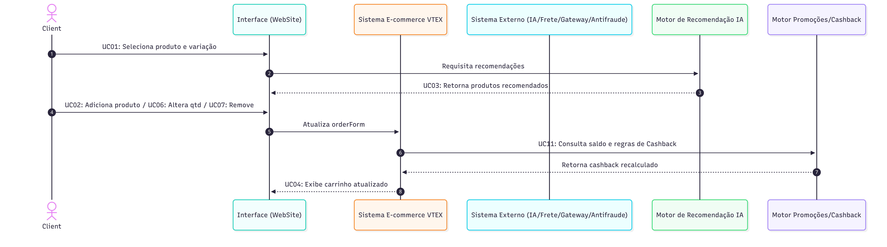

## Modelagem Dinâmico - Diagrama de Sequência

### Introdução

No contexto da arquitetura de software para sistemas complexos e distribuídos, a modelagem dinâmica é fundamental para compreender a interação e o comportamento dos componentes ao longo do tempo. Enquanto a modelagem estática define a estrutura do sistema, os aspectos dinâmicos revelam como os dados trafegam e como as regras de negócio são executadas em tempo real.

Para mapear essa complexidade no ecossistema de e-commerce da Decathlon, utiliza-se o Diagrama de Sequência como artefato principal para representar a ordem das ações do sistema. Com base na inspeção do site e no mapeamento dos casos de uso, este diagrama detalha a troca de mensagens entre a tela do usuário, o sistema principal do e-commerce (VTEX) e os serviços de apoio (como IA, Cashback e Frete), mostrando como as responsabilidades estão divididas e como cada parte se comunica.

### Objetivo
Mapear e formalizar a dimensão temporal e comportamental da arquitetura do e-commerce da Decathlon, detalhando a orquestração síncrona e assíncrona, o ciclo de vida das requisições e o protocolo de troca de mensagens entre atores, a interface e os serviços de backend. O artefato busca assegurar que a execução das regras de negócio, a consistência de estado do carrinho e o fluxo transacional ocorram de forma eficiente, resiliente e desacoplada, servindo como guia técnico para a implementação e validação das integrações do sistema.

## Participação e Rastreabilidade do Artefato

| Etapa / Tópico do Relatório | Autor(a) Principal | Revisor(a) em Par | Evidência / Commit |
| :--- | :--- | :--- | :---: |
| **Estruturação da Página & Introdução** | Rafaela Andrea Radamés Guerra | Camile Barbosa Gonzaga de Oliveira | [Commit](https://github.com/...) |
| **Metodologia e Ferramental** | Rafaela Andrea Radamés Guerra | Letícia de Carvalho dos Santos | [Commit](https://github.com/...) |
| **Diagrama de Casos de Uso (Tópico 1)** | Letícia de Carvalho dos Santos e Rafaela Andrea Radamés Guerra | Camile Barbosa Gonzaga de Oliveira | [Commit](https://github.com/...) |
| **Diagrama de Classes (Tópico 2)** | Camile Barbosa Gonzaga de Oliveira e Rafaela Andrea Radamés Guerra | Letícia de Carvalho dos Santos | [Commit](https://github.com/...) |
| **Diagrama de Pacotes (Tópico 3)** | Rafaela Andrea Radamés Guerra | Camile Barbosa Gonzaga de Oliveira | [Commit](https://github.com/...) |
| **Uso da IA Generativa & Validação** | Camile Barbosa Gonzaga de Oliveira | Rafaela Andrea Radamés Guerra | [Commit](https://github.com/...) |
| **Lições Aprendidas & Conclusão** | [preencher] | [preencher] | [Commit](https://github.com/...) |

---

## Metodologia e Ferramental

A construção dos artefatos de modelagem estática não partiu de documentação
oficial da plataforma — inexistente para o sistema objeto de estudo — mas de um
processo de **Engenharia Reversa orientada a evidências**, estruturado em quatro
etapas sequenciais:

**Etapa 1 — Testes de Caixa-Preta.** Percorreu-se o Fluxo C (Carrinho >> Checkout
>> Pagamento) sob a ótica do usuário final, sem acesso ao código-fonte,
registrando cada interação e a resposta observável do sistema.

**Etapa 2 — Inspeção de Tráfego de Rede.** Com o DevTools (F12), nas abas
*Network* (filtro XHR/Fetch), *Sources* e *Console*, capturaram-se as requisições
HTTP, os *payloads* JSON e os scripts de terceiros acionados em cada cenário,
resultando nas **18 evidências** que sustentam este relatório.

**Etapa 3 — Abstração e Modelagem.** Os dados brutos foram traduzidos em
elementos UML: eventos de interface originaram **Casos de Uso**; estruturas JSON
(`orderForm`, `shippingData`, `paymentData`) originaram **Classes**; e a
segregação entre domínios de serviço originou os **Pacotes**.

**Etapa 4 — Revisão em Pares.** Todo artefato produzido foi submetido a revisão
por um segundo integrante, conforme a matriz de responsabilidades apresentada na
seção *Participação e Rastreabilidade do Artefato*.

### Ferramental Utilizado

| Ferramenta | Finalidade no Projeto |
| :--- | :--- |
| **Google Chrome DevTools (F12)** | Inspeção de requisições XHR/Fetch, análise de *payloads* JSON, rastreio de scripts de terceiros e identificação de endpoints. |
| **Mermaid (Mermaid Live Editor)** | Diagramação do Diagrama de Classes em formato *diagram-as-code*, permitindo versionamento textual e fonte editável pública. |
| **Lucidchart / draw.io** | Elaboração dos Diagramas de Casos de Uso e de Pacotes, com controle de notação UML. |
| **GitHub** | Versionamento dos artefatos, rastreabilidade via *commits* e revisão em pares por *Pull Request*. |
| **GitHub Pages / Docsify** | Publicação e navegação da documentação do projeto. |
| **IA Generativa (Claude / ChatGPT)** | Apoio à estruturação inicial de hipóteses arquiteturais e revisão textual, **sempre** com validação humana posterior contra as evidências coletadas (ver seção *Uso da IA Generativa*). |

> **Nota metodológica:** nenhum artefato gerado com apoio de IA foi incorporado
> sem confronto direto com as evidências empíricas do DevTools. A IA atuou como
> ferramenta de aceleração de rascunho, não como fonte de verdade.

---

## Diagrama de Sequencia

### Fundamentação Teórica

O Diagrama de Sequência é o artefato responsável por representar o comportamento dinâmico e temporal do e-commerce. Ele detalha a ordem cronológica de chamadas entre a interface (WebSite), o core transacional (VTEX) e os motores e serviços externos periféricos (IA, Promoções/Cashback, Logística/Frete, Gateway e Antifraude). Seu papel arquitetural é evidenciar o desacoplamento de responsabilidades e a comunicação entre os 5 módulos do sistema:

1. **Catálogo e Recomendação**
2. **Carrinho e Benefícios**
3. **Identificação e Sessão**
4. **Logística e Endereçamento**
5. **Pagamento e Antifraude**

---

### Mapeamento

---

### Decisões de arquitetura e modelagem

Cada elemento da modelagem dinâmica foi fundamentado na literatura de Engenharia de Software e Modelagem Orientada a Objetos, estabelecendo as diretrizes arquiteturais para todos os módulos do sistema:

* **Decisão de Comportamento 01: Abstração de Padrões e Unificação de Entradas por Intent**
  * **Aplicação:** Operações correlatas que alteram o mesmo estado do sistema — como adição, alteração e remoção de itens (UC02, UC06, UC07) no carrinho, ou a atualização de dados cadastrais/endereço — são consolidadas em um fluxo de comunicação único (`UI ->> Core`), variando apenas o *payload* da requisição.
  * **Fundamentação:** Segundo Fowler (2003), diagramas de sequência devem priorizar a clareza dos caminhos de controle e da intenção arquitetural. Abstrair variações de dados que trafegam pelo mesmo canal de comunicação evita a poluição visual do diagrama, mantendo o foco na identificação dos papéis das mensagens e nos limites de responsabilidade entre os componentes.

* **Decisão de Comportamento 02: Desacoplamento da Camada de Apresentação via Orquestração Centralizada**
  * **Aplicação:** Chamadas a serviços especializados — como a consulta de promoções (`PROM`), motores de recomendação, cálculo de frete/logística ou gateways de pagamento e antifraude — são orquestradas diretamente pelo núcleo da plataforma (`VTEX`), e jamais disparadas diretamente pela interface do usuário (`UI`).
  * **Fundamentação:** Conforme Larman (2007), a aplicação dos padrões GRASP *Controller* e *Low Coupling* (Baixo Acoplamento) establishes que a camada de apresentação não deve orquestrar regras de negócio do domínio. Delegar a orquestração dos serviços periféricos para o núcleo transacional centraliza o controle de estado no *backend*, garante a integridade das transações e reduz a vulnerabilidade da aplicação.

---

**Consolidação Arquitetural do Fluxo:**
A modelagem dinâmica reflete o padrão de comunicação do e-commerce, onde o cliente interage diretamente com a interface, mas toda a inteligência e validação de regras de negócio são centralizadas no núcleo transacional (`VTEX`). Este atua como orquestrador síncrono e assíncrono dos serviços periféricos (Inteligência Artificial, Promoções, Logística e Gateways), garantindo que a interface receba apenas o estado consolidado da aplicação após a execução de todas as regras de domínio.

**Consolidação do Fluxo de Carrinho:**
Representa a visão consolidada do fluxo de carrinho, mostrando como as interações do cliente (seleção de produto, adição, alteração e remoção de itens) disparam tanto a busca por recomendações via IA quanto a consulta ao módulo de Promoções para recálculo de cashback. A VTEX atua como orquestradora central, consultando o serviço PROM sempre que o `orderForm` é atualizado, antes de retornar o carrinho atualizado para a UI.

### Modelo UML

Fonte: Elaborado pelos autores da Subequipe 3: Letícia de Carvalho dos Santos, Rafaela Andrea, 2026.

> **Recurso Utilizado:** Ferramenta colaborativa [Miro / Lucidchart / Draw.io / Mermaid] durante sessão de *Pair Modeling* no dia DD/MM/2026.

#### Elementos e Recursos da Notação Utilizados
* **[Elemento 1, ex: Mensagens Síncronas / Assíncronas]:** [Explicação de onde e por que foi aplicado no diagrama].
* **[Elemento 2, ex: Fragmentos Combinados (alt, loop, opt)]:** [Explicação das estruturas de controle utilizadas no fluxo].
* **[Elemento 3, ex: Linhas de Vida (Lifelines) e Destruição]:** [Explicação da representação dos objetos participantes].

---

## Uso da IA Generativa e Validação Humana

O uso de IA Generativa neste módulo foi restrito a três frentes, todas seguidas
de validação humana obrigatória:

| Frente de Uso | Papel da IA | Mecanismo de Validação Aplicado |
| :--- | :--- | :--- |
| **Hipótese arquitetural inicial (v1.0 do Diagrama de Classes)** | Geração de uma primeira estrutura de entidades a partir do Rich Picture e do SIG produzidos no Módulo 1. | Confronto entidade a entidade com os *payloads* JSON reais capturados no DevTools; entidades sem evidência empírica foram descartadas na v2.0. |
| **Sugestão de nomenclatura e padrões de projeto** | Apontamento de padrões candidatos (Strategy, Aggregate) para as decisões de modelagem. | Verificação direta na literatura de referência (LARMAN, GAMMA et al., EVANS) antes da incorporação ao texto. |
| **Revisão textual e coesão** | Revisão gramatical e padronização de estilo das seções descritivas. | Leitura crítica e reescrita pelos autores; nenhum trecho técnico foi aceito sem conferência. |

**Limitações observadas:** a IA tendeu a propor entidades genéricas de
e-commerce (ex.: `Estoque`, `Avaliacao`, `Frete` como classe isolada) que **não**
possuíam contrapartida nas requisições observadas. Esse comportamento reforçou a
necessidade da etapa de engenharia reversa como filtro de veracidade — o que
motivou a refatoração da v1.0 para a v2.0 do Diagrama de Classes.

---

## Referências bibliográficas

> - BOOCH, Grady; RUMBAUGH, James; JACOBSON, Ivar. **UML: guia do usuário.** 2. ed. Rio de Janeiro: Elsevier, 2006.
> - EVANS, Eric. **Domain-Driven Design: tackling complexity in the heart of software.** Boston: Addison-Wesley, 2003.
> - FOWLER, Martin. **UML essencial: um breve guia para a linguagem-padrão de modelagem de objetos.** 3. ed. Porto Alegre: Bookman, 2005.
> - GAMMA, Erich; HELM, Richard; JOHNSON, Ralph; VLISSIDES, John. **Padrões de projeto: soluções reutilizáveis de software orientado a objetos.** Porto Alegre: Bookman, 2000.
> - LARMAN, Craig. **Utilizando UML e padrões: uma introdução à análise e ao projeto orientados a objetos e ao desenvolvimento iterativo.** 3. ed. Porto Alegre: Bookman, 2007.
> - SOMMERVILLE, Ian. **Engenharia de software.** 9. ed. São Paulo: Pearson Prentice Hall, 2011.

---

> **Histórico de Versões**
> 
> | Versão | Data | Descrição | Autores | Revisor |
> | :---: | :---: | :--- | :--- | :---: |
> | 0.1 | 12/09/2026 | Criação e Estruturação da página | [Rafaela Andrea](https://github.com/radamesGuerra) | [Camile Barbosa](https://github.com/Camile0318) |
> | 0.2 | 17/09/2026 | Contribuição dos módulos 1 e 2 do diagrama de sequência, Elaboração dos tópicos 1 e 4 | [Leticia Santos](https://github.com/LeticiaSantosss) | [Camile Barbosa](https://github.com/Camile0318) |
> | 0.3 | 17/09/2026 | Adiciona os tópicos de metodologia e ferramental e outras estruturas | [Rafaela Andrea](https://github.com/radamesGuerra) | [Camile Barbosa](https://github.com/Camile0318) |