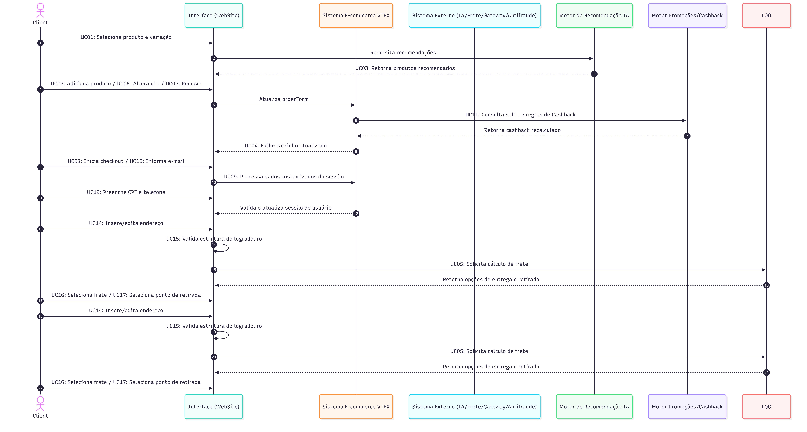

## Modelagem Dinâmica

Segundo Grady Booch, James Rumbaugh e Ivar Jacobson, se a visão estática representa a planta estrutural de um sistema, a visão dinâmica retrata a sua execução temporal e o comportamento dos seus elementos. Enquanto a estrutura define a organização das partes, a modelagem dinâmica foca em como esses componentes colaboram, trocam mensagens e reagem a eventos ao longo do tempo.

Dentre os principais objetivos dessa modelagem estão:

- **Mapear a Orquestração do Fluxo de Execução:** Representar a ordem cronológica das chamadas e respostas que ocorrem durante a navegação e finalização da compra.
- **Evidenciar a Troca de Mensagens:** Detalhar a comunicação assíncrona e síncrona entre o *Frontend React/Next.js*, o *Core E-Commerce (VTEX)* e os *Serviços Externos*.
- **Demonstrar a Mudança de Estado do Sistema:** Ilustrar como o estado global do carrinho (`OrderForm`) é atualizado iterativamente a cada ação do usuário na interface.
- **Validar as Evidências do DevTools:** Rastrear a execução ponta a ponta correlacionando requisições HTTP/XHR (métodos `GET`, `POST`, `PUT`) aos objetos responsáveis pelo processamento.

Nesse contexto, para fornecer uma visão dinâmica do Fluxo: Carrinho De Compras >> Checkout >> Pagamento, optou-se estrategicamente por detalhar o comportamento do sistema por meio do **Diagrama de Sequência**. Devido à complexidade do ecossistema VTEX, a modelagem foi modularizada em 5 fluxos comportamentais complementares:

1. [DS01 — Módulo Catálogo e Seleção de Produtos](#): Modela a interação inicial do usuário com a vitrine, busca e adição de itens ao carrinho, evidenciando as chamadas de inicialização da sessão.
2. [DS02 — Módulo Carrinho e Aplicabilidade de Benefícios](#): Detalha a simulação de frete, aplicação de cupons de desconto e recalculo de *cashback* com o motor de promoções.
3. [DS03 — Módulo Identificação e Gestão de Sessão](#): Rastreia o fluxo de autenticação do cliente, validação do perfil e recuperação dos dados cadastrais salvos.
4. [DS04 — Módulo Logística e Seleção de Entrega](#): Ilustra a consulta de endereçamento via API externa (ViaCEP), o cálculo das opções de entrega e a seleção do ponto de retirada ou frete expresso.
5. [DS05 — Módulo Pagamento e Processamento Antifraude](#): Modela o encerramento da compra, destacando a coleta de telemetria pelo motor de antifraude, a tokenização do cartão e a autorização no gateway financeiro.

A escolha do Diagrama de Sequência justifica-se por sua capacidade de correlacionar diretamente o tempo de vida dos objetos aos *payloads* de rede inspecionados, garantindo rastreabilidade entre o código interceptado no navegador e a execução dos microsserviços.

> **Nota de rastreabilidade:** A modelagem dinâmica aqui apresentada deriva de inspeções de tráfego de rede capturados via DevTools (F12) durante a execução do fluxo e-commerce no sistema.
[Relatório de Inspeção do Fluxo C](/2026.2-T02-_G1_ProjetoComercioEletr-nico_Entrega02/assets/documents/RelatorioInspecaoFluxoC.pdf ':ignore')

---

## Participação e Rastreabilidade do Artefato

A Tabela a seguir apresenta a matriz de contribuições do grupo no desenvolvimento da documentação da Modelagem Dinâmica, detalhando a autoria principal, a revisão em pares e o artefato/versão gerado para cada tópico do relatório.

**Tabela — Matriz de Contribuições e Rastreabilidade do Artefato**

| Etapa / Tópico do Relatório | Autor(a) Principal | Revisor(a) em Par | Evidência / Commit Associado |
| :--- | :--- | :--- | :---: |
| **Estruturação da Página & Introdução** | Rafaela Andrea Radamés Guerra | Camile Barbosa Gonzaga de Oliveira | - |
| **Metodologia e Ferramental** | Rafaela Andrea Radamés Guerra | Camile Barbosa Gonzaga de Oliveira | - |
| **Fundamentação Teórica (Tópico 3.1)** | Letícia de Carvalho dos Santos | Camile Barbosa Gonzaga de Oliveira | - |
| **Mapeamento & Rastreabilidade DevTools (Tópico 3.2)** | Camile Barbosa Gonzaga de Oliveira e Letícia de Carvalho dos Santos | Rafaela Andrea Radamés Guerra | - |
| **Decisões de Arquitetura e Modelagem (Tópico 3.3)** | Rafaela Andrea Radamés Guerra, Letícia de Carvalho dos Santos e Camile Barbosa Gonzaga de Oliveira | Trabalho Conjunto / Validação em Par | - |
| **Modelo UML — Diagramas de Sequência (Tópico 3.4)** | Rafaela Andrea (v1.0 — Atores e Mapeamento Inicial)<br>Letícia de Carvalho (v2.0 — Módulos DS01 e DS02)<br>Camile Barbosa (v3.0 — Módulos DS03 a DS05 e Finalização) | Camile Barbosa (v1.0)<br>Camile Barbosa (v2.0)<br>Rafaela Andrea e Letícia de Carvalho (v3.0) | - |
| **Consolidação Final do Relatório & Revisão Geral** | Rafaela Andrea Radamés Guerra | Camile Barbosa Gonzaga de Oliveira e Letícia de Carvalho dos Santos | - |

---

## Metodologia e Ferramental

A construção do artefato de modelagem dinâmica não partiu de um processo de **Engenharia Reversa orientada a evidências**, estruturado em quatro etapas sequenciais:

**Etapa 1 — Testes de Caixa-Preta.** Percorreu-se o Fluxo C (Carrinho >> Checkout >> Pagamento) sob a ótica do usuário final, sem acesso ao código-fonte, registrando cada interação e a resposta observável do sistema.

**Etapa 2 — Inspeção de Tráfego de Rede.** Com o DevTools (F12), nas abas *Network* (filtro XHR/Fetch), *Sources* e *Console*, capturaram-se as requisições HTTP, os *payloads* JSON e os scripts de terceiros acionados em cada cenário, resultando nas **18 evidências** que sustentam este relatório.

**Etapa 3 — Abstração e Modelagem.** Os dados brutos foram traduzidos em elementos UML: eventos de interface originaram **Casos de Uso**; estruturas JSON (`orderForm`, `shippingData`, `paymentData`) originaram **Classes**; e a segregação entre domínios de serviço originou os **Pacotes**.

**Etapa 4 — Revisão em Pares.** Todo artefato produzido foi submetido a revisão por um segundo integrante.

### Ferramental Utilizado

| Ferramenta | Finalidade no Projeto |
| :--- | :--- |
| **Google Chrome DevTools (F12)** | Inspeção de requisições XHR/Fetch, análise de *payloads* JSON, rastreio de scripts de terceiros e identificação de endpoints. |
| **Mermaid (Mermaid Live Editor)** | Diagramação dos Diagramas de Sequência e Classes em formato *diagram-as-code*, permitindo versionamento textual e fonte editável pública. |
| **GitHub** | Versionamento dos artefatos, rastreabilidade via *commits* e revisão em pares por *Pull Request*. |
| **GitHub Pages / Docsify** | Publicação e navegação da documentação do projeto. |
| **IA Generativa (Claude / ChatGPT / Gemini)** | Apoio à estruturação inicial de hipóteses arquiteturais e revisão textual, **sempre** com validação humana posterior contra as evidências coletadas (ver seção *Uso da IA Generativa*). |

> **Nota metodológica:** nenhum artefato gerado com apoio de IA foi incorporado sem confronto com as evidências empíricas do DevTools. A IA atuou como ferramenta de aceleração de rascunho, não como fonte de verdade.

---

## Diagrama de Sequência

### Fundamentação Teórica

O **Diagrama de Sequência** é um artefato comportamental da UML responsável por representar a dimensão temporal e a dinâmica de troca de mensagens entre os componentes de um sistema ao longo de uma linha de tempo (*Lifeline*).

Segundo Booch, Rumbaugh e Jacobson (2006), o diagrama de sequência enfatiza a ordenação temporal das mensagens enviadas e recebidas por objetos, tornando-se o instrumento ideal para visualizar cenários de uso complexos e fluxos de controle síncronos e assíncronos em arquiteturas distribuídas.

#### Elementos Estruturais e Notação Utilizada

* **Linhas de Vida (*Lifelines*):** Representam os participantes ativos da interação (Atores, Interfaces, Microsserviços e APIs externas) organizados horizontalmente.
* **Mensagens Síncronas (Seta Preenchida):** Indicam chamadas bloqueantes onde o remetente aguarda o processamento do destinatário (ex.: requisições `HTTP POST/PUT`).
* **Mensagens Assíncronas (Seta Aberta):** Representam disparos de eventos que não bloqueiam a execução principal (ex.: envio de telemetria em segundo plano).
* **Respostas (*Reply/Return* — Seta Tracejada):** Indicam o retorno de dados ou *payloads* JSON confirmando o resultado da operação.
* **Fragmentos Combinados (*Combined Fragments*):** Blocos estruturados que delimitam regras de negócio na execução do fluxo:
  * `alt` (*Alternative*): Para fluxos alternativos e condicionais.
  * `opt` (*Optional*): Para passos opcionais.
  * `loop`: Para repetições e iterações.

---

### 3.2. Mapeamento

O Diagrama de Sequência foi construído a partir da correlação direta entre os **Casos de Uso**, as evidências de tráfego de rede capturadas via Chrome DevTools (F12) e a arquitetura de 3 camadas da solução. Esta seção detalha o mapeamento do fluxo comportamental completo (organizado nos 5 módulos de sequência), demonstrando a rastreabilidade entre as interações do usuário, as requisições HTTP/XHR e a orquestração do `OrderForm`.

A Tabela 3.2 apresenta a rastreabilidade bidirecional entre os Casos de Uso, a execução temporal no diagrama, os componentes envolvidos e as evidências de rede coletadas:

**Tabela 3.2 — Rastreabilidade entre Casos de Uso, Chamadas de Rede e Lifelines UML**

| Módulo / UC | Caso de Uso / Operação | Mensagem e Rótulo no Diagrama (SD) | Componentes / *Lifelines* | Evidência DevTools (Endpoint / Payload) |
| :--- | :--- | :--- | :--- | :--- |
| **DS01 — UC01** | Selecionar Produto / Especificar SKU | `1: GET /api/catalog_system/pub/products/search` | **Cliente** $\rightarrow$ **UI_Frontend** $\rightarrow$ **VTEX_Core** | **Evidência 01:** Consulta de metadados do SKU e especificações do produto. |
| **DS01 — UC03** | Gerar Recomendações de IA | `2: POST /api/rnr/recommendations`<br>`3: Return recomendações` | **UI_Frontend** $\leftrightarrow$ **Motor_IA** | **Evidências 02 e 03:** Chamada de vitrine inteligente de produtos recomendados. |
| **DS02 — UC02/UC06/UC07** | Adicionar / Alterar Qtd / Remover Item | `4: Manipular itens do carrinho` | **Cliente** $\rightarrow$ **UI_Frontend** | **Evidências 02, 04 e 05:** Interações na interface disparando mutação de itens. |
| **DS02 — Core** | Atualizar Estado do Carrinho (`orderForm`) | `5: POST /api/checkout/pub/orderForm/{id}/items` | **UI_Frontend** $\rightarrow$ **VTEX_Core** | **Evidências 02, 04 e 05:** Requisição central de sincronização do estado da sessão. |
| **DS02 — UC11** | Consultar Cashback e Regras de Promoção | `6: Invocação motor de benefícios`<br>`7: Return saldo/cupom recalculado` | **VTEX_Core** $\leftrightarrow$ **Motor_Promocoes** | **Evidência 07:** Script `CashbackCheckout.tsx` e recálculo síncrono de cupons. |
| **DS03 — UC08/UC09** | Identificação e Sessão do Cliente | `8: POST /api/checkout/pub/profiles` | **Cliente** $\rightarrow$ **UI_Frontend** $\rightarrow$ **VTEX_Core** | **Evidência 08:** Preenchimento e recuperação do perfil cadastral (`clientProfileData`). |
| **DS04 — UC12/UC13** | Simulação Logística e Endereçamento | `9: GET /api/viaCEP`<br>`10: POST /api/checkout/pub/orderForm/{id}/attachments/shippingData` | **VTEX_Core** $\leftrightarrow$ **Servico_ViaCEP** / **Motor_Frete** | **Evidências 09 a 12:** Consulta externa de CEP e cálculo de modalidades SLA/Pontos de Retirada. |
| **DS05 — UC15/UC16** | Antifraude e Roteamento de Pagamento | `11: Coletar fingerprint (async)`<br>`12: POST /api/checkout/pub/gateway/process` | **VTEX_Core** $\rightarrow$ **Motor_Antifraude** / **Gateway_Pagamento** | **Evidências 13 a 18:** Disparo da telemetria `vendavalida` e autorização na adquirente financeira. |

---

#### Correspondência com a Arquitetura

As interações representadas refletem o isolamento de responsabilidades e a distribuição em 3 camadas definidas na modelagem estática:

- **Cliente:** Ator primário e iniciador de todas as requisições temporais na interface.
- **UI_Frontend (Next.js / React):** Camada de apresentação responsável por capturar os eventos do DOM, disparar chamadas REST e renderizar o estado retornado.
- **VTEX_Core (Orquestrador / OrderForm):** Núcleo transacional (*backend controller*) que centraliza o estado do checkout, gerencia as regras de negócio e orquestra a comunicação com microsserviços.
- **Serviços Especializados Periféricos (`Motor_IA`, `Motor_Promocoes`, `Motor_Frete`):** Motores de negócio acionados pelo *Core* para execução de cálculos específicos.
- **Serviços e Integrações Externas (`Servico_ViaCEP`, `Motor_Antifraude`, `Gateway_Pagamento`):** APIs e scripts terceiros integrados para suporte a endereçamento, análise de risco e liquidação financeira.

Dessa forma, o fluxo comporta a seguinte direção arquitetural:

$$\text{Cliente} \longrightarrow \text{UI\_Frontend} \longleftrightarrow \text{VTEX\_Core (OrderForm)} \longleftrightarrow \text{Serviços Periféricos / Externos}$$

---

#### Relação com o Fluxo Investigado

Ao contrário de uma visão monolítica, o mapeamento dinâmico subdivide as 18 evidências do **Fluxo C** em 5 fases comportamentais encadeadas. A execução da sessão exige a passagem sequencial pelos módulos: a atualização dos itens no `OrderForm` (**DS01/DS02**) prepara o contexto para a identificação do cliente (**DS03**), que por sua vez habilita o cálculo logístico de entrega (**DS04**), culminando na execução da telemetria de risco e liquidação no gateway financeiro (**DS05**).

---

### 3.3. Decisões de Arquitetura e Modelagem

- **Decisão 01 — Agrupamento de Mutações de Carrinho por Intenção (*Intent-based Mapping*)**
  - **Aplicação:** Operações distintas que manipulam a mesma estrutura de itens no carrinho (adicionar UC02, alterar quantidade UC06 e remover UC07) foram consolidadas em uma chamada funcional mapeada ao mesmo endpoint (`/items`), variando unicamente o *payload* JSON enviado.
  - **Fundamentação:** Segundo Fowler (2003), diagramas de sequência devem priorizar a clareza das rotas de controle e da intenção da arquitetura. Abstrair pequenas variações de dados que trafegam pela mesma rota evita a poluição visual e foca nos limites de responsabilidade entre os componentes.

- **Decisão 02 — Centralização do Estado no Agregador Backend (`VTEX_Core / OrderForm`)**
  - **Aplicação:** O *Frontend* jamais realiza chamadas diretas aos motores de frete, regras de cashback ou gateways de pagamento. Toda e qualquer requisição é intermediada e validada pelo núcleo transacional `VTEX_Core`.
  - **Fundamentação:** Conforme Larman (2007), a aplicação dos padrões GRASP *Controller* e *Baixo Acoplamento* estabelece que a camada de apresentação não deve orquestrar regras de domínio. Centralizar o controle no *backend* previne inconsistências de estado no cliente e reduz vulnerabilidades de segurança no fluxo financeiro.

- **Decisão 03 — Assincronismo no Disparo da Telemetria de Antifraude**
  - **Aplicação:** A chamada ao script de biometria comportamental (`collect.vendavalida.com.br`) foi modelada como uma mensagem assíncrona (*non-blocking*) disparada em segundo plano durante a fase de pagamento.
  - **Fundamentação:** Aplica o princípio de resiliência e desempenho em arquiteturas web (GAMBETTA, 2017). A coleta de risco não deve bloquear a renderização dos formulários de pagamento nem interromper a experiência do usuário caso haja latência no provedor externo de antifraude.

---

#### Consolidação Arquitetural do Fluxo Dinâmico

A modelagem comportamental reflete a natureza orientada a eventos do e-commerce moderno: a interface captura a intenção do cliente, mas toda a validação de domínio e orquestração de microsserviços é mantida no núcleo transacional `VTEX_Core`. O retorno de qualquer operação é sempre a versão consolidada do objeto `OrderForm`, garantindo a sincronização em tempo real entre o estado do servidor e a tela do usuário.

---

### Modelo UML



<p align="center"><sub>Fonte: Elaborado por Camile Barbosa Gonzaga de Oliveira, Letícia de Carvalho dos Santos e Rafaela Andrea Radamés Guerra.</sub></p>

<details>
<summary><b> Código Mermaid (Clique para expandir)</b></summary>

```sequenceDiagram
    autonumber
    actor C as Client
    participant UI as Interface (WebSite)
    participant VTEX as Sistema E-commerce VTEX
    participant EXT as Sistema Externo (IA/Frete/Gateway/Antifraude)
    participant IA as Motor de Recomendação IA
    participant PROM as Motor Promoções/Cashback

    C->>UI: UC01: Seleciona produto e variação
    UI->>IA: Requisita recomendações
    IA-->>UI: UC03: Retorna produtos recomendados

    C->>UI: UC02: Adiciona produto / UC06: Altera qtd / UC07: Remove
    UI->>VTEX: Atualiza orderForm
    VTEX->>PROM: UC11: Consulta saldo e regras de Cashback
    PROM-->>VTEX: Retorna cashback recalculado
    VTEX-->>UI: UC04: Exibe carrinho atualizado

    C->>UI: UC08: Inicia checkout / UC10: Informa e-mail
    UI->>VTEX: UC09: Processa dados customizados da sessão
    C->>UI: UC12: Preenche CPF e telefone
    VTEX-->>UI: Valida e atualiza sessão do usuário

    C->>UI: UC14: Insere/edita endereço
    UI->>UI: UC15: Valida estrutura do logradouro
    UI->>LOG: UC05: Solicita cálculo de frete
    LOG-->>UI: Retorna opções de entrega e retirada
    C->>UI: UC16: Seleciona frete / UC17: Seleciona ponto de retirada

    C->>UI: UC14: Insere/edita endereço
    UI->>UI: UC15: Valida estrutura do logradouro
    UI->>LOG: UC05: Solicita cálculo de frete
    LOG-->>UI: Retorna opções de entrega e retirada
    C->>UI: UC16: Seleciona frete / UC17: Seleciona ponto de retirada
```

</details>
<br>
<details>
<summary><b> Histórico de Versionamento e Evolução do Diagrama (Clique para expandir)</b></summary>

| Versão | Data | Modificações Realizadas | Artefato |
| :--- | :--- | :--- | :--- |
| **v1.0** | 15/09/2026 | Mapeamento inicial com os atores, por Rafaela | [Versão v1.0](/2026.2-T02-_G1_ProjetoComercioEletr-nico_Entrega02/assets/images/DiagramaSequenciaFluxoCV2.png ':ignore') |
| **v2.0** | 15/09/2026 | Adiciona Módulo: Catálogo e Recomendação e Módulo: Carrinho e Benefícios, por Letícia | [Versão v2.0](/2026.2-T02-_G1_ProjetoComercioEletr-nico_Entrega02/assets/images/DiagramaSequenciaFluxoCV1.png ':ignore') |
| **v3.0 (Atual)** | 17/09/2026 | Finaliza o artefato, por Camile | Artefato exibido no tópico |

> **Nota de Versionamento:** A transição de versões foi motivada pela necessidade de organizar a complexidade visual do modelo e garantir rastreabilidade direta com os microsserviços VTEX identificados nas evidências.
</details>


> **Recurso Utilizado:** Ferramenta colaborativa Mermaid em sessões de *Pair Modeling*.

#### Elementos e Recursos da Notação Utilizados

| Elemento UML | Aplicação e Semântica no Diagrama |
| :--- | :--- |
| **Ator (*Actor*)** | Representa o **Cliente**, participante primário responsável por disparar as ações na interface (seleção, identificação, frete e pagamento). |
| **Linha de Vida (*Lifeline*)** | Representa a existência temporal dos componentes da arquitetura de 3 camadas durante a sessão:<br>• **Apresentação:** `UI_Frontend` (Next.js/React)<br>• **Orquestrador Core:** `VTEX_Core` (Gestão de `OrderForm`)<br>• **Serviços Periféricos / Externos:** `Motor_IA`, `Motor_Promocoes`, `Servico_ViaCEP`, `Motor_Antifraude` e `Gateway_Pagamento`. |
| **Mensagem Síncrona (Seta preenchida)** | Chamada bloqueante onde o remetente aguarda a resposta do destinatário (ex: requisições HTTP `POST/PUT` enviadas pela `UI_Frontend` ao `VTEX_Core` para atualização do `OrderForm`). |
| **Mensagem Assíncrona (Seta aberta)** | Disparo de eventos não-bloqueantes que executam em segundo plano sem travar a navegação (ex: coleta de fingerprint pelo `Motor_Antifraude` via `collect.vendavalida.com.br`). |
| **Mensagem de Retorno (*Reply / Return*)** | Resposta síncrona (linha tracejada) contendo o *payload* JSON com o estado atualizado do sistema (ex: retorno das recomendações da IA, recálculo de cashback ou confirmação `200 OK`). |
| **Barra de Ativação (*Activation Bar*)** | Retângulos verticais sobre a linha de vida que indicam o período exato em que a *lifeline* está em execução ativa no servidor ou processando dados. |
| **Ordenação Temporal** | Disposição cronológica estrita no eixo vertical (de cima para baixo), mapeando o ciclo de vida exato das requisições capturadas no DevTools. |

---

## Referências bibliográficas

> * BOOCH, Grady; RUMBAUGH, James; JACOBSON, Ivar. **UML: guia do usuário.** 2. ed. Rio de Janeiro: Elsevier, 2006.
> * EVANS, Eric. **Domain-Driven Design: tackling complexity in the heart of software.** Boston: Addison-Wesley, 2003.
> * FOWLER, Martin. **UML essencial: um breve guia para a linguagem-padrão de modelagem de objetos.** 3. ed. Porto Alegre: Bookman, 2005.
> * GAMMA, Erich; HELM, Richard; JOHNSON, Ralph; VLISSIDES, John. **Padrões de projeto: soluções reutilizáveis de software orientado a objetos.** Porto Alegre: Bookman, 2000.
> * LARMAN, Craig. **Utilizando UML e padrões: uma introdução à análise e ao projeto orientados a objetos e ao desenvolvimento iterativo.** 3. ed. Porto Alegre: Bookman, 2007.
> * SOMMERVILLE, Ian. **Engenharia de software.** 9. ed. São Paulo: Pearson Prentice Hall, 2011.

---

> **Histórico de Versões**
> 
> | Versão | Data | Descrição | Autores | Revisor |
> | :---: | :---: | :--- | :--- | :---: |
> | `0.1` | 12/09/2026 | Criação e Estruturação da página | [Rafaela Andrea](https://github.com/radamesGuerra) | [Camile Barbosa](https://github.com/Camile0318) |
> | `0.2` | 17/09/2026 | Contribuição dos módulos 1 e 2 do diagrama de sequência, Elaboração dos tópicos 1 e 4 | [Leticia Santos](https://github.com/LeticiaSantosss) | [Camile Barbosa](https://github.com/Camile0318) |
> | `0.3` | 17/09/2026 | Adiciona os tópicos de metodologia e ferramental e outras estruturas | [Rafaela Andrea](https://github.com/radamesGuerra) | [Camile Barbosa](https://github.com/Camile0318) |
> | `0.4` | 17/09/2026 | Refatoração e inclusão da rastreabilidade bidirecional com DevTools no Diagrama de Sequência | [Camile Barbosa](https://github.com/Camile0318) e [Leticia Santos](https://github.com/LeticiaSantosss) | [Rafaela Andrea](https://github.com/radamesGuerra) |
> | `1.0` | 18/09/2026 | Versão final | [Rafaela Andrea](https://github.com/radamesGuerra) | [Camile Barbosa](https://github.com/Camile0318) e [Leticia Santos](https://github.com/LeticiaSantosss) |

