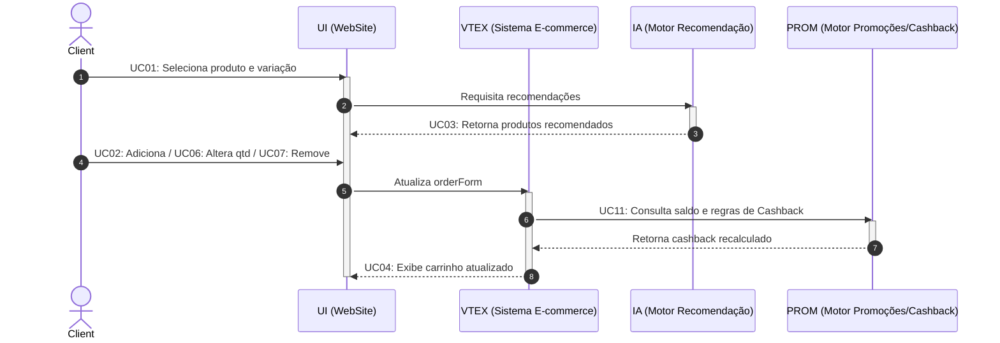

## Modelagem Dinâmica - Diagrama de Sequência

### Introdução

No contexto da arquitetura de software para sistemas complexos e distribuídos, a modelagem dinâmica é fundamental para compreender a interação e o comportamento dos componentes ao longo do tempo. Enquanto a modelagem estática define a estrutura do sistema, os aspectos dinâmicos revelam como os dados trafegam e como as regras de negócio são executadas em tempo real.

Para mapear essa complexidade no ecossistema de e-commerce da Decathlon, utiliza-se o Diagrama de Sequência como artefato principal para representar a ordem das ações do sistema. Com base na inspeção do site e no mapeamento dos casos de uso, este diagrama detalha a troca de mensagens entre a tela do usuário (UI), o sistema principal do e-commerce (VTEX) e os serviços de apoio (como IA, PROM e Frete), mostrando como as responsabilidades estão divididas e como cada parte se comunica.

### Objetivo
Mapear e formalizar a dimensão temporal e comportamental da arquitetura do e-commerce da Decathlon, detalhando a orquestração síncrona e assíncrona, o ciclo de vida das requisições e o protocolo de troca de mensagens entre atores, a interface e os serviços de backend. O artefato busca assegurar que a execução das regras de negócio, a consistência de estado do carrinho e o fluxo transacional ocorram de forma eficiente, resiliente e desacoplada, servindo como guia técnico para a implementação e validação das integrações do sistema.

## Participação e Rastreabilidade do Artefato

| Etapa / Tópico do Relatório | Autor(a) Principal | Revisor(a) em Par | Evidência / Commit |
| :--- | :--- | :--- | :---: |
| **Estruturação da Página & Introdução** | Rafaela Andrea Radamés Guerra | Camile Barbosa Gonzaga de Oliveira | [Commit](https://github.com/...) |
| **Metodologia e Ferramental** | Rafaela Andrea Radamés Guerra | Letícia de Carvalho dos Santos | [Commit](https://github.com/...) |
| **Diagrama de Casos de Uso (Tópico 1)** | Letícia de Carvalho dos Santos e Rafaela Andrea Radamés Guerra | Camile Barbosa Gonzaga de Oliveira | [Commit](https://github.com/...) |
| **Diagrama de Classes (Tópico 2)** | Camile Barbosa Gonzaga de Oliveira e Rafaela Andrea Radamés Guerra | Letícia de Carvalho dos Santos | [Commit](https://github.com/...) |
| **Diagrama de Pacotes (Tópico 3)** | Rafaela Andrea Radamés Guerra | Camile Barbosa Gonzaga de Oliveira | [Commit](https://github.com/...) |
| **Diagrama de Sequência (Tópico 4)** | Letícia de Carvalho dos Santos e Camile Barbosa Gonzaga de Oliveira | Rafaela Andrea Radamés Guerra | [Commit](https://github.com/...) |
| **Uso da IA Generativa & Validação** | Camile Barbosa Gonzaga de Oliveira | Rafaela Andrea Radamés Guerra | [Commit](https://github.com/...) |
| **Lições Aprendidas & Conclusão** | Camile Barbosa Gonzaga de Oliveira e Letícia de Carvalho dos Santos | Rafaela Andrea Radamés Guerra | [Commit](https://github.com/...) |

---

## Metodologia e Ferramental

A construção dos artefatos de modelagem dinâmica não partiu de documentação oficial da plataforma — inexistente para o sistema objeto de estudo —, mas de um processo de **Engenharia Reversa orientada a evidências**, estruturado em quatro etapas sequenciais:

**Etapa 1 — Testes de Caixa-Preta.** Percorreu-se o Fluxo C (Carrinho >> Checkout >> Pagamento) sob a ótica do usuário final, sem acesso ao código-fonte, registrando cada interação e a resposta observável do sistema.

**Etapa 2 — Inspeção de Tráfego de Rede.** Com o DevTools (F12), nas abas *Network* (filtro XHR/Fetch), *Sources* e *Console*, capturaram-se as requisições HTTP, os *payloads* JSON e os scripts de terceiros acionados em cada cenário, resultando nas **18 evidências** que sustentam este relatório.

**Etapa 3 — Abstração e Modelagem.** Os dados brutos foram traduzidos em elementos UML: eventos de interface originaram **Casos de Uso**; estruturas JSON (`orderForm`, `shippingData`, `paymentData`) originaram **Classes**; e a segregação entre domínios de serviço originou os **Pacotes**.

**Etapa 4 — Revisão em Pares.** Todo artefato produzido foi submetido a revisão por um segundo integrante, conforme a matriz de responsabilidades apresentada na seção *Participação e Rastreabilidade do Artefato*.

### Ferramental Utilizado

| Ferramenta | Finalidade no Projeto |
| :--- | :--- |
| **Google Chrome DevTools (F12)** | Inspeção de requisições XHR/Fetch, análise de *payloads* JSON, rastreio de scripts de terceiros e identificação de endpoints. |
| **Mermaid (Mermaid Live Editor)** | Diagramação dos Diagramas de Sequência e Classes em formato *diagram-as-code*, permitindo versionamento textual e fonte editável pública. |
| **Lucidchart / draw.io** | Elaboração dos Diagramas de Casos de Uso e de Pacotes, com controle de notação UML. |
| **GitHub** | Versionamento dos artefatos, rastreabilidade via *commits* e revisão em pares por *Pull Request*. |
| **GitHub Pages / Docsify** | Publicação e navegação da documentação do projeto. |
| **IA Generativa (Claude / ChatGPT)** | Apoio à estruturação inicial de hipóteses arquiteturais e revisão textual, **sempre** com validação humana posterior contra as evidências coletadas (ver seção *Uso da IA Generativa*). |

> **Nota metodológica:** nenhum artefato gerado com apoio de IA foi incorporado sem confronto direto com as evidências empíricas do DevTools. A IA atuou como ferramenta de aceleração de rascunho, não como fonte de verdade.

---

## Diagrama de Sequência

### Fundamentação Teórica

O Diagrama de Sequência é o artefato responsável por representar o comportamento dinâmico e temporal do e-commerce. Ele detalha a ordem cronológica de chamadas entre a interface (UI), o core transacional (VTEX) e os motores e serviços externos periféricos (IA, PROM, Logística/Frete, Gateway e Antifraude). Seu papel arquitetural é evidenciar o desacoplamento de responsabilidades e a comunicação entre os 5 módulos do sistema:

1. **Catálogo e Recomendação**
2. **Carrinho e Benefícios**
3. **Identificação e Sessão**
4. **Logística e Endereçamento**
5. **Pagamento e Antifraude**

---

### Mapeamento e Vinculação de Evidências (DevTools)

O Diagrama de Sequência foi construído a partir da correlação entre os **Casos de Uso**, as evidências coletadas durante os testes de caixa-preta via Chrome DevTools (F12) e as responsabilidades identificadas na arquitetura do sistema. Nesta primeira parte do fluxo, o foco está nas interações relacionadas ao **carrinho de compras**, contemplando seleção de produto, recomendações, alteração do carrinho, atualização do `orderForm` e consulta de cashback.

A tabela a seguir apresenta a rastreabilidade bidirecional entre os Casos de Uso, as interações no diagrama, os componentes padronizados e as evidências coletadas na investigação:

| ID UC | Caso de Uso | Mensagem no Diagrama (SD) | Componentes Envolvidos | Evidência DevTools (Endpoint / Payload) |
| :--- | :--- | :--- | :--- | :--- |
| **UC01** | Selecionar Produto / Especificar Variação (SKU) | `1: UC01: Seleciona produto e variação` | **Client** $\rightarrow$ **UI** | **Evidência 01:** Requisição `GET /api/catalog_system/pub/products/search` com metadados do SKU. |
| **UC03** | Gerar Recomendações de IA | `2: Requisita recomendações` `3: UC03: Retorna produtos recomendados` | **UI** $\leftrightarrow$ **IA** | **Evidências 02 e 03:** Chamada `POST /api/rnr/recommendations` retornando lista de recomendados. |
| **UC02** **UC06** **UC07** | Adicionar Produto / Alterar Quantidade / Remover Item | `4: UC02: Adiciona / UC06: Altera qtd / UC07: Remove` | **Client** $\rightarrow$ **UI** | **Evidências 02, 04 e 05:** Interações no DOM disparando manipulação de itens do carrinho. |
| **—** | Atualizar Estado do Carrinho (`orderForm`) | `5: Atualiza orderForm` | **UI** $\rightarrow$ **VTEX** | **Evidências 02, 04 e 05:** Requisição `POST /api/checkout/pub/orderForm/{orderFormId}/items`. |
| **UC11** | Consultar Cashback e Regras de Promoção | `6: UC11: Consulta saldo e regras` `7: Retorna cashback recalculado` | **VTEX** $\leftrightarrow$ **PROM** | **Evidência 07:** Invocação interna do serviço de benefícios (`/api/rnb/calculator`) para recálculo de saldo/regras. |
| **UC04** | Visualizar Carrinho Atualizado | `8: UC04: Exibe carrinho atualizado` | **VTEX** $\rightarrow$ **UI** | **Evidências 03, 04 e 05:** Resposta `200 OK` do `orderForm` sincronizada e apresentada ao **Client**. |

#### Correspondência com a arquitetura

As interações representadas refletem a separação padronizada dos componentes identificados nos modelos estáticos:

- **Client:** Ator principal que inicia as ações de seleção e manipulação do carrinho;
- **UI (Interface WebSite):** Recebe as ações do cliente e apresenta os resultados consolidados na tela;
- **VTEX (Sistema E-commerce VTEX):** Atua como núcleo transacional (*backend controller*), centralizando a atualização do `orderForm` e a orquestração das operações;
- **IA (Motor de Recomendação IA):** Serviço especializado periférico responsável pela geração e retorno das recomendações de produtos;
- **PROM (Motor Promoções/Cashback):** Serviço especializado periférico responsável pela consulta de saldo e recálculo das regras de cashback/benefícios.

Dessa forma, o fluxo representado segue a direção arquitetural:

**Client → UI → VTEX → Serviços Especializados (IA / PROM) → VTEX → UI → Client.**

#### Relação com o fluxo investigado

O diagrama apresentado corresponde ao **subfluxo inicial do Fluxo C**, relacionado ao carrinho de compras e aos benefícios associados. As demais etapas identificadas na investigação — identificação do cliente, preenchimento de dados, endereço, logística, seleção de pagamento, antifraude e finalização do pedido — constituem interações posteriores do Fluxo C e serão incorporadas às extensões do modelo.

Assim, o mapeamento mantém a rastreabilidade direta:

**Evidência DevTools → Caso de Uso → Interação no Diagrama de Sequência → Componente Arquitetural.**

---

### Decisões de arquitetura e modelagem

Cada elemento da modelagem dinâmica foi fundamentado na literatura de Engenharia de Software e Modelagem Orientada a Objetos:

* **Decisão de Comportamento 01: Abstração de Padrões e Unificação de Entradas por Intent**
  * **Aplicação:** Operações correlatas que alteram o mesmo estado do sistema — como adição, alteração e remoção de itens (UC02, UC06, UC07) no carrinho — são consolidadas em uma chamada funcional única no diagrama (`Client ->> UI`), variando apenas o *payload* encaminhado ao core.
  * **Fundamentação:** Segundo Fowler (2005), diagramas de sequência devem priorizar a clareza dos caminhos de controle e da intenção arquitetural. Abstrair variações de dados que trafegam pelo mesmo canal evita poluição visual e foca nos limites de responsabilidade entre os componentes.

* **Decisão de Comportamento 02: Desacoplamento da Camada de Apresentação via Orquestração Centralizada**
  * **Aplicação:** Chamadas a serviços especializados — como o motor de promoções (`PROM`), recomendações de IA, logística ou gateways — são orquestradas diretamente pelo núcleo transacional (`VTEX`), e jamais disparadas diretamente pela interface do usuário (`UI`).
  * **Fundamentação:** Conforme Larman (2007), a aplicação dos padrões GRASP *Controller* e *Low Coupling* estabelece que a camada de apresentação não deve orquestrar regras de negócio do domínio. Delegar a orquestração para o núcleo centraliza o controle de estado no *backend* e reduz vulnerabilidades da aplicação.

---

**Consolidação Arquitetural do Fluxo:**
A modelagem dinâmica reflete o padrão de comunicação do e-commerce, onde o cliente interage com a interface, mas toda a inteligência e validação das regras de negócio são centralizadas no núcleo transacional (`VTEX`). Este atua como orquestrador síncrono dos serviços periféricos (`IA` e `PROM`), garantindo que a interface receba apenas o estado consolidado da aplicação após a execução das regras de domínio.

---

### Modelo UML

> **Recurso Utilizado:** Ferramenta colaborativa Mermaid durante sessão de *Pair Modeling* no dia 16/09/2026.

#### Elementos e Recursos da Notação Utilizados

| Elemento UML | Aplicação no diagrama |
| --- | --- |
| **Ator (Actor)** | Representa o **Client**, responsável por iniciar as ações de seleção e manipulação no carrinho. |
| **Participante / Lifeline** | Componentes padronizados: **UI (WebSite)**, **VTEX (Sistema E-commerce)**, **IA (Motor Recomendação)** e **PROM (Motor Promoções/Cashback)**. |
| **Linha de vida (Lifeline)** | Linha vertical associada a cada participante, representando sua existência ao longo da sequência de interações. |
| **Mensagem de chamada** | Solicitação enviada entre participantes (ex.: `UI` solicita recomendações ao motor `IA` e envia atualização do `orderForm` para a `VTEX`). |
| **Mensagem de retorno** | Resposta a uma solicitação prévia (ex.: retorno dos produtos recomendados pela `IA` e do cashback recalculado pelo `PROM`). |
| **Ordem temporal** | Disposição vertical que estabelece a cronologia do fluxo, do disparo do cliente à atualização final da tela. |
| **Ativação (Activation Bar)** | Retângulos nas linhas de vida indicando o período em que o participante está processando uma execução. |

---

## Uso da IA Generativa e Validação Humana

O uso de IA Generativa neste módulo foi restrito a três frentes, todas seguidas de validação humana obrigatória:

| Frente de Uso | Papel da IA | Mecanismo de Validação Aplicado |
| --- | --- | --- |
| **Hipótese arquitetural inicial (v1.0 do Diagrama de Classes)** | Geração de uma primeira estrutura de entidades a partir do Rich Picture e do SIG produzidos no Módulo 1. | Confronto entidade a entidade com os *payloads* JSON reais capturados no DevTools; entidades sem evidência empírica foram descartadas na v2.0. |
| **Sugestão de nomenclatura e padrões de projeto** | Apontamento de padrões candidatos (Strategy, Aggregate) para as decisões de modelagem. | Verificação direta na literatura de referência (LARMAN, GAMMA et al., EVANS) antes da incorporação ao texto. |
| **Revisão textual e coesão** | Revisão gramatical e padronização de estilo das seções descritivas. | Leitura crítica e reescrita pelas autoras; nenhum trecho técnico foi aceito sem conferência. |

**Limitações observadas:** A IA tendeu a propor entidades genéricas de e-commerce (ex.: `Estoque`, `Avaliacao`, `Frete` como classe isolada) que **não** possuíam contrapartida nas requisições observadas. Esse comportamento reforçou a necessidade da engenharia reversa como filtro de veracidade.

---

## Referências bibliográficas

> * BOOCH, Grady; RUMBAUGH, James; JACOBSON, Ivar. **UML: guia do usuário.** 2. ed. Rio de Janeiro: Elsevier, 2006.
> * EVANS, Eric. **Domain-Driven Design: tackling complexity in the heart of software.** Boston: Addison-Wesley, 2003.
> * FOWLER, Martin. **UML essencial: um breve guia para a linguagem-padrão de modelagem de objetos.** 3. ed. Porto Alegre: Bookman, 2005.
> * GAMMA, Erich; HELM, Richard; JOHNSON, Ralph; VLISSIDES, John. **Padrões de projeto: soluções reutilizáveis de software orientado a objetos.** Porto Alegre: Bookman, 2000.
> * LARMAN, Craig. **Utilizando UML e padrões: uma introdução à análise e ao projeto orientados a objetos e ao desenvolvimento iterativo.** 3. ed. Porto Alegre: Bookman, 2007.
> * SOMMERVILLE, Ian. **Engenharia de software.** 9. ed. São Paulo: Pearson Prentice Hall, 2011.
> 
> 

---

> **Histórico de Versões**
> | Versão | Data | Descrição | Autores | Revisor |
> | --- | --- | --- | --- | --- |
> | 0.1 | 12/09/2026 | Criação e Estruturação da página | [Rafaela Andrea](https://github.com/radamesGuerra?utm_source=gemini) | [Camile Barbosa](https://github.com/Camile0318?utm_source=gemini) |
> | 0.2 | 17/09/2026 | Contribuição dos módulos 1 e 2 do diagrama de sequência, Elaboração dos tópicos 1 e 4 | [Leticia Santos](https://github.com/LeticiaSantosss?utm_source=gemini) | [Camile Barbosa](https://github.com/Camile0318?utm_source=gemini) |
> | 0.3 | 17/09/2026 | Adiciona os tópicos de metodologia e ferramental e outras estruturas | [Rafaela Andrea](https://github.com/radamesGuerra?utm_source=gemini) | [Camile Barbosa](https://github.com/Camile0318?utm_source=gemini) |
> | 0.4 | 17/09/2026 | Refatoração e inclusão da rastreabilidade bidirecional com DevTools no Diagrama de Sequência | [Camile Barbosa](https://github.com/Camile0318?utm_source=gemini) e [Leticia Santos](https://github.com/LeticiaSantosss?utm_source=gemini) | [Rafaela Andrea](https://github.com/radamesGuerra?utm_source=gemini) |
> 
> 
